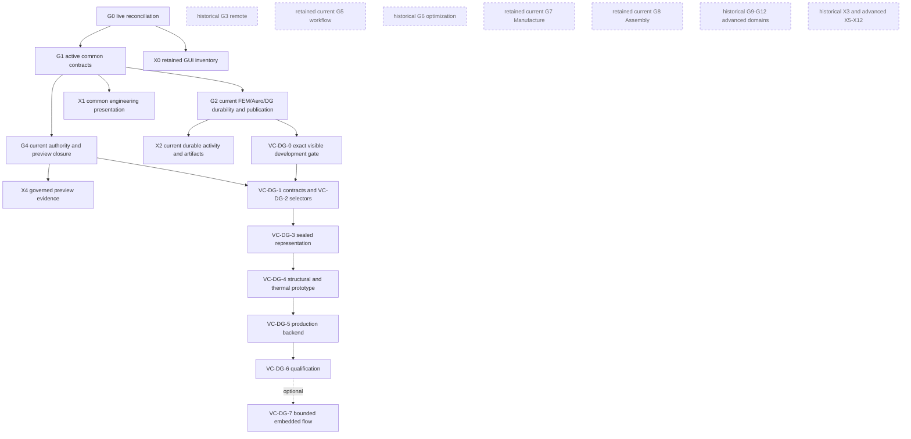

# VibeCAD governed engineering roadmap

**Roadmap status:** active and canonical for bounded public host closure,
retained current capability, and the VC-DG direct-geometry lane

**Audited baseline:**
`93500486c1515eac2ee98121e16a96a3038c0299` on 2026-08-26

**Current implementation checkpoint:** the dependency-ordered roadmap stack
#90 through #135 reaches `c0157d9a6b4a6bc4d54130025ec9dfaf5c7fbbda`
and was reconciled on 2026-08-27 with `10-X-eng/vibecad@60b8f3fd` as a bounded
fork checkpoint. Milestone status below remains evidence-bounded and does not
claim completion of the active public boundary.

**Latest observable stabilization checkpoint:** the 2026-08-28 working tranche
based on `75917cf660cf100a09fc2d7cae033145b4661bea` proves the repo-local
one-click GUI/control/file-tour loop and matched three-cycle installed Windows
and Linux x86-64 physical CalculiX solve/import/persistence burn-ins, matched
exact-source identity/refusal/rebind burn-ins, and matched physical CalculiX
active-close/publication-refusal burn-ins. The tranche also repairs the
rattler-build Pixi lock so strict lock freshness and locked dependency installs
pass without bypassing the solver. An additive one-cycle Windows checkpoint now
also carries a real physical CalculiX result through durable G2 verification,
content-addressed completed-workspace bundle admission, a production FEM
publisher, and Native document-thread transaction authority. It proves
write-once receipt persistence, duplicate-free save/reopen replay, rollback,
and unknown-outcome refusal. The installed host and solver are exact, but the
new publisher is still loaded from the source checkout, so package rebuild and
repeated cross-platform acceptance remain. The
[FEM compatibility report](vibecad-analysis-fem-compatibility-report.md)
records the detailed boundary. The new one-cycle path advances G2 but is not a
G5 workflow submission and does not close either milestone.

## 2026-08-29 public-scope classification

This roadmap remains canonical for bounded public host closure, retained current
capability, shared architectural contracts, and the VC-DG direct-geometry lane.
It no longer makes every preserved G/X research milestone a public release
obligation. Current source and already-landed behavior are retained; a historical
classification changes future completion obligations, not existing code,
compatibility, tests, documents, or user data.

**Bounded direct-geometry exception.** The owner has explicitly retained
VC-DG-0 through VC-DG-6 in VibeCAD as a narrow active lane. The exception covers
only the direct-geometry structural/thermal core defined by the repository
specification and the optional VC-DG-7 preview, which may begin only after
VC-DG-6 is finished and the VibeCAD owner explicitly says to begin. It does not
make nonlinear/composites/fatigue programs, generalized
multiphysics, broad solver registries, remote execution, high-fidelity Aero, or
other advanced engineering expansion part of current VibeCAD completion.
Shared contracts may be reused without changing this scope; each implementation
and completion claim still has one named owner.

| Lane | Public classification | Active public obligation |
| --- | --- | --- |
| G0 | **STAYS PUBLIC / SHARED LINEAGE** | Repeat source, owner, package, test, and roadmap reconciliation at each bounded tranche. |
| G1 | **STAYS PUBLIC / SHARED LINEAGE** | Finish only contracts required by retained public behavior and VC-DG. |
| G2 | **COMPLETE CURRENT PUBLIC DEPENDENCIES** | Close durability, recovery, currentness, and publish-once behavior required by current FEM, low-order Aero, and VC-DG. Generalized expansion is not an active public gate. |
| G3 | **HISTORICAL / NON-NORMATIVE** | Preserve the remote-provider design record; no current public completion obligation. |
| G4 | **STAYS PUBLIC / SHARED LINEAGE** | Fix authority/preview inconsistencies affecting shipped behavior and support bounded VC-DG selector preview/acceptance. |
| G5 | **RETAIN CURRENT CAPABILITY / SHARED LINEAGE** | Preserve landed bounded workflow behavior. Advanced orchestration closure is not an active public gate. |
| G6 | **HISTORICAL / NON-NORMATIVE** | Preserve landed foundations and design record; no future public optimization completion obligation. |
| G7 | **RETAIN CURRENT CAPABILITY** | Preserve current Manufacture/CAM and landed evidence seams; advanced runtime integration is not an active public gate. |
| G8 | **RETAIN CURRENT CAPABILITY** | Preserve current Assembly/mechanism/fastener behavior and landed identity/evidence seams; advanced consolidation is not an active public gate. |
| McMasterInsert | **RETAIN CURRENT CAPABILITY / ACTIVE ACCEPTANCE CLOSURE** | The current catalog/import/cache/placement slice is partial until already-started packaging, runtime, and visible acceptance work closes. Preserve the current workbench. This is separate from bundled standard fasteners. Procurement intelligence, supplier comparison, automated sourcing, and generalized catalog expansion are not active VibeCAD gates. |
| G9-G12 | **HISTORICAL / NON-NORMATIVE** | Preserve proposals, sequencing, service, and Robot projection records without making them public release blockers. |
| X0 | **SHARED LINEAGE** | Retain the verified target and GUI inventory. |
| X1 | **STAYS PUBLIC / SHARED LINEAGE** | Preserve and finish the generic result/presentation surface needed by retained public behavior and VC-DG. |
| X2 | **RETAIN CURRENT CAPABILITY** | Preserve current result/activity/artifact UI; generalized extension is not an active public gate. |
| X3 | **HISTORICAL / NON-NORMATIVE** | Preserve remote-execution UI design only. |
| X4 | **STAYS PUBLIC / SHARED LINEAGE** | Preserve generic preview evidence and extend only where active public lanes require it. |
| X5-X6 | **HISTORICAL / NON-NORMATIVE** | Preserve landed projections and design records; no future public completion obligation. |
| X7-X8 | **RETAIN CURRENT CAPABILITY** | Preserve current Manufacture and Assembly projections; advanced UI expansion is not an active public gate. |
| X9-X12 | **HISTORICAL / NON-NORMATIVE** | Preserve advanced proposal/sequence/service/Robot UI records without active public completion obligations. |
| VC-DG-0 through VC-DG-6 | **ACTIVE PUBLIC LANE** | Deliver the bounded structural/thermal direct-geometry core through the existing G1/G2/G4 and Analysis authorities. |
| VC-DG-7 | **OPTIONAL PUBLIC LANE** | Proposed fixed-boundary incompressible embedded-flow preview after VC-DG-6; non-blocking for VC-DG core and unrelated to historical Aero Steps 12-20. |

### Active public completion boundary

Current public completion requires:

1. exact-checkout, frozen-lock, visible GUI development acceptance with the
   plain cyan in-application pointer and native file round trip;
2. current Native authority and compatibility closure;
3. package-contained and repeatable current FEM/CalculiX lifecycle,
   verification, recovery, currentness, and publish-once closure;
4. low-order Aero Steps 0-11 closure in the Aero owner roadmap;
5. retained generic Engineering Experience X1/X2/X4 surfaces working against
   their actual owners;
6. completion and regression protection of the already-started current
   McMasterInsert catalog/import/cache/placement and package-acceptance slice;
   and
7. VC-DG-0 through VC-DG-6 closure under the direct-geometry specification.

The boundary does not require G3, advanced G5, G6, advanced G7/G8, G9-G12,
X3, advanced X5-X12, historical Aero Steps 12-20, or optional VC-DG-7. Every
already-landed capability and compatibility seam remains protected against
regression even when its future expansion is historical/non-normative.

### Cross-repository accountable assignment checkpoint

This checkpoint makes the current VibeCAD/VibeMechanica cutline executable for
planning without replacing any detailed domain roadmap. It reflects the
VibeCAD state reviewed at
`8611ac881a67b77b777c38f1749880527d2cc956`; a downstream mirror or support role
does not transfer implementation ownership or accept a synchronization receipt.
Each row has exactly one accountable owner. The supporting or consuming owner
may review compatibility, provide source lineage, or consume an accepted
interface, but is not a second accountable owner.

Aero Steps 12-20 are assigned to VibeMechanica. The reusable tester remains a
separately maintained tool surface consumed by both products. Generic CfdOF
compatibility remains VibeCAD-owned compatibility work; generic CfdOF
compatibility earns zero Aero Step 12 completion credit and zero direct-geometry
method credit. Aero Step 13 remains optional and non-blocking in VibeMechanica;
it is not a dependency of Steps 14 or 16.

<!-- VIBECAD-CROSS-REPOSITORY-ASSIGNMENTS:BEGIN -->
| Item ID | Accountable owner | Supporting or consuming owner | Status | Dependency or start condition | Acceptance and claim boundary |
| --- | --- | --- | --- | --- | --- |
| `REUSABLE-VISIBLE-TESTER` | Reusable tester tooling | VibeCAD and VibeMechanica | partial | Independent root tool; product profiles consume it | Exact-checkout one-click launch, authenticated checkout-bound control, semantic UI discovery, plain cyan in-app pointer, native file lifecycle, screenshots, collision-safe receipts, and bounded timeouts pass. Generic success is infrastructure evidence only and earns no physics credit. |
| `VIBECAD-NATIVE-HOST` | VibeCAD | Reusable tester tooling; VibeMechanica consumes only accepted compatibility | partial | G0, G1, G2, G4 and exact-package tester evidence | Current Native authority, preview/apply/refuse behavior, document-thread mutation, persistence, packaging, and visible acceptance close without a second CAD mutation owner. |
| `VIBECAD-FEM-CALCULIX-RETAINED` | VibeCAD | VibeMechanica consumes only an accepted compatibility handoff | partial | VIBECAD-NATIVE-HOST and package-contained solver availability | Existing FEM and CalculiX behavior, normal production verification/publication, save/reopen, recovery, cancellation, package registration, and installed cross-platform acceptance pass. This does not assign generalized Structures or Physics expansion to VibeCAD. |
| `VIBECAD-MCMASTERINSERT-RETAINED` | VibeCAD | VibeMechanica has no implementation obligation | partial | VIBECAD-NATIVE-HOST | Existing browse, import, cache, component metadata, and placement behavior finishes already-started package, runtime, and visible acceptance work. It creates no procurement, sourcing, supplier-comparison, or purchasing authority. |
| `VIBECAD-ENGINEERING-PRESENTATION` | VibeCAD | VibeMechanica consumes compatible presentation contracts after accepted sync | partial | X1, X2 and X4 current public dependencies | Actual current result, activity, artifact, and preview evidence is rendered through its existing domain owners without creating a second scientific renderer or mutation authority. |
| `AERO-STEP-00-11` | VibeCAD | VibeMechanica consumes only an accepted compatibility handoff | partial | VIBECAD-NATIVE-HOST and current G2 dependencies | Close the canonical low-order Aero Steps 0-11 package with installed visible persistence, cancellation, currentness, verification, publication, and honest claim ceilings. |
| `AERO-STEP-12-20` | VibeMechanica | VibeCAD provides preserved source and compatibility lineage | planned in VibeMechanica; Step 13 optional; historical in VibeCAD | VibeMechanica VM-0 through VM-3 prerequisites and its own Aero dependency order | Production CFD, fields, remote compute, qualification, propulsion, unsteady and 6DOF work, FSI, and advanced diagnostics close only in VibeMechanica. Optional restricted-use FluidX3D Step 13 is non-blocking and is not a dependency of Steps 14 or 16. No current VibeCAD compatibility repair claims this work. |
| `VIBECAD-CFDOF-COMPATIBILITY` | VibeCAD | VibeMechanica may consume an independently accepted comparison interface | partial compatibility | VIBECAD-NATIVE-HOST; no dependency on VC-DG-7 | Preserve or repair generic FreeCAD CfdOF compatibility as a reference, fallback, or comparison surface. Presence, importability, packaging, or a conforming solve earns no Aero Step 12 or direct-geometry method credit. |
| `VC-DG-0` | VibeCAD | Reusable tester tooling supplies the independent generic prerequisite; VibeMechanica is a compatibility consumer only | partial | REUSABLE-VISIBLE-TESTER | Register and pass the VC-DG exact-package visible acceptance profile without forking the tester or claiming numerical capability. |
| `VC-DG-1` | VibeCAD | VibeMechanica is a compatibility consumer only | partial | VC-DG-0 | Versioned terminology, identity, representation, selector, method, preparation, qualification, and result contracts serialize, reopen, fail closed, and remain authority-separated. |
| `VC-DG-2` | VibeCAD | VibeMechanica is a compatibility consumer only | partial | VC-DG-1 | Persistent semantic selectors preview, accept where required, save, reopen, re-resolve, and report resolved, empty, ambiguous, and stale outcomes without silently choosing geometry. |
| `VC-DG-3` | VibeCAD | VibeMechanica is a compatibility consumer only | partial | VC-DG-2 | The immutable source-revision-bound representation pipeline proves geometry identity, units, placement, deterministic derivation, quality findings, artifacts, cancellation, cache, replay, and currentness. |
| `VC-DG-4` | VibeCAD | VibeMechanica is a compatibility consumer only | partial | VC-DG-3 and retained FEM/CalculiX reference capability | Bounded structural and thermal direct-route prototypes publish low-claim results with selectors, balances, diagnostics, persistence, cancellation, staleness, and independent conforming comparison. Plumbing success remains unqualified. |
| `VC-DG-5` | VibeCAD | VibeMechanica is a compatibility consumer only | partial | VC-DG-4 | An audited open-capable production backend is selected, pinned, packaged, cancellable, replayable, license-inventoried, and integrated without changing existing solver behavior. No candidate name is a dependency commitment. |
| `VC-DG-6` | VibeCAD | VibeMechanica is a compatibility consumer only | blocked | VC-DG-5 | Qualification begins only after the production direct route exists and closes only with structural and thermal benchmarks, systematic resolution, balance and sensitivity evidence, independent comparisons, context limits, and evidence-bound claim promotion. |
| `VC-DG-7` | VibeCAD | VibeMechanica is a compatibility consumer only | optional; not started | VC-DG-6 plus the VibeCAD owner explicitly saying to begin | Optional fixed-boundary incompressible embedded-flow preview only. Its owner is already decided. It is non-blocking for the VC-DG core, independent of VibeMechanica Aero, and earns no Aero Steps 12-20 credit. |
| `VIBEMECHANICA-GENERALIZED-PHYSICS` | VibeMechanica | VibeCAD provides inherited compatibility and accepted source lineage | planned in VibeMechanica; outside VibeCAD | VibeMechanica repository, GUI compatibility, Physics Core, and qualification prerequisites | Generalized Structures, advanced physics, multiphysics, mechanics-domain expansion, remote execution, productization, and governed intelligence close in VibeMechanica and are not VibeCAD release obligations. |
<!-- VIBECAD-CROSS-REPOSITORY-ASSIGNMENTS:END -->

VC-DG-0 through VC-DG-5 are partial at this checkpoint. VC-DG-6 is blocked by
VC-DG-5. VC-DG-7 is assigned to VibeCAD. Its optional status does not make its
owner undecided. It is not started, does not block completion of VC-DG-0 through
VC-DG-6, and may begin only after VC-DG-6 is finished and the VibeCAD owner
explicitly says to begin. A status change in one repository must be carried
through that repository's normal review and guarded synchronization path before
the other repository may mirror it.

## 1. Purpose

This roadmap turns the Governed Engineering Architecture whitepaper into an
implementation plan tied to the current VibeCAD source tree. It preserves the
paper's central direction while correcting status inflation, avoiding duplicate
domain owners, and adding the persistence, security, migration, recovery, and
acceptance requirements needed for real delivery.

The target product is a governed parametric engineering host in which:

- AI proposes, explains, compares, and steers engineering work;
- Native and VibeScript own interactive CAD mutation;
- Analysis owns detached computation lifecycle, not domain physics;
- domain adapters own physics, manufacturing, assembly, and robot semantics;
- exact source identity, sealed inputs, currentness, verification, provenance,
  and publication authority remain machine-checkable;
- human-selected authority and approval policies remain explicit;
- every completion claim names the evidence and the boundary it proves.

This roadmap does not claim that a model, mechanism, process plan, solver
result, manufactured part, robot path, or product is safe for real-world use.

## 2. Source-of-truth order

Use this precedence when implementation and documents disagree:

1. Current executable source, build registration, tests, and validated runtime
   behavior determine what exists.
2. This roadmap determines the cross-domain sequence, status, dependencies,
   and closure gates.
3. Domain roadmaps and specifications determine domain semantics and acceptance
   details. In particular:
   - [VibeCADAero canonical roadmap](vibecadaero-roadmap.md) owns retained
     low-order Aero physics and Steps 0-11 acceptance, and preserves later
     advanced solver/qualification records as historical/non-normative;
   - [Assembly and Mechanism Integration](assembly-mechanism-integration-spec.md)
     owns the authoritative Assembly graph, mechanism evaluation, and Part
     Design verification facade;
    - [Bundled Standard Fasteners](standard-fasteners-integration-spec.md) owns
      standard-component packaging, catalogs, and supported fastener geometry.
    - [McMaster-Carr insert](../src/Mod/McMasterInsert/README.md) and its
      executable module own the retained live vendor-catalog, downloaded-CAD
      import/cache, component metadata, and placement workflow. McMasterInsert
      is not the bundled standard-fastener catalog and does not establish a
      procurement, sourcing, supplier-comparison, or purchasing authority.
   - [Direct-Geometry, No-Body-Fitted-Meshing Analysis for VibeCAD](direct-geometry/VIBECAD_DIRECT_GEOMETRY_ANALYSIS_WHITEPAPER.md)
     preserves the accepted source specification and owns the unaffected VC-DG
     numerical, validation, and definition-of-done requirements;
   - the [direct-geometry reconciliation addendum](direct-geometry/VIBECAD_DIRECT_GEOMETRY_RECONCILIATION_ADDENDUM.md)
     owns repository-specific integration clarifications for the reusable tester,
     VC-DG-7 start condition, generic CfdOF, and McMasterInsert; this
     roadmap owns VC-DG package status, dependencies, and order.
4. The
   [whitepaper evaluation](vibecad-governed-engineering-whitepaper-evaluation.md)
   explains why the submitted proposal was accepted, bounded, reframed, or
   rejected as duplicate.
5. The submitted whitepaper is strategic input, not implementation evidence.

If current source contradicts a roadmap status, the source wins and the
roadmap must be corrected in the same pull request that relies on the newly
discovered state. Do not rewrite an old audit baseline to attribute later work
to an earlier revision.

## 3. Status vocabulary

| Status | Meaning |
| --- | --- |
| **Verified complete for the stated slice** | The bounded milestone has source, tests, packaging, and stated acceptance evidence. It makes no claim about later milestones. |
| **Partial** | A real foundation or product slice exists, but one or more named closure gates remain. |
| **Design-ready** | Owners, dependencies, compatibility boundaries, and acceptance gates are defined; production implementation has not closed them. |
| **Blocked by prerequisite** | Work must not become a production path until a named earlier gate closes. |
| **Unverified** | Current evidence is insufficient or contradictory. |
| **Retain current capability** | Existing behavior remains supported and regression-protected; generalized future expansion is not an active closure gate. |
| **Historical/non-normative** | Preserved design provenance; not a current public completion obligation unless explicitly reactivated. |
| **Optional proposed** | Separately gated work that does not block the required active public boundary. |

An interface, schema, mock provider, preview, queued job, solver exit code,
plausible output, screenshot, generated report, focused unit test, or design
document does not by itself complete a milestone.

## 4. Non-negotiable architecture locks

### 4.1 Existing owners remain authoritative

| State or capability | Authoritative owner | Other layers may do |
| --- | --- | --- |
| Parametric CAD state and accepted mutation | Native FreeCAD/VibeCAD and the selected Native or VibeScript authoring path | Propose, preview, validate, and request mutation through the owner |
| Structural revision, call ticket, Native receipt, preview lifecycle | Native host state and dispatcher | Reference exact identities and policy; never bypass or clone them |
| Detached job lifecycle, artifacts, provider attempts, recovery | Analysis host runtime | Submit prepared domain work and consume bounded results |
| Physics/model choice, units, solver input/output meaning, qualification | Domain adapter and domain roadmap | Provider executes an explicit prepared specification |
| Assembly occurrences, connectors, joints, solved placements, kinematic state | Native Assembly and its shared mechanism-evaluation layer | Propose candidates and consume validated graph/evidence |
| Manufacturing Job, CAM operations, tools, post-processing, simulation | Native Manufacture/CAM domain | Run suitable detached tasks and attach evidence to exact domain state |
| Robot setup, kinematics, trajectory, simulation, and export | Native Robot domain | Receive verified task intent and perform downstream domain validation |
| Engineering Experience shell, cards, charts, and overlays | Presentation layer consuming exact G/domain contracts | Render governed state and request owning actions; never infer, mutate, execute, verify, publish, or export |
| Human approval and authoring mode | Human-selected VibeCAD authority state | Report requirements and wait for the owning authority |

No milestone may create a second canonical Assembly graph, manufacturing Job,
Robot trajectory stack, preview controller, publication coordinator, solver
physics selector, or provider-specific CAD mutation API.

The visual north star is a quality and information-architecture target, not
engineering evidence. Scientific field color and governance/status color are
independent systems. No screenshot, card, chart, thumbnail, progress indicator,
or badge may invent a value or strengthen the source claim. The cross-cutting
[Engineering Experience X-track](design/engineering-experience/ENGINEERING_EXPERIENCE_X_TRACK.md)
is a presentation projection of G0-G12, not a parallel owner or roadmap.

### 4.2 Identities are distinct and non-substitutable

The following identities must be explicit where applicable:

- project and source document UID;
- structural revision and dependency snapshot digest;
- Native call ticket, preview ID, idempotency token, and receipt ID;
- durable analysis ID;
- host execution-attempt ID;
- provider job ID;
- lifecycle event source and event ID;
- trace ID and span ID;
- immutable result ID;
- publication receipt ID;
- workflow definition ID, workflow run ID, and node-run ID;
- assembly occurrence, component interface, joint, step, and task IDs.

A provider job ID is not an analysis ID. A trace ID is not durable job
identity. A source path or label is not document identity. A hash proves bytes,
not engineering meaning or publication authority.

### 4.3 Authority is narrower than capability

- Read, view, immediate mutation, preview-required mutation,
  confirmation-required mutation, export, external side effect, and privileged
  utility execution are separate policy classes.
- A preview never becomes accepted engineering state without a fresh apply
  gate owned by the authoritative mutation path.
- A successful provider attempt never publishes by itself.
- A worker or provider never receives a live FreeCAD document handle, GUI
  object, credential object, or document-thread mutation callback.
- Retry, reconnect, callback, restart, and duplicate events never authorize a
  second publication.
- The `/v1/run` compatibility route is a privileged local Python escape hatch,
  not evidence that all external CAD mutation is governed. Its retention,
  confinement, or deprecation requires a separately approved compatibility
  decision.

### 4.4 Persistence separates metadata from immutable artifacts

Durable metadata records identity, lifecycle, references, state transitions,
currentness decisions, and publication receipts. Immutable artifact storage
holds sealed inputs, logs, outputs, evidence, and portable bundles by verified
descriptor. Large fields do not enter FCStd or the metadata database as
unbounded blobs.

Every durable schema is versioned on first write. Readers either migrate an
explicitly supported old version or refuse it with a structured diagnostic.
Unknown versions are never guessed.

### 4.5 Provenance is a graph

The VibeCAD provenance profile is conceptually aligned with
[W3C PROV-DM](https://www.w3.org/TR/prov-dm/):

- entities include CAD revisions, prepared inputs, artifacts, results,
  findings, publications, manufacturing outputs, assembly steps, and robot
  tasks;
- activities include proposal, mutation, preparation, execution,
  verification, selection, publication, export, and projection;
- agents include the human initiator, model/provider, VibeCAD code, domain
  adapter, solver, execution provider, and external tool;
- usage, generation, derivation, association, delegation, and invalidation
  connect them.

Hashes, timestamps, labels, and free-form metadata are properties of this
graph; they are not a substitute for it. RDF is not required as the internal
storage format.

### 4.6 Remote execution is untrusted until verified

- Credentials remain in a host credential owner and never enter a document,
  manifest, bundle, provenance payload, log, or provider result.
- Portable content references include media type, digest, and byte size, using
  the [OCI descriptor](https://specs.opencontainers.org/image-spec/descriptor/)
  as an informative model rather than requiring an OCI image.
- Returned events have duplicate/out-of-order handling. Event identity follows
  a source-plus-ID rule comparable to
  [CloudEvents](https://github.com/cloudevents/spec/blob/ce%40stable/cloudevents/spec.md);
  diagnostic request correlation may use
  [W3C Trace Context](https://www.w3.org/TR/trace-context/). Neither replaces
  durable VibeCAD identity.
- Every collected artifact is checked against its expected descriptor before
  parsing. Parsers retain path, archive, symlink, size, count, decompression,
  and schema bounds.
- Remote completion is an input to host verification, not publication
  approval.

### 4.7 Findings and claim ceilings are explicit

Every common finding has a stable ID, taxonomy/rule identity, domain, verdict
or severity, code, message, affected engineering identities, evidence
references, currentness, remediation when known, and a claim ceiling. Domain
payloads remain intact. The result/finding structure may learn from
[SARIF 2.1.0](https://docs.oasis-open.org/sarif/sarif/v2.1.0/sarif-v2.1.0.html)
without adopting SARIF as VibeCAD's engineering schema.

### 4.8 Compatibility and packaging are part of implementation

- Preserve existing Native names, schemas, synchronous behavior, domain
  objects, document formats, errors, and compatibility facades unless a
  separately approved migration says otherwise.
- Existing default CMake install-component behavior remains covered.
- Every new public Python facade, package, schema, resource, and test fixture is
  registered for source, build-tree, and installed-tree use as applicable.
- New persistence dependencies require Windows, Linux, and macOS packaging and
  upgrade evidence before release.
- No roadmap tranche removes an old API merely because a replacement exists.

### 4.9 Observable exact-checkout development is a delivery gate

Every user-visible governed-engineering slice is developed and accepted in the
same visible local GUI that a human can watch. On Windows, the canonical path is
the repo-root one-click launcher in
[developer-launch-windows.md](developer-launch-windows.md). It builds only the
exact checkout, visibly marks its source SHA, scopes the authenticated loopback
agent endpoint to that checkout, and refuses an installed-product fallback.

The development agent may drive bounded application routes, `/v1/native`,
domain routes such as `/v1/aero`, or the repo's Qt GUI harness. Those mechanisms
do not enlarge authority: Native mutation, previews, fresh authorization,
domain verification, publication, document-thread ownership, and receipts
remain mandatory. A qualifying checkpoint combines a human-watchable workflow
with before/after context or screenshots where relevant, exact owning
receipts/artifacts, and proportional automated tests. A screenshot, mock,
headless proxy, installed build, or privileged unreceipted Python mutation is
not a substitute.

When the workflow needs menu or ribbon interaction, the canonical Windows tour
uses a plain cyan virtual cursor overlay and semantic `/v1/ui/click` targets. It
must not call `SetCursorPos`, `SendInput`, or otherwise move, click, confine,
hide, or block the human's physical cursor. File-workflow checkpoints must also
prove the real open/save-as/save/close/reopen lifecycle, default overwrite
protection, and a clean final document state in the same exact GUI process.

### 4.10 Direct-geometry representation and method locks

The VC-DG lane keeps the accepted BREP and Native document authoritative. A
tessellation, signed-distance field, background grid, cut-cell classification,
or solver deck is derived, immutable, source-revision-bound evidence. A
`GeometryRepresentationDescriptor`, semantic selector, numerical method, solver,
provider, resolution, result, qualification record, and publication receipt are
distinct identities and may not substitute for one another.

The user is not required to create or manage a body-fitted mesh. The numerical
method may use a background grid, lattice, cells, or integration points; the
roadmap must not call the whole lane meshless. CalculiX, Elmer, and Gmsh remain
conforming references/fallbacks/oracles and cannot earn direct-geometry credit.
Ambiguous, empty, or stale selectors fail closed, unsupported physics refuses
before execution, and no execution success can promote a qualification ceiling.

## 5. Verified baseline and honest boundary

The 2026-08-26 audit of `93500486c1515eac2ee98121e16a96a3038c0299`
found these foundations:

| Foundation | Evidence | Boundary retained by this roadmap |
| --- | --- | --- |
| Native revision/ticket/idempotency/receipt state | `VibeCADNativeState.py`, dispatcher and state tests | Bounded process/document memory is not the unified durable ledger. |
| Native preview lifecycle | ten allowlisted modeling families plus apply/reject/stale tests | No complete operation policy census exists. |
| Domain-neutral Analysis contracts | prepared analysis, dependency snapshot, input manifest, execution spec, currentness report, installed facades | Common result, finding, and provenance envelopes are incomplete. |
| Analysis runtime | bounded in-memory lifecycle, cancellation, document-thread commit gate | No restart recovery or durable identity. |
| Local provider and FEM migration | local provider plus CalculiX, Elmer, Z88, and Mystran adapters/tests | Reconnect unsupported; full parity/stabilization remains. |
| Agent Native control | loopback token, context, Native dispatcher, held sessions, screenshots, prompt path | `/v1/run` remains privileged Python execution; dispatcher exclusivity is false as a whole-product claim. |
| Manufacture/CAM | Jobs, tools, operations, posts, simulation, retained simulation result, templates, outputs | No common Analysis-backed durable manufacturing-task orchestration. |
| Assembly | occurrences, all current joint kinds, joint graph, solve/diagnosis, simulation/playback, BOM, fasteners, component interfaces, rigid static mechanism checks | Continuous-motion certification, flexible coverage, full interface taxonomy, sequencing, and service planning remain. |
| Robot | setup, tool shape, home state, trajectory/waypoints/features, simulation, KUKA export | No verified Assembly-step-to-Robot-task projection. |
| Direct-geometry lane | host/FEM/tessellation/publication foundations only | No unfitted or immersed structural, thermal, or flow route is implemented. VC-DG-0 through VC-DG-5 are partial, VC-DG-6 is blocked by VC-DG-5, and VC-DG-7 is optional, assigned to VibeCAD, and not started; it waits for VC-DG-6 plus an explicit VibeCAD go-ahead. |
| Aero host plan | canonical Steps 8/8A define durable jobs/artifacts/publication for retained low-order Aero | Those steps are partial and remain active only through the bounded Steps 0-11 public lane. |

### Post-baseline implementation reconciliation

The table above remains the historical `93500486c` audit. The current roadmap execution branch was reconciled at `911a4773db5cb0b529b2673b245e729656eea49d` on 2026-08-26 through the dependency-ordered fork PR stack #90 through #95. That stack adds artifact sealing, a four-solver compatibility oracle, process cleanup/redaction hardening, durable metadata and recovery primitives, runtime lifecycle wiring, and an independent publication coordinator. It moves G2 from design-ready to partial; it does not prove G2 closed or attribute those changes to the historical baseline.

Subsequent post-baseline work through fork PR #100 adds truthful roadmap
reconciliation, common engineering contracts, the Native authority census, the
durable workflow-DAG core, and governed-optimization contracts. Each remains
partial at the real domain/runtime/installed acceptance gates stated below.
The Engineering Experience source update was incorporated after PR #100 reached a
checked boundary; it does not retroactively alter the historical audit or claim
that the north-star UI exists.

The same planning source and north-star image were resupplied on 2026-08-27 after
fork PR #121 reached its review boundary. Their hashes match the already
preserved repository copies exactly. This reconfirms, rather than replaces, the
X-track design direction. Under the current classification, only X1/X2/X4
closure remains active. Landed EVS slices keep their regression obligations;
advanced workflow/optimization projections remain non-blocking provenance.

Fork PRs #101 through #105 preserve the Engineering Experience planning source,
add the common projection facade, project durable Analysis/workflow/optimization
records, bind the first Manufacture post-evidence seam to exact G2/G5 records,
and project bounded Assembly simulation evidence without creating a second
Assembly graph. These are partial foundations at X0-X8, not completion of the
corresponding G milestones.

The compatibility-repair tranche immediately after #105 preserves the public
`manufacture.post` operation discriminator even when provider availability
narrows to one of its variants, and removes raw workbench/edit activation from
Native domain modules. Authorized GUI transitions retain their existing
document-thread and post-state checks but are performed by one installed host
surface authority owner. This closes those two discovered regressions only; it
does not complete G7, G8, or the repository-wide acceptance gates.

The 2026-08-28 durable FEM publication tranche adds a domain-owned production
adapter that freezes runtime preferences with the prepared FEM dependency set,
seals every completed-workspace path in a deterministic
`canonical-zip-stored-v1` bundle, independently revalidates the live and
content-addressed bytes, and delegates the unchanged production FEM importer to
the existing Native mutation authority. One physical Windows CalculiX cycle
proves a receipt-backed success/save/reopen/replay lane and a separate
transaction-rollback/unknown-outcome lane at the `model_unqualified` claim
ceiling. Because the new adapter is source-loaded beside exact installed host
and solver binaries, this advances but does not close G2 or its installed,
restart, provider, cross-platform, and normal-route acceptance gates.

## 6. Dependency graph

The solid graph is the current public completion program. Dashed nodes are
preserved historical or optional continuation and do not block the solid graph.

G0, G1, G2, G4, X1, X2, X4, and VC-DG-0 through VC-DG-6 are
dependency-ordered active public work. G5, G7, and G8 retain landed behavior and
regression obligations without requiring their generalized advanced closure.
G3, G6, G9-G12, X3, and advanced X5-X12 remain searchable design provenance.
VC-DG-7 is assigned to VibeCAD but is optional and not started. It may begin
only after VC-DG-6 is finished and the VibeCAD owner explicitly says to begin.

## 7. Roadmap at a glance

| Milestone | Public classification | Whitepaper mapping | Current status | What remains before closure |
| --- | --- | --- | --- | --- |
| G0 — live reconciliation | **STAYS PUBLIC / SHARED LINEAGE** | prerequisite | **Verified complete for this baseline** | Repeat at the start of every implementation tranche and record drift. |
| G1 — common engineering contracts | **STAYS PUBLIC / SHARED LINEAGE** | C, D, E | **Partial** | Define versioned identities, result envelope, finding taxonomy/profile, provenance graph, compatibility rules, and cross-domain fixtures. |
| G2 — durable Analysis and publication | **COMPLETE CURRENT PUBLIC DEPENDENCIES** | A plus C/E | **Partial** | Generic persistence/reconnect/admission/verification/publication foundations and one physical production-FEM cycle exist. Active closure is limited to exact-package normal-route current FEM, retained low-order Aero, VC-DG support, true process-crash reconstruction, governed cleanup/compact references/corruption restore, and applicable installed cross-platform acceptance. Production remote transport and generalized expansion are non-blocking historical continuations. |
| G3 — remote provider | **HISTORICAL / NON-NORMATIVE** | B | **Preserved design; prior production plan blocked by G2** | No active public closure obligation. Preserve the real-target/reconnect/credential/transport/restart design record for any separately authorized future work. |
| G4 — authority policy and preview evidence | **STAYS PUBLIC / SHARED LINEAGE** | F, G | **Partial** | The executable registry-bound census classifies all current operations; add bounded domain preview evidence where justified and prove authoritative installed/runtime integration. |
| G5 — workflow DAG | **RETAIN CURRENT CAPABILITY** | H | **Partial retained capability** | Preserve the landed bounded DAG/scheduler/restart/cancel/retry/publish-once core and its tests. Generalized five-stage production workflow closure is not an active public gate. |
| G6 — optimization | **HISTORICAL / NON-NORMATIVE** | I | **Partial retained foundation** | Preserve landed contracts/evaluation/ranking/selection/provenance. No active public mutation-owner, remote, or installed optimization closure obligation. |
| G7 — Manufacture runtime integration | **RETAIN CURRENT CAPABILITY** | J | **Partial retained runtime integration** | Preserve current Post/CAMotics/live simulation, durable evidence seams, claim ceilings, and regressions. Generalized A/B, stale/restart, and installed expansion is non-blocking. |
| G8 — Assembly consolidation | **RETAIN CURRENT CAPABILITY** | K, L, N | **Partial retained identity/interface/currentness/evidence foundation** | Preserve current Native graph, interface, semantic geometry, simulation, mechanism, fastener, and evidence behavior. Broader migration/topology/catalog/continuous/flexible/contact consolidation is non-blocking. |
| G9 — joint inference | **HISTORICAL / NON-NORMATIVE** | M | **Partial live scenario/joint/relation/coupling-decision foundation** | Preserved if separately reactivated: the installed mutation-free planning facade binds deterministic ranked proposals to the exact persisted-identity graph revision and reports ambiguous/no-candidate outcomes. A document-owned reader extracts occurrences and published native interfaces from the human-active Assembly, includes only joints whose exact connector paths resolve to two distinct published interface identities, reports unresolved joints as bounded omissions, and rejects an active Assembly that changes during the read. Versioned interface declarations now carry explicit per-family rack-pinion, screw, belt, and gear parameters into live Slider/Revolute records only when one non-grounded moving occurrence is exact; existing coupling dependencies suppress duplicate proposals. Acceptance revalidates proposals and can delegate fixed/revolute/cylindrical/slider/ball creation, distance/parallel/perpendicular/angle relations, or explicit-contract couplings exactly once through the matching ordinary Native Assembly runtime and receipt path. No numeric value, interface mapping, moving component, or coupling relation is fabricated. Ranked joint proposals reject explicitly incompatible or indeterminate semantic geometry while preserving legacy/unrecorded evidence at a bounded ceiling. Rejections can be recorded in a bounded, append-only, revision-bound Assembly document log; that log deliberately cannot claim acceptance without the mutation receipt. Richer semantic geometry families, provider/UI reachability, real installed-host acceptance and broader adversarial coverage remain. |
| G10 — assembly sequencing | **HISTORICAL / NON-NORMATIVE** | O | **Partial contract foundation** | Preserved if separately reactivated: the installed bounded planner now validates exact graph currentness and precedence, deterministically enumerates explicit-evidence orders, and separates sampled, continuous, collision, inaccessible, unsupported and indeterminate verdicts; real insertion/access/fastener/fixture/contact extraction, native collision/continuous-motion evidence, durable records and runtime/GUI integration remain. |
| G11 — service/disassembly | **HISTORICAL / NON-NORMATIVE** | P | **Partial projection foundation; closure blocked by G10** | Preserved if separately reactivated: current G10 alternatives can now be reversed for explicit targets under protected-component constraints, with a bounded-model-only ceiling and equal-optimum reporting; full removal constraints, fastener/tool/fixture/access and replacement policy, minimum-set search, failed reverse-step verification, durable evidence and runtime/GUI integration remain. |
| G12 — Robot task projection | **HISTORICAL / NON-NORMATIVE** | Q | **Partial foundation** | Preserved if separately reactivated: versioned step-to-task contract, frames/units/tool/TCP/force/torque/tolerance, traceability, Robot-domain validation and downstream boundary. |
| X0-X12 — Engineering Experience | **MIXED; X1/X2/X4 ACTIVE** | cross-cutting presentation | **X0 documented; X1/X2/X5/X6/X7/X8 projection foundations partial** | Close only X1/X2/X4 for active public work; preserve every landed projection and keep X3/advanced X5-X12 historical/non-blocking. |
| VC-DG-0 through VC-DG-5 | **ACTIVE PUBLIC LANE** | direct-geometry specification | **Partial; no package complete** | Close visible development, contracts, selectors, representation, structural/thermal method, and packaged-backend gates in dependency order. |
| VC-DG-6 | **ACTIVE PUBLIC LANE** | direct-geometry specification | **Blocked by VC-DG-5; no direct-method qualification started** | Begin qualification only after the production backend exists, then close benchmark, refinement, balance, sensitivity, comparison, context, and claim-ceiling gates. |
| VC-DG-7 | **OPTIONAL PUBLIC LANE; ASSIGNED TO VIBECAD** | direct-geometry specification | **Optional; not started; waits for VC-DG-6 and an explicit VibeCAD go-ahead** | Its owner is decided. The bounded fixed-boundary embedded-flow preview remains non-blocking and earns no core or Aero completion credit. |

## 8. Dependency-ordered implementation roadmap

### G0 — live reconciliation and owner map

**Public classification: STAYS PUBLIC / SHARED LINEAGE.**

**Status: Verified complete for baseline `93500486c`; repeat per tranche.**

Before each implementation tranche:

- record exact source SHA, audit date, branch, and relevant dependency versions;
- reread every source, test, build, document, and public schema owner touched;
- list user-visible and downstream compatibility surfaces;
- identify uncommitted or parallel work in the same owners;
- compare current behavior with the previous accepted oracle;
- update this roadmap when status or ownership has drifted.

Closure evidence is a reviewable source/owner map for the next tranche, not a
claim that the entire repository was revalidated.

### G1 — common engineering identity, result, finding, and provenance contracts

**Public classification: STAYS PUBLIC / SHARED LINEAGE.**

**Status: Partial.**

Active closure covers only common contracts required by shipped behavior, current FEM, retained low-order Aero, and VC-DG. Landed Manufacture, Assembly, Robot, workflow, and optimization records remain regression fixtures; this section does not require generalized new domain expansion.

Current Native receipts and Analysis prepared contracts provide real pieces,
but no one versioned host profile spans mutation, analysis, manufacturing,
assembly sequencing, and robot projection.

Implement a minimal additive contract layer under `src/Mod/VibeCAD/tool_impl/`.
Exact filenames are implementation choices; public facades are added only when
an installed downstream consumer requires them.

Required contract families:

1. **Identity:** typed IDs and references with explicit namespace, owner,
   version, and non-substitution checks.
2. **Result envelope:** immutable result ID, analysis/activity identity, domain,
   adapter, provider attempt, status, source/dependency identity, artifact
   descriptors, bounded summary metrics, findings, provenance reference,
   currentness, and publication state.
3. **Finding envelope:** finding/rule/source ID, domain, verdict/severity, code,
   affected engineering identities, evidence, remediation, currentness, and
   claim ceiling.
4. **Provenance graph:** versioned entities, activities, agents, roles, usage,
   generation, derivation, association, delegation, and invalidation.
5. **Descriptor:** media type, digest algorithm/value, byte size, semantic role,
   schema, and optional trusted signature reference.

Required invariants:

- canonical serialization is deterministic and rejects non-finite values,
  duplicate IDs, unknown required types, and oversized records;
- domain payloads remain opaque to the host except for declared common fields;
- no live object, provider instance, process handle, credential, callback, or
  absolute temporary path is serializable;
- result status, verification verdict, currentness, and publication state are
  independent axes;
- unknown major versions are refused; additive minor evolution has fixtures;
- redaction tests prove secrets cannot enter common envelopes;
- round-trip tests cover Native, FEM, Aero, Manufacture, Assembly, and Robot
  representative records without requiring those domains to share payloads.

Closure requires schema fixtures, compatibility tests, CMake/installed-tree
coverage for every public module, and a written change policy. It does not
require G2 persistence.

### G2 — durable Analysis jobs, artifacts, recovery, and publication

**Public classification: COMPLETE CURRENT PUBLIC DEPENDENCIES.**

**Status: Partial on the current roadmap execution branch.**

For active public closure, G2 is bounded to package-contained current FEM/CalculiX, retained low-order Aero, and VC-DG lifecycle, recovery, currentness, artifact, and publish-once needs. The remote-provider and generalized multi-domain requirements below remain preserved design constraints but are not active closure gates.

This milestone consolidates VibeCADAero Steps 8 and 8A as a host capability;
the Aero roadmap remains the detailed compatibility and first-consumer owner.

Implemented post-baseline slices include immutable artifact descriptors and admission, content-addressed storage, protected cleanup, per-analysis quotas, exact live publication references, versioned atomic metadata and migration, per-user application-data ownership, locking, legal lifecycle transitions, attempt/provider identity, retry, retention metadata, runtime lifecycle binding, and independent verification/publication coordinators. Latest-attempt restart classification requires persisted reconnect support, client-exit survivability and an external job ID. Provider-facing recovery revalidates the exact live provider, reconnects only that attempt, consumes strict bounded status evidence, validates a generic returned manifest, persists an attempt-bound collection receipt, and advances only to `collecting`. Separate receipt-bound output admission resolves files beneath an owned local transport root, rejects path/symlink escape, bounds reads by declared size, independently verifies hashes and byte counts, admits immutable content-addressed objects, records exact metadata under a state guard, and advances only to `verifying`. Domain verification rechecks those immutable bytes, binds one bounded engineering-result receipt to the exact attempt/dependency/artifact identities, and safely resumes to `waiting_to_publish` without mutation authority. Verified publication requires that receipt, exact currentness and authorization, acquires one owner, delegates only through Native authority, persists a write-once receipt, finalizes receipt-backed transition failure without remutation, and refuses unknown mutation outcomes. Existing records remain conservatively compatible, and malformed recovery/collection/verification/publication evidence fails closed.

The additive production FEM path now packages the complete logical workspace in one deterministic, path-preserving content-addressed bundle so equal-content files at different required paths are not collapsed. It revalidates that bundle and the frozen FEM dependency set before the unchanged production importer constructs the draft, then revalidates again before evidence and Native commit. A physical CalculiX integration proves one successful save/reopen/replay lane and one rollback/unknown-outcome lane with real exact-UID transactions. This is not yet a production remote route or full G2 closure: real credentials, authenticated network and portable-bundle upload/download remain absent; the FEM route is integration-orchestrated and source-loaded rather than normal-route, final-package evidence; Aero migration, true process-crash reconstruction, future migrations, governed cleanup, compact references, corruption/restore acceptance, and authoritative cross-platform packaging remain.

Durable metadata must record:

- analysis ID, domain/adapter, source document UID, schema versions, created and
  updated times;
- immutable prepared-analysis digest, dependency snapshot, input manifest,
  execution specification, and provenance activity;
- each host attempt and provider job ID without overwriting prior attempts;
- monotonic lifecycle events and terminal reason;
- artifact descriptors, pin/retention state, and cleanup eligibility;
- currentness evaluations and exact reasons;
- publication intent, authorization, receipt, and replay status.

Required lifecycle and recovery behavior:

- transactional versioned metadata with explicit migration and backup rules;
- one-writer/locking behavior defined for multiple VibeCAD processes;
- fault injection before and after every state, artifact, and publication
  transition;
- restart classifies incomplete preparation, running local work, reconnectable
  remote work, collection, verification, waiting-to-publish, publishing, and
  terminal records without guessing success;
- non-reconnectable local work becomes a truthful interrupted state; it is not
  silently relaunched as the same attempt;
- retry creates a new attempt under the same analysis only when input identity
  and policy permit it;
- immutable artifacts are staged, hashed, size/count checked, atomically
  admitted, and never trusted from filename or provider claim;
- retention supports pin, quota, evidence-aware cleanup, tombstone, and
  reference-integrity checks;
- publication reacquires the exact live document by UID, recomputes
  dependency-scoped currentness, validates outputs, enters one document
  transaction, and writes one idempotent receipt;
- crash/reconnect/retry cannot duplicate document objects or publication
  history;
- cancellation before publication prevents publication; after the publication
  gate begins, completion/rollback follows one atomic owner and is reported
  exactly.

Storage selection is not pre-approved. A SQLite-based metadata spike may use
the official [WAL behavior](https://www.sqlite.org/wal.html) as one candidate,
but must prove packaging, checkpoint/copy behavior, locking, migration, power
loss, corruption handling, and supported-platform behavior before adoption.

First acceptance fixture:

1. prepare and start a real supported FEM analysis;
2. stop VibeCAD at controlled crash points;
3. restart and recover exact analysis/attempt/artifact identity;
4. finish or truthfully mark interruption;
5. mutate an unrelated document dependency and prove scoped currentness;
6. mutate a required dependency and prove publication rejection;
7. restore/re-run from the accepted source and publish once;
8. restart again and prove no duplicate publication.

The current physical FEM checkpoint advances the real-analysis and publish-once
parts of this fixture and proves duplicate-free in-process save/reopen replay.
It does not substitute that reopen for a host process crash: controlled
termination, independent restart reconstruction, artifact rematerialization,
and the full stale/current dependency sequence remain required.

### G3 — one real reconnectable remote provider

**Public classification: HISTORICAL / NON-NORMATIVE.**

**Status: Blocked by G2 for production.**

The provider contract remains transport/execution only. It accepts a prepared
portable bundle and execution specification; it does not select physics,
solver models, CAD mutation, verification rules, or publication policy.

Required provider operations:

- capability discovery and exact provider/runtime version;
- upload/admit portable bundle;
- launch one provider attempt;
- poll and receive authenticated lifecycle events;
- cancel with explicit accepted/rejected/too-late result;
- reconnect by provider job identity after host restart;
- collect typed output descriptors and bounded logs;
- clean remote temporary state under explicit retention policy.

Required trust and failure gates:

- credentials stay in the host credential owner and are redacted from every
  persisted/returned surface;
- bundle manifest declares entry point, platform/runtime, units, source
  dependencies, expected outputs, and bounds;
- callback/poll events reject invalid identity, replay, unknown attempt,
  impossible transition, and out-of-order state without corrupting lifecycle;
- uploads and downloads enforce host/provider size, count, rate, timeout, and
  retry budgets;
- output bytes are verified before parsing and are quarantined on mismatch;
- provider success with missing, corrupt, stale, or semantically invalid output
  becomes a failed/indeterminate verification state, never publication;
- quota exhaustion, auth expiry, provider outage, host network loss, and cancel
  races have exact diagnostics and recovery behavior;
- one real restart/reconnect/collect/currentness/publish-once run passes on a
  supported packaged build.

The first provider target is selected in its implementation proposal from
verified current APIs, licensing, quotas, authentication, platform support,
and operational cost. This roadmap does not invent or pre-approve one.

### G4 — Native authority-policy census and preview evidence

**Public classification: STAYS PUBLIC / SHARED LINEAGE.**

**Status: Partial.**

The current preview store and modeling families are a real foundation. The
current roadmap execution stack also supplies an executable census projected
from the production registry: 738 registered variants plus `/v1/prompt` and
`/v1/run`, with exactly one of the eight policies below and explicit owner,
currentness, evidence, rollback, and test metadata. The remaining work is
bounded domain preview evidence and authoritative installed/runtime acceptance,
not indiscriminate previewing.

For every frozen capability operation, record exactly one primary policy:

- read only;
- presentation/view change;
- safe immediate mutation;
- preview required;
- explicit confirmation required;
- export to a human-authorized destination;
- external side effect;
- privileged compatibility/utility execution.

The census must include Model, Sketch, Assembly, Analyze, Manufacture, Drawing,
Robot, Aero, file/export, local agent, and background operations. It records
reason, mutation owner, transaction behavior, currentness inputs, receipt/effect
evidence, undo/rollback behavior, and tests.

Preview-evidence extensions may add:

- exact affected object identities and before/after revision expectations;
- bounded parameter and dependency diffs;
- precomputed transient geometry or placement summaries;
- interference, toolpath, file-output, or external-effect summaries where the
  owning domain can compute them without publication;
- cost/resource estimates and claim ceilings.

Required invariants:

- preview preparation does not publish hidden durable engineering objects;
- stored previews are bounded, expiring, non-executable data;
- apply revalidates revision, authority mode, selection/object identity,
  dependency identity, and user-explicit fields;
- reject and expiry leave accepted engineering state unchanged;
- adding preview evidence does not create a second mutation implementation;
- no consequential operation remains unclassified;
- `/v1/run` is explicitly classified as privileged compatibility execution,
  not a safe immediate Native mutation.

### VC-DG — direct-geometry structural, thermal, and optional bounded-flow lane

**Canonical technical specification:**
[Direct-Geometry, No-Body-Fitted-Meshing Analysis for VibeCAD](direct-geometry/VIBECAD_DIRECT_GEOMETRY_ANALYSIS_WHITEPAPER.md).
This roadmap owns implementation status, dependency order, and closure claims;
the technical specification owns the detailed contracts, algorithms, test
matrix, and definition of done. Current executable source wins over both.

**Program status: no VC-DG work package is complete.** The current tree contains
important host, FEM, tessellation, publication, developer-control, and conforming
reference-solver foundations. It does not contain an implemented unfitted or
immersed structural, thermal, or flow route. In particular, the current
Gmsh-to-CalculiX path is a conventional body-fitted reference/fallback/oracle;
its success must never be reported as direct-geometry completion.

**Scope lock.** The required public core is three-dimensional linear static,
homogeneous isotropic, small-strain structures and steady linear isotropic
thermal conduction on simple closed solids, with semantic selectors, fields,
quantities of interest, systematic resolution evidence, and an independent
conforming comparison. "No body-fitted meshing" means that the user is not
required to create, repair, convert, or manage a boundary-conforming mesh. The
numerical method may and normally will use a background grid, lattice, cells,
integration points, or another derived discretization. The roadmap must not call
this universally meshless.

The lane is additive to G1/G2/G4 and the existing Analysis Runtime. Native CAD
remains the only accepted mutation owner; host-side services resolve selectors,
seal geometry representations, verify and qualify results, and publish through
the existing coordinator; a provider only executes immutable prepared work. No
VC-DG package creates a second job lifecycle, artifact store, publication owner,
CAD authority, field viewer, or solver-selection authority.

#### VC-DG-0 — direct-geometry profile for the reusable visible tester

**Status: Partial; the reusable tester exists, but the VC-DG acceptance profile
and exact-package evidence remain open.**

VC-DG-0 does not own or fork the development-control system. It consumes the
independently owned, repository-wide visible tester through a domain-specific
acceptance profile. Present generic foundations include the repository-local
Windows launcher, checkout-scoped agent control, guarded native file operations,
semantic live-Qt navigation, screenshots, and the plain cyan in-application tour
pointer. The pointer does not move or click the human's physical Windows cursor.
The generic tester is versioned independently from every domain profile; no
VC-DG algorithm, roadmap rule, product boundary, or profile-specific physics
requirement belongs in its reusable core.

VC-DG-0 closes when one deterministic exact-checkout package and one-click launch
use the frozen dependency graph, visibly identify the source revision, refuse
installed fallback, expose authenticated readiness, and register a versioned
VC-DG profile against the generic tester. The generic layer discovers semantic
menus and tabs; the VibeCAD profile requires File/Tools/Macro and the currently
installed Aero/Model/McMaster surfaces without hard-coding those profile-specific
names as requirements for the reusable generic tester. The same profile contract
must require a real save-as/save/close/reopen round trip, overwrite/discard refusal,
bounded cancel/result/currentness behavior, screenshot receipts, no unintended
open documents, and zero physical pointer or keyboard injection. Later VC-DG
packages add their own selector, solve, result, persistence, and currentness cases
to this profile and cannot close until those cases pass. Focused contracts,
package evidence, and direct visual inspection are all required; source-only or
headless evidence is insufficient. Closing the generic tester alone does not
claim any direct-geometry numerical capability.

#### VC-DG-1 — terminology and contracts

**Status: Partial foundation; the direct-geometry contract set is open.**

Canonical hashing, generic Analysis preparation/artifact/currentness contracts,
provider separation, and durable result/publication foundations exist. Closure
requires versioned, bounded contracts for:

- `GeometryRepresentationDescriptor`;
- `SelectorDefinition` and `SelectorResolution`;
- `NumericalMethodDescriptor` distinct from solver and provider;
- `DirectGeometryPreparedInput`;
- `MethodQualificationRecord`;
- resolution-study identity and results; and
- result metadata that carries representation, method, resolution,
  enforcement, stabilization, qualification, and claim ceiling.

Serialization must be deterministic, finite, secret-free, path-bounded,
forward-compatible under the repository policy, and registered for source,
build, and installed-tree use where public facades are introduced.

#### VC-DG-2 — semantic selector resolution

**Status: Partial foundation; durable engineering selectors are not implemented.**

`VibeCADGeometrySelector` and current FEM assignment helpers can match geometry
and resolve explicit subelements, but they do not provide the required persisted
selector identity and lifecycle. Implement host-side, source-revision-bound
selectors with stable ID, semantic role, version, rule parameters, source
revision, and resolution digest. Resolution must distinguish `resolved`,
`empty`, `ambiguous`, and `stale`; must never silently choose among ambiguous
surfaces; and must support preview, explicit acceptance where consequential,
save, close, reopen, and re-resolution evidence.

The first bounded fixtures are plane-proximity fixed support and traction or
pressure selection on a box and cantilever. Face numbers may appear only as an
ephemeral resolved output, never as the long-lived engineering definition.

#### VC-DG-3 — sealed geometry representation pipeline

**Status: Partial foundation; no direct representation pipeline is implemented.**

The current background tessellation job records BREP identity, settings, hashes,
bounds, cache, cancellation, and staleness, but "background" there describes
asynchronous execution, not a nonconforming numerical grid. Implement an
immutable source-revision-bound representation pipeline that proves units,
placements, deterministic tessellation, closure/orientation/degeneracy status,
feature-size and memory estimates, explicit failure findings, artifact identity,
and currentness. Optional signed-distance or sparse-volume artifacts may be
added only with deterministic bounds and provenance.

Closure requires save/reopen, cache/replay, cancellation, geometry-change
staleness, malformed/open-shell refusal, and installed cross-platform evidence.
The accepted BREP remains authoritative; every tessellation, field, background
domain, and cut-cell classification is derived evidence.

#### VC-DG-4 — structural and thermal plumbing prototype

**Status: Partial host and conforming-reference foundation; the direct route is
not started and remains `preview_unqualified`.**

Existing Analysis FEM adapters, local provider execution, durable publication,
and physical CalculiX evidence are retained. Implement one bounded background-
grid prototype that classifies inside/outside/cut cells, integrates the physical
subdomain, applies immersed or weak boundary conditions through resolved
selectors, reports stabilization and conditioning diagnostics, parses sidecar
fields, and publishes only a low-claim result through existing authorities.

The first structural fixture is a linear isotropic cantilever; the first thermal
fixture is a steady isotropic conduction block. Both require reaction or energy
balance, explicit method/resolution identity, cancel/reopen/stale behavior, and
comparison-ready quantities of interest. Plumbing success cannot promote the
claim ceiling above `preview_unqualified`.

#### VC-DG-5 — production open-backend integration

**Status: Partial packaging/reference-solver foundation; no selected production
unfitted or immersed backend is integrated.**

CalculiX, Elmer, and Gmsh remain valuable conforming references and fallbacks,
not the direct method. Select an open-capable backend only after a pinned API,
license, supported-physics, Windows build/package, process-control, cancellation,
artifact, parser, deterministic-replay, and maintenance audit. Add it through the
method and provider registries without changing existing solver behavior or
making a restricted-use or paid dependency mandatory for the core route.

Closure requires an exact packaged Windows route, every additionally supported
platform, license inventory, process-tree cleanup, bounded logs/artifacts,
replay, failure mapping, and reference-adapter evidence.

#### VC-DG-6 — qualification and claim ceilings

**Status: Blocked by VC-DG-5; not started for a direct method.**

A physical CalculiX `model_unqualified` receipt and generic verification
contracts do not qualify an unfitted method. Close this package only with
analytical or manufactured tests, structural and thermal benchmark suites,
three-level systematic resolution studies, reaction/force and heat/energy
balance, small-cut conditioning and integration sensitivity, geometry-
representation sensitivity, CalculiX/Elmer independent comparisons, exact
context of use, known limitations, and evidence-bound claim promotion.

Allowed claim ceilings remain independent of process success:
`plumbing_only`, `preview_unqualified`, `software_verified`,
`numerically_benchmarked`, `independently_cross_verified`, and
`validated_for_context`. A zero exit code never promotes a claim.

#### VC-DG-7 — optional bounded fixed-boundary embedded flow

**Status: Assigned to VibeCAD; optional; not started; waits for VC-DG-6 and an
explicit VibeCAD go-ahead; non-blocking for VC-DG core completion.**

Its owner is already decided; VibeMechanica has no implementation obligation.
After VC-DG-6 is finished and the VibeCAD owner explicitly says to begin,
VibeCAD may evaluate an open-capable local embedded-flow method
for simple closed fixed-boundary incompressible domains. The bounded target is a
straight duct or obstacle channel with pressure, velocity, pressure drop,
residual history, mass and momentum checks, method/resolution identity, and an
independent OpenFOAM comparison. It remains `preview_unqualified` until its own
benchmark, refinement, conservation, sensitivity, and reference evidence
supports a higher ceiling.

**Why optional:** the accepted required VC-DG product is the structural and
thermal core closed by VC-DG-0 through VC-DG-6. VC-DG-7 adds a separate fluid
method, conservation problem, benchmark set, and qualification burden; none is
needed to prove the structural/thermal core. Requiring it would delay that core
and blur the boundary with VibeMechanica's advanced Aero program. Optional
changes the VibeCAD release gate, not ownership: VibeCAD still owns and tracks
the package.

VC-DG-7 excludes turbulence/high-Re automation, compressibility, moving
boundaries, propulsion interaction, unsteady or six-degree-of-freedom dynamics,
fluid-structure interaction, general multiphysics, remote compute, autonomous
routing, and the advanced common CFD viewer. It neither reactivates nor earns
completion credit for historical VibeCADAero Steps 12-20.

#### VC-DG closure invariants

The direct-geometry initiative closes only when the technical specification's
full definition of done is evidenced in the exact package. At minimum:

- structural and thermal examples run without user-managed body-fitted meshing;
- selectors, representations, method, solver, provider, artifacts, results,
  currentness, qualification, and publication remain separately identified;
- unsupported physics fails before execution with actionable findings;
- save, close, reopen, rerun, cancel, recover, stale preservation, and
  publish-once behavior are proven;
- large fields remain immutable sidecars while FCStd contains compact links and
  decisions;
- a conforming CalculiX or Elmer comparison and systematic resolution studies
  exist;
- the required core uses no paid or noncommercial-only dependency and records
  its license obligations; and
- no unresolved issue remains inside the declared VC-DG core scope.

### G5 — durable workflow DAG

**Public classification: RETAIN CURRENT CAPABILITY; ADVANCED CLOSURE NON-BLOCKING.**

**Status: Partial on the current roadmap execution branch.**

A workflow references G2 analyses/jobs; it does not embed provider processes or
live domain objects. Definitions and runs are separate, versioned entities.

The current roadmap execution stack implements bounded validated definitions,
deterministic topological/ready scheduling, atomic inter-process run metadata,
node attempts, restart interruption, cancellation and late-completion guards,
upstream state eligibility, deterministic condition skipping, retry limits,
publish-once receipts, bounded summaries, and a failure-injected five-stage
contract benchmark. Read-only discovery now finds validated runs by both current
and prior node-attempt Analysis identities, without invoking recovery or
scheduling. Separate installed Windows and Linux x86-64 checkpoints now each
prove three independent physical CalculiX solve/import/persistence lifecycles
and three independent exact-source identity/refusal/rebind lifecycles. A third
checkpoint on each platform proves three real physical CalculiX jobs close their
exact active source after snapshot authentication, finish the solver afterward,
refuse publication at the exact-document guard, and clean every owned resource.
None is submitted or resumed through this DAG. Production G2 submission/domain
wiring and the real local FEM five-stage workflow benchmark remain before
closure.

One workflow definition contains bounded nodes and edges with:

- stable node ID, job template/domain adapter, declared inputs and outputs;
- upstream dependencies and required upstream result/finding/currentness state;
- condition and skip semantics that are deterministic data, not arbitrary
  Python;
- failure, cancellation, retry, retention, and publication policies;
- resource class, concurrency group, and bounded fan-out;
- provenance mappings from upstream entities to prepared downstream inputs.

Required scheduler behavior:

- reject cycles, missing nodes, duplicate IDs, incompatible schemas, unbounded
  expansion, and unsatisfied required outputs before execution;
- compute deterministic ready-node ordering;
- persist every node transition and recover after restart;
- distinguish workflow cancellation from provider cancellation and late
  completion;
- never launch downstream work from stale, failed, indeterminate, unpublished,
  or otherwise disallowed upstream state;
- support node retry as a new attempt without duplicating accepted downstream
  publication;
- emit one bounded workflow result/provenance summary without copying all large
  child artifacts.

First benchmark: geometry preparation -> mesh -> solve -> postprocess ->
verify, using real local Analysis jobs and injected failure/restart at every
edge. Remote execution is not required to close the local workflow slice.

### G6 — governed optimization

**Public classification: HISTORICAL / NON-NORMATIVE.**

**Status: Partial.**

Optimization composes existing design mutation and workflow evaluation. It is
not a provider feature and does not gain direct document authority.

Each optimization definition declares:

- exact source design and revision;
- typed design variables, units, bounds, discrete choices, and mutation owner;
- objective directions, constraints, finding/currentness requirements, and
  ranking/tie policy;
- candidate/workflow/resource/time/cost budgets;
- deterministic seed and algorithm/version where applicable;
- duplicate-candidate identity and cache policy;
- failed, cancelled, stale, and indeterminate candidate treatment;
- human review and publication policy.

Every candidate is an immutable provenance branch with its mutation proposal,
prepared inputs, workflow jobs, metrics, findings, and rank. Candidate geometry
must not silently replace accepted document state. The first acceptance case
uses a small deterministic design with an independently enumerable search
space, injected failures, duplicate candidates, restart recovery, and a final
human-authorized publish-once operation.

Implemented contract foundation:

- `tool_impl/governed_optimization.py` and the installed
  `VibeCADGovernedOptimization.py` facade bind exact source/workflow identities,
  typed owner-scoped variables, objectives, constraints, deterministic
  algorithm identity, and finite candidate/workflow/time/cost/concurrency
  budgets;
- `enumerate-v1` normalizes exact decimal values, rejects duplicates, checks the
  complete search-space bound before evaluation, and creates immutable hashed
  mutation proposals without document authority;
- atomic durable run records cover child-workflow references, injected write
  failure, interruption recovery, and workflow-run budget exhaustion;
- deterministic ranking keeps constraint feasibility distinct from objectives
  and explicitly handles failed, cancelled, stale, interrupted, missing-metric,
  unevaluated, and indeterminate candidates;
- exact-source human selection and receipt-bound publish-once intent prevent
  candidate geometry from silently replacing accepted document state; and
- focused tests independently enumerate the bounded benchmark and packaging
  tests require the facade in source, build, and installed trees.

Remaining closure criteria are real mutation-owner candidate preparation, G5
workflow submission/reconnect, measured runtime resource/time/cost accounting,
G3 publication-coordinator consumption, and the complete acceptance case in an
installed VibeCAD deployment. See
[VibeCAD governed optimization](vibecad-governed-optimization.md).

### G7 — Manufacture runtime integration

**Public classification: RETAIN CURRENT CAPABILITY; ADVANCED CLOSURE NON-BLOCKING.**

**Status: Partial foundation.**

The existing Native Manufacture/CAM object model remains authoritative.
Suitable expensive work may use G2/G5 for detached preparation and evidence,
including selected toolpath generation, simulation, post-processing,
verification, slicing, support generation, or nesting when those capabilities
exist in an owning domain.

Implementation rules:

- retain `manufacture.job` and existing operation/tool/post/simulation/export
  schemas and document identities;
- characterize current synchronous/background behavior and results before
  extraction;
- seal exact Job, stock, controller, tool, operation, post, and source geometry
  dependencies;
- workers produce artifacts and domain drafts only; the Manufacture owner
  validates and publishes on the document thread;
- post output and files retain human-authorized destination and hash guards;
- simulation evidence states stock/toolpath/model bounds and never certifies a
  real machine process by itself;
- no generic workflow step invents feeds, speeds, tools, controllers, support
  policy, or manufacturing semantics.

Closure requires A/B compatibility for selected current operations, restart and
stale-source tests, installed packaging, and at least one real bounded
Manufacture workflow that publishes once without changing untouched domain
behavior.

The first G7/X7 runtime seam is implemented by
`VibeCADNativeManufactureGovernance.py`, the existing Native Manufacture post
runtime and `tool_impl/engineering_experience.py`. Each accepted post request
derives four bounded hashes from the already-frozen CAM input, then the existing
background manager advances one durable Manufacture Analysis record and one
single-node workflow run. Human-authorized output descriptors are pinned as
evidence; intent and authorization metadata deliberately omit destination
paths. The committed result carries exact Analysis, workflow, node and attempt
references, and projection refuses mismatched records or outputs absent from
the durable artifact set. Job, postprocessor, machine and output hashes,
unchanged document/history/selection/visibility state and the
`not_proven_toolpath` ceiling remain owned by Manufacture.

The same owner-preserving seam now covers CAMotics read/launch evidence, live GL
simulation presentation and retained native material simulation. Each runtime
derives path-free identities from its frozen Job/operation/settings state,
admits only its exact program, surface, or retained-Mesh digest, and projects a
bounded `simulation_evidence_only` claim. A CAMotics surface, opened GL task, or
retained stock-removal Mesh is explicitly not manufacturability or continuous
toolpath certification. The public CAMotics `operation` discriminator is also
retained for installed-client compatibility.

G7 remains partial until restart and stale-source reconciliation are proven,
existing behavior passes A/B GUI acceptance, and authoritative build/install
packaging is exercised.

### G8 — Assembly state, interface, and validation consolidation

**Public classification: RETAIN CURRENT CAPABILITY; ADVANCED CLOSURE NON-BLOCKING.**

**Status: Partial.**

Programs K, L, and N continue the existing
[Assembly and Mechanism Integration](assembly-mechanism-integration-spec.md).
They do not create a new host or Analysis graph.

Current foundations to preserve:

- native components/occurrences and rigid/flexible subassembly semantics;
- all currently supported native joint kinds and exact joint group;
- `VibeCADNativeAssemblyJointGraph.py` diagnostics and connector references;
- `component.interface` named LCS publication;
- Assembly structure, inspect, solve, diagnosis, simulation, playback, export,
  BOM, fastener, and static mechanism-check surfaces;
- standard-fastener catalog identity and exclusions;
- current public APIs and existing document compatibility.

Remaining consolidation work:

- stable occurrence, connector, interface, joint, and graph-revision identity
  across save/reopen, rename, reorder, source replacement, and recompute;
- versioned normalized mechanism scenario and evidence report;
- expanded interface taxonomy for shafts, bores, planar mates, bolt patterns,
  threads, bearing seats, fluid ports, electrical connectors, tools, and
  fixtures, with exact geometry references and invalidation behavior;
- explicit compatibility/fit semantics separate from geometric proximity;
- continuous declared-motion certification with conservative subdivision and
  sampled/pass/fail/indeterminate distinctions;
- flexible-subassembly, closed-loop, contact, clearance, fastener, and motion
  evidence;
- compact Part Design verification facade over the same engine;
- portable persisted evidence with currentness and claim ceilings.

The Native component-interface contract now accepts the expanded semantic kind
vocabulary for bearing faces/seats, bores, shafts/seats, threads/axes, planar
mates, bolt/mounting patterns, fluid ports, electrical connectors, tools and
fixtures in addition to the original axis/plane/point/frame kinds. The same
enumeration is exposed by the strict provider schema and human dialog, and its
descriptor projection supplies only conservative geometry-family defaults.
This closes vocabulary transport, not the remaining exact-geometry or
invalidation behavior.

Compatibility identity and engineering fit are now separate public data. The
legacy `compatibility` token remains unchanged and optional. A second optional
`vibecad-interface-fit-v1` object records an explicit fit class, optional
standard/designation, and paired minimum/maximum clearance bounds; it is
validated, persisted as bounded canonical JSON, exposed by discovery/result
projection, and editable in the human publication dialog. Existing callers and
documents without the fit field remain valid and no fit is inferred from
interface kind, geometry, or proximity. G9 proposal evidence reports
compatibility-token agreement and fit agreement separately and rejects two
explicitly contradictory fit declarations. Geometry- and catalog-backed fit
evaluation remains open.

Native component-interface publication now also persists a
`vibecad-interface-geometry-binding-v1` snapshot of the LCS map mode, bounded
support object/subelements, and a conservative SHA-256 of each complete support
shape. Reads independently recapture that evidence and report `current`,
`stale`, `unbound`, `indeterminate`, `unrecorded`, or `invalid`; the evidence is
projected through component discovery and connector descriptors. G9 proposals
reject stale/invalid bindings before ranking and cannot receive high confidence
unless both interfaces have current geometry evidence. A free LCS remains a
valid semantic frame but is explicitly `unbound`, not geometry proof. Because
whole-support hashing intentionally invalidates on any support-shape change,
semantic-kind-specific topology validation and finer stable-reference behavior
remain open.

Closure remains governed by the Assembly specification's release gates and
owner approval points. This host roadmap must not mark G8 complete merely
because graph-reading modules exist.

The first G8/X8 projection consumes `AssemblySimulationState.summary()` and
the existing bounded `solver_diagnostics()` result. It preserves the native
graph-state hash, counts, eligible-joint summaries and authored simulation
summaries, exposes no mutation/solve/inference authority, leaves joint,
sequence and service proposals empty, and fixes the claim ceiling at graph and
sampled-motion evidence only. This projection alone is not stable persisted
graph identity, expanded-interface, continuous-motion,
flexible/closed-loop/contact, or GUI closure.

The first persisted-identity seam is implemented in
`VibeCADNativeAssemblyIdentity.py`. Existing owning mutations assign one
versioned UUID to each newly authored Assembly, joint group, occurrence,
regular joint, and published interface LCS; repeat assignment is idempotent,
kind changes and partial/malformed identity records are rejected, and connector
identity is derived from the persisted joint plus its explicit side. The
simulation-state projection includes these identities when present without
silently mutating legacy documents during reads. This is an additive identity
foundation, not save/reopen closure: legacy migration, source-replacement
semantics, interface-aware graph revision, and real rename/reorder/reopen tests
remain required before stable graph identity is claimed.

### G9 — propose-only joint inference

**Public classification: HISTORICAL / NON-NORMATIVE.**

**Status: Partial live joint/relation/coupling-decision foundation.**

Joint inference reads G8 interfaces and geometry snapshots and returns ranked,
bounded proposals. It never authors an accepted joint directly.

`VibeCADAssemblyPlanning.py` is now an installed facade over a pure,
mutation-free planning core. It validates the normalized persisted-identity
scenario, computes a canonical graph revision independent of input ordering,
and deterministically ranks only pairs whose explicitly declared allowed-joint
sets overlap and whose compatibility declarations do not conflict. Results are
bound to that exact revision, report `proposed`, `ambiguous`, or
`no-candidate`, and explicitly require a currentness check plus the existing
Assembly owner for acceptance. This is a contract and deterministic ranking
foundation only: it does not infer intent from topology, author joints inside
the planning core, or establish complete supported-family coverage.

The acceptance seam recomputes the canonical proposal set against the live
scenario, rejects stale, missing, or altered candidates before invoking any
owner, delegates exactly once to an explicitly supplied Assembly mutation
owner, requires that owner to return its ordinary mutation receipt, and binds
that receipt to proposal and graph provenance. An additive Native adapter now
resolves each occurrence and interface through its persisted identity, verifies
the graph-bound published interface name and live geometry-currentness status,
checks that the ordinary call ticket belongs to the current document and the
matching `assembly.joint` or `assembly.relation` capability. It delegates fixed,
revolute, cylindrical, slider, or ball creation and distance, parallel,
perpendicular, or angle relation creation to `NativeAssemblyJointRuntime`. The
generic injected seam remains compatible. Distance and angle proposals require
matching finite values from the versioned, explicitly published interface
parameter contract; disagreement, absence, malformed data, and out-of-range
values yield no candidate rather than invented intent.

An installed, document-owned Native reader now builds that scenario directly
from the human-active Assembly. It requires the assembly, every occurrence,
every published native interface, and every included joint to carry its
write-once persisted identity; projects interface connector, compatibility,
fit, relation-parameter, coupling-parameter and geometry-currentness
declarations; then computes
the canonical graph revision through the same planning validator. Existing
joints are included only when both exact Native connector paths resolve to two
distinct published interface identities. Element-based or otherwise
unresolved joints are retained in a bounded omission report instead of being
silently converted into fabricated interfaces. A guard and repeated active-
Assembly read reject a graph that changes during extraction. For Slider and
Revolute joints it projects coupling declarations only from the connector on a
uniquely identified non-grounded moving occurrence. The reader is explicit
that it performs no mutation.

The additive coupling planner operates over existing graph joints rather than
misrepresenting couplings as two-interface joints. Rack-pinion and screw require
an explicit Slider/Revolute pair; belt and gears require two explicit Revolute
joints. Every proposal is bound to persistent joint and moving-occurrence
identities and refuses missing, unknown, nonpositive, mismatched, or incomplete
parameters. Acceptance recomputes the canonical proposal, resolves the exact
live joint and occurrence identities, and invokes `assembly.coupling` once with
its ordinary receipt. The versioned native-interface contract can explicitly
declare rack-pinion pitch radius (optional on the rack side, required on the
pinion side), matching screw lead, and per-side belt or gear pitch radius. The
live reader projects those declarations into existing motion-joint records,
refuses ambiguous moving sides, and recognizes already-realized couplings from
exact prerequisite connector equality so they are not proposed again. Legacy
flat planning inputs remain accepted; neither path infers values from labels or
geometry.

For Native interfaces bound to exact support subelements, the currentness
record now also carries bounded semantic geometry evidence. Axis, plane, point,
bore, shaft, bearing and thread families classify only the resolved OCC
subelement type; publication rejects an explicitly incompatible declaration,
while unavailable extraction remains `indeterminate` or `unbound`. Joint
planning refuses incompatible/indeterminate semantic evidence and never
promotes the older kind-to-geometry fallback into proof. Pattern, fixture,
port, connector and tool-specific extraction still remain.

Provider/UI reachability for proposal rejection, real installed-host
acceptance, and broader adversarial fixtures remain runtime work.

The document-owned rejection seam recomputes the exact proposal before writing,
requires a nonempty reason and actor, and appends a self-hashed record bound to
the scenario, graph revision, proposal identity, and proposal content hash. It
fails closed on malformed, oversized, duplicated, or hash-inconsistent saved
logs; an exact retry is a no-op, while a contradictory same-revision rejection
is refused. The property is read-only in the editor and the write uses the
ordinary Native transaction/verification/receipt runner. Successful acceptance
is intentionally excluded from this log: acceptance evidence is the existing
Assembly joint mutation receipt, so a document record cannot assert a joint was
accepted when no joint mutation occurred.

Pipeline:

1. resolve exact source graph/interface revision;
2. extract declared interfaces and bounded geometric features;
3. classify interface types with evidence;
4. generate bounded candidate pairs;
5. filter impossible type, dimension, orientation, ownership, and graph cases;
6. score geometry and semantic compatibility separately;
7. propose joint kind, connector orientation, parameters, confidence, and
   alternatives;
8. explain evidence and uncertainty;
9. accept/reject through the existing Assembly joint authoring authority.

Required gates:

- no label-only or topology-index-only attachment when a stable semantic
  interface is required;
- deterministic candidate ordering and tie behavior;
- explicit unknown/ambiguous result rather than fabricated intent;
- source/currentness validation at acceptance;
- accepted proposal receives an ordinary Assembly receipt and provenance link;
- false-positive, false-negative, ambiguous, symmetric, stale, and adversarial
  fixtures across every supported joint family intended for inference.

### G10 — verified assembly sequencing

**Public classification: HISTORICAL / NON-NORMATIVE.**

**Status: Partial contract foundation.**

Sequencing consumes a validated G8 graph plus explicitly declared assembly
constraints. Exploded-view placements are presentation evidence only and do
not prove a feasible sequence.

The same installed facade now provides a bounded deterministic precedence
planner over caller-supplied per-occurrence evidence. It rejects stale graph
revisions, detects cyclic precedence, caps returned alternatives, and preserves
the distinction between `sampled-clear`, `continuous-pass`, `collision`,
`inaccessible`, `unsupported`, and `indeterminate`. Its result cannot exceed
`sampled-or-indeterminate` unless every supplied step is explicitly
`continuous-pass`. It performs no CAD mutation and does not manufacture
collision, access, fastener, contact, force, torque, or continuous-motion
evidence. Native evidence extraction, durable result ownership and acceptance
remain open.

The sequencing model includes:

- components, fasteners, fixtures, joints/attachments, contact policy, and
  current source identity;
- insertion/removal direction candidates and bounded travel;
- tool/hand/access volumes and approach constraints;
- fastener closure/opening state and required tool semantics;
- temporary support/fixture requirements;
- precedence constraints and allowed subassemblies;
- exact or conservative collision/clearance evidence;
- step verdict, uncertainty, and claim ceiling.

Required behavior:

- detect invalid or cyclic precedence before solving;
- bound candidate directions, search depth, time, memory, and returned
  alternatives;
- distinguish sampled-clear, continuous-pass, collision, inaccessible,
  unsupported, and indeterminate;
- preserve graph and evidence identity per step;
- revalidate currentness before presenting or projecting a sequence;
- never infer force, torque, deformation, ergonomics, or real tool access from
  kinematics alone;
- validate deterministic reference assemblies, including cases with no valid
  sequence and cases where a visually plausible exploded view is infeasible.

### G11 — service and disassembly planning

**Public classification: HISTORICAL / NON-NORMATIVE.**

**Status: Partial projection foundation; closure blocked by G10.**

Service planning reverses or modifies the sequencing problem for an explicit
target and service objective. It reuses the same graph, access, collision,
fastener, fixture, and evidence owners.

The first projection foundation consumes only a current G10 contract result,
reverses bounded alternatives for explicit target occurrences, rejects removal
paths that disturb protected occurrences, minimizes the modeled removed-count
objective, and reports multiple equal optima. Every result is labeled
`bounded-model-only`; it is not a universal minimum-removal proof. This does not
unblock closure because the upstream G10 alternatives still need native
geometry/access/fastener/contact/continuous-motion evidence and durable runtime
integration.

Each request declares target components, protected components, allowed damage
or replacement policy, available tools/fixtures, access boundary, cost metric,
and claim ceiling. Results include blocking components, fastener dependencies,
candidate removal sets, objective value, verified/indeterminate sequence,
reassembly requirements, evidence, and currentness.

"Minimum removal set" is a bounded optimization result under the declared
model, not a universal proof. Closure requires independently constructed small
optimal fixtures, inaccessible targets, multiple equal optima, stale graphs,
failed reverse steps, and service-specific human review.

### G12 — verified Assembly-step to Robot-task projection

**Public classification: HISTORICAL / NON-NORMATIVE.**

**Status: Partial foundation.**

The existing Robot domain remains authoritative for robot setup, kinematics,
trajectory, simulation, and export. G12 adds a versioned adapter from one
current, verified G10 step to robot-consumable engineering intent.

Each projected task includes:

- source assembly/sequence/step identity and provenance;
- component, interface, fastener, fixture, and tool identities;
- reference frame convention, units, target pose, approach, insertion/removal
  vector, and bounded path corridor;
- TCP/tool identity, grasp/attachment assumption, tolerance, speed class,
  torque/force limits when explicitly sourced, and dependencies;
- required preconditions, expected postconditions, evidence, currentness, and
  unresolved assumptions;
- downstream validation status.

Projection does not prove reachability, inverse-kinematic solvability,
collision-free motion, controller compatibility, calibration, grasp stability,
force-control behavior, cell safety, or executable production readiness. Those
remain Robot/downstream responsibilities.

Closure requires frame/unit round trips, stale-step rejection, unsupported-tool
and unreachable-task handoff states, current Robot-domain import/validation,
traceability through trajectory/export, and no direct generation of accepted
motion from unverified assembly inference.

### X0-X12 — Engineering Experience presentation track

**Public classification: MIXED; X1/X2/X4 ACTIVE, OTHER LANDED SLICES RETAINED, ADVANCED EXPANSION NON-BLOCKING.**

The Engineering Experience layer is the visible, human-facing projection of
the corresponding G milestone. It does not introduce a visualization
workbench, universal engineering owner, scientific renderer, shadow document
graph, scheduler, preview controller, publication path, Manufacture result
engine, Assembly graph, or Robot task authority.

The user-supplied visual reference and reconciled planning source are preserved
verbatim and hash-bound under
[`docs/design/engineering-experience/source-material/`](design/engineering-experience/source-material/README.md).
They establish a visual north star while executable source and this roadmap
remain authoritative.

X0 is documented through the visual target, component map, color system, Analyze
workspace specification, and exact X0-X12 dependency/delivery matrix. Later X
slices land only with sufficient backing G contracts:

- X1 renders the G1 result/finding/provenance envelope and its independent
  execution, verification, currentness and publication axes;
- X2/X3 render durable local/remote attempts, artifacts, recovery and receipts
  from G2/G3;
- X4 renders G4 policy-specific preview/evidence without gaining apply
  authority;
- X5/X6 render authoritative workflow and optimization state from G5/G6;
- X7 presents Manufacture-owned Job/toolpath/simulation/output evidence from
  G7 without a generic CAM owner; and
- X8-X12 add Assembly interfaces/motion, propose-only joints, sequence,
  service, and Robot task overlays only as G8-G12 become authoritative.

The X1/X2/X5/X6 projection foundations are implemented in
`tool_impl/engineering_experience.py` behind the installed
`VibeCADEngineeringExperience.py` facade. G1 preserves domain payload and
independent governance axes; G2 consumes exact durable activity, artifact,
currentness, publication and restart records; G5 summarizes exact workflow
nodes and attempts; and G6 pairs persisted candidates with the owning store's
precomputed ranking while keeping mutation proposals inert. None may mutate,
execute, recover, schedule, rank, select, publish or export. These foundations
do not close their X milestones: broader Qt views, GUI/accessibility,
fault/restart scenarios and installed application acceptance remain.

The first EVS-01 slice styles the existing Analyze Results browser as the
accessible Engineering presentation shell in both supported themes and leaves
its result selector, pressure/velocity/turbulence presentation, passage
measurement and flow-comparison routes intact. This is a presentation-only X1
increment; it does not yet provide the cross-domain shell, field adapters,
durable activity UI or installed GUI acceptance required for X1/X2 closure.

EVS-02 adds `tool_impl/engineering_field_adapters.py` behind the explicitly
installed `VibeCADEngineeringFieldAdapters.py` facade. It consumes only bounded
metadata already emitted by the legacy FEM, VTK and OpenFOAM owners and projects
semantic, unit, association, component and available-range descriptors. Legacy
units come from the authoritative Fem mechanical-result presentation; unknown
units/ranges remain unavailable. It neither imports FreeCAD nor reads/copies
large arrays, renders fields or changes presentation ownership. Focused
source-tree and facade-registration tests cover the contract; configured
build/install-tree execution remains a packaging acceptance gate rather than a
claimed result of this slice.

The first EVS-03 slice generalizes the existing Analyze result selector from
OpenFOAM-only discovery to every live legacy FEM or VTK result accepted by the
Native Analyze result-state owner. It renders bounded field cards with exact
available ranges, units, association and presentation type, retains all current
flow controls, and leaves execution/verification/currentness/publication visibly
unavailable when no G1 envelope is attached. Generic selection routes supported
flow, legacy FEM and VTK fields through their existing owner surfaces after a
fresh state-hash check, with rollback or explicit refusal where the owner cannot
represent the request. It does not attach common provenance/metrics or prove installed GUI
behavior. Ambiguous same-name point/cell arrays and unsupported legacy fields
are refused rather than guessed. EVS-03 and EVS-04 therefore remain partial.

The EVS-05/06 contract foundation adds bounded `EngineeringFieldViewState` for
selected field, validated scientific colormap, auto/manual/clamped range,
deformation scale, mesh edges, legend and undeformed outline. Automatic mode
cannot smuggle manual limits; manual/clamped modes require finite ordered
limits. This state is explicitly presentation-only and currently grants no
owner capability or application behavior. Owner-specific controls, scoped
presets and installed GUI acceptance remain before EVS-05/06 completion.

The shared shell may be designed early, but no durable activity, workflow,
candidate, interface, sequence, service, or Robot behavior is faked ahead of
its dependency. Exact owners, initial files, visual examples, and acceptance
gates are canonicalized in the
[X-track specification](design/engineering-experience/ENGINEERING_EXPERIENCE_X_TRACK.md).

## 9. Cross-cutting verification matrix

| Area | Required unit/contract evidence | Required integrated evidence |
| --- | --- | --- |
| Observable exact-checkout workflow | one-click launcher, repo-local executable, Python user-site quarantine, visible identity, checkout-scoped endpoint/auth/readiness, independent-cursor, and semantic-target contracts | real visible GUI driven through the owning route or Qt harness while a human can watch, with a plain cyan virtual cursor where UI interaction is needed, no physical-cursor control, real file round trip where applicable, before/after capture, and exact receipts/artifacts |
| Common contracts | canonical serialization, bounds, unknown versions, identity non-substitution, redaction | representative Native/FEM/Aero/Manufacture/Assembly/Robot records |
| Persistence | migrations, transactions, locks, state machine, fault points, corruption diagnostics | real packaged restart/recovery with exact project/document identity |
| Artifacts | descriptor/hash/size/count, traversal, symlink, archive, decompression, quarantine, cleanup | real large input/output retention and recovery |
| Publication | currentness, transaction rollback, receipt idempotence, retry/reconnect races | close/switch/reopen/replaced/same-name document cases |
| Remote | event dedup/order, auth expiry, quota, backoff, reconnect, cancel races | one real supported remote attempt across VibeCAD restart |
| Preview policy | complete operation census, stale/reject/apply, expiry, evidence bounds | representative operation from every authority class and surface |
| Workflow | cycle/bound/schema checks, deterministic ready order, failure/cancel/retry | local prepare-mesh-solve-postprocess-verify with crash injection |
| Optimization | bounds, seed, candidate dedup, failed/indeterminate ranking, budgets | independently enumerable design and human-authorized publish once |
| Manufacture | sealed domain dependencies, A/B behavior, stale rejection, output hashes | one real detached task attached to the exact current Job once |
| Assembly | identity, graph diagnostics, interface invalidation, motion verdicts | deterministic rigid/flexible/closed-loop/reference mechanisms |
| Sequencing/service | precedence, access/collision bounds, optimal small fixtures, no-solution cases | verified sequence and service target on real Assembly documents |
| Robot projection | frames, units, task schema, currentness, unsupported assumptions | Assembly step -> Robot validation -> traceable trajectory/export handoff |
| Engineering Experience | projection/view-model bounds, independent state axes, semantic color separation, accessibility, no authority | real structural/flow/workflow/optimization/Manufacture/Assembly/Robot state rendered from exact current contracts |
| Packaging | source/build/installed imports, resource lists, component behavior, strict Pixi lock freshness, and upgrades | supported Windows/Linux/macOS package matrix as applicable |

The matrix is applicability-aware. Remote, advanced workflow, optimization,
advanced Manufacture/Assembly, sequencing/service, and Robot rows protect
already-landed behavior or preserved design records; they are not active closure
gates. The following VC-DG rows are active in addition to the retained G1/G2/G4
rows:

| Area | Required unit/contract evidence | Required integrated evidence |
| --- | --- | --- |
| Direct-geometry selectors/representation | deterministic selector lifecycle, ambiguity/staleness refusal, representation hashes, units/placement/closure/size bounds | save/reopen/re-resolve, cache/replay/cancel/stale, malformed/open-shell refusal in exact packages |
| Direct-geometry structural/thermal | method/solver/provider separation, cut-cell and boundary-enforcement diagnostics, field/QOI parsing, balance checks | cantilever and conduction block without user-managed body-fitted mesh, plus conforming comparison |
| Direct-geometry qualification | three-level resolution studies, conditioning/integration sensitivity, claim-ceiling promotion rules | packaged cross-platform benchmark and independent CalculiX/Elmer comparison |

Documentation-only roadmap changes do not require red/green production tests.
They do require source-bound claim checks, link checks, baseline consistency,
Markdown integrity, forbidden-name checks, and a clean diff review.

## 10. System-level acceptance scenarios

### 10.1 Restart-safe local analysis

**Public classification: Active for current FEM, low-order Aero, and VC-DG dependencies.**

VibeCAD prepares a real supported FEM job, crashes at every injected lifecycle
boundary, restarts, recovers exact identities, truthfully classifies the
attempt, validates artifacts/currentness, and publishes exactly once or refuses
with an exact reason.

### 10.2 Remote analysis

**Public classification: Historical/non-normative; not a current public closure gate.**

VibeCAD seals one real domain case, launches it on the selected real provider,
restarts, reconnects without creating a second provider attempt, rejects a
duplicate/out-of-order event, verifies every returned descriptor, rejects stale
source publication, and publishes once after an accepted fresh re-run.

### 10.3 Consequential Native mutation

**Public classification: Active for shipped Native behavior and VC-DG.**

The authority census classifies the operation. A preview-required mutation
produces bounded evidence without accepted-state mutation, rejects apply after
source/authority drift, and applies once through the owning dispatcher when
fresh.

### 10.4 Durable workflow

**Public classification: Retain current capability; advanced closure is non-blocking.**

A five-node engineering workflow survives restart and node retry, never runs a
dependent node from disallowed upstream state, preserves node/result
provenance, and publishes only nodes whose explicit policy and currentness
permit it.

### 10.5 Governed optimization

**Public classification: Historical/non-normative.**

The system explores a bounded independently enumerable design, records every
candidate and failure, recovers after restart, ranks deterministically under
the declared objectives/constraints, and leaves accepted CAD unchanged until a
human-authorized publication.

### 10.6 Manufacture integration

**Public classification: Retain current capability; advanced closure is non-blocking.**

A selected expensive Manufacture task runs detached from an exact current Job,
returns verified artifacts, refuses stale attachment, preserves current domain
objects and public behavior, and publishes one receipt-bound result.

### 10.7 Assembly sequence and service plan

**Public classification: Historical/non-normative.**

The system produces a sequence only from a current validated Assembly graph,
reports insertion/access/collision evidence per step, returns `indeterminate`
when continuous proof is unavailable, and derives a target service plan without
claiming unmodeled shop feasibility.

### 10.8 Robot task handoff

**Public classification: Historical/non-normative.**

One verified assembly step projects into a unit/frame-explicit task with exact
source and tool identities. The Robot domain accepts or rejects the handoff
without treating projection as reachability or motion-plan proof, and every
later trajectory/export remains traceable to the source step.

### 10.9 External-agent authority

**Public classification: Active compatibility and authority boundary.**

`/v1/native` and held sessions continue to share the frozen dispatcher,
revision checks, previews, receipts, undo scope, limits, and expiry. Product
documentation and tests separately identify `/v1/run` as privileged
compatibility execution until an approved migration changes it; no claim says
that every local automation path is dispatcher-only.

### 10.10 Governed Engineering Experience

**Public classification: Active only for X1/X2/X4; other landed projections remain regression-protected.**

The Analyze workspace selects a real published structural or flow result,
displays an exact field through the existing owning presentation path with a
named unit/range/scale, and separately displays execution, verification,
currentness and publication state. The same shell renders a real recovered G2
attempt, G5 workflow progression, G6 candidate comparison and G7 Manufacture
evidence without creating new authority. Stale source remains visibly
historical, scientific red is not presented as a failed verdict, and every
displayed item can reach its exact provenance and claim ceiling.

### 10.11 Observable exact-checkout development

**Public classification: Active and mandatory.**

The one-click development launcher builds and opens the exact current checkout,
the GUI visibly reports its source SHA, and the checkout-scoped authenticated
agent endpoint reports ready. An external development agent then performs the
scenario under test in that same visible window through the authoritative route
or Qt harness. A human can watch the state change, and the checkpoint preserves
before/after capture, exact receipts/artifacts, and automated-test output without
granting the harness any additional authority.

### 10.12 Direct-geometry structural and thermal core

**Public classification: Active through VC-DG-0 to VC-DG-6.**

In the exact visible package, a user selects a simple closed solid, resolves
semantic support/load or thermal selectors, runs structural and thermal cases
without creating or managing a body-fitted mesh, cancels and repeats safely,
views source-bound fields and quantities of interest, saves/closes/reopens the
document, and sees stale historical evidence after source change. The route
records representation, method, solver, provider, resolution, enforcement,
stabilization, balance, qualification, and publication identities separately;
unsupported or ambiguous input refuses before execution. Systematic resolution
evidence and a conforming reference comparison bound every promoted claim.

## 11. Hazards and forbidden shortcuts

- Do not create a second generic scheduler inside Aero, Manufacture, Assembly,
  Robot, or a provider.
- Do not serialize live FreeCAD, Qt, process, provider, credential, or callback
  objects.
- Do not recover uncertain publication by blindly rerunning commit logic.
- Do not overwrite attempt history with the latest provider job ID.
- Do not treat a provider callback, process exit, solver success, artifact
  presence, or result plausibility as verification or publication.
- Do not trust filenames, archive paths, reported hashes, media types, units,
  frames, or schema versions without host checks.
- Do not let remote workers choose physics or mutate CAD.
- Do not use trace IDs as durable job IDs or labels/paths as document identity.
- Do not flatten domain payloads into one lossy universal result.
- Do not turn provenance into a free-form dictionary with no entities,
  activities, agents, or relationships.
- Do not mark every mutation preview-required without a policy reason, or call
  an unclassified mutation safe.
- Do not call source-text filtering of Python a security sandbox.
- Do not replace existing Manufacture, Assembly, component-interface, or Robot
  state with whitepaper greenfield models.
- Do not treat the Engineering Experience layer or north-star image as an
  engineering owner, capability proof, scientific renderer, or source of
  values/status; do not conflate scientific magnitude color with governance
  state color.
- Do not treat an exploded view as a verified assembly sequence.
- Do not treat joint inference as joint acceptance.
- Do not treat robot task projection as reachability, motion planning,
  calibration, control, or cell-safety proof.
- Do not put large result fields or complete workflow histories into FCStd.
- Do not add public source modules without CMake and isolated installed-tree
  coverage.
- Do not combine contracts, persistence, remote provider, workflow,
  optimization, and multiple domain adapters in one change.
- Do not remove compatibility routes or alter public schemas without separately
  approved migration and rollback.
- Do not call the conforming Gmsh-to-CalculiX route direct geometry, or call
  background-grid/cut-cell methods universally meshless.
- Do not persist face indices as durable engineering selectors, silently resolve
  ambiguity, or let representation, method, solver, and provider identities
  substitute for one another.
- Do not promote a VC-DG claim from solver success without the required balance,
  resolution, sensitivity, benchmark, and independent-comparison evidence.

## 12. Stop conditions

Stop the affected tranche and resolve explicitly if:

- the authoritative owner or public compatibility behavior is ambiguous;
- current behavior differs from the accepted characterization oracle;
- durable state cannot distinguish incomplete work from committed success;
- a source document/dependency/result/artifact/publication identity is missing
  or can be substituted by name/path;
- migration, lock, copy/backup, or corruption behavior is unknown for the
  selected store;
- a credential or secret can enter persisted or portable data;
- output descriptors or semantic manifests are absent or ambiguous;
- remote duplicate/out-of-order events can advance lifecycle incorrectly;
- cancellation and publication can both succeed for one attempt;
- a workflow can cycle, expand without a bound, or run from disallowed upstream
  state;
- optimization can mutate accepted state without the explicit publication
  gate;
- an Assembly proposal would create a second graph/interface/solver owner;
- a sequence uses sampled frames but claims continuous accessibility;
- a robot task omits frame, units, tool/TCP identity, tolerance, or source step;
- platform packaging or installed-tree imports are missing;
- the exact checkout cannot be built, visibly identified, authenticated, and
  controlled through the required one-click live-development path;
- implementation would require an unapproved API/document migration or
  destructive history rewrite;
- a VC-DG selector is empty, ambiguous, or stale; geometry is open, malformed,
  or unbounded; representation identity is missing; or the selected method
  lacks pinned license, API, or package evidence;
- direct-geometry balance, conditioning, resolution, sensitivity, or
  conforming-reference evidence cannot support the requested claim ceiling.

## 13. Next executable tranches

The active public work remains small, reversible, and dependency-ordered:

1. **Close the reusable tester and VC-DG-0 acceptance profile:** finish the
   frozen-lock exact package, one-click launcher, authenticated exact-process
   control, semantic discovered-tab and configured VibeCAD cyan-pointer tours,
   native file round trip, screenshots, collision-safe receipts, and zero
   physical pointer/keyboard control. Register VC-DG as a consumer profile; do
   not create a second tester or treat generic tester success as physics credit.
2. **Close current FEM/CalculiX G2 dependencies:** promote the production FEM
   verifier/publisher into the normal route, rebuild and repeat package-contained
   Windows/Linux gates, prove true process-crash recovery and publish-once
   behavior, and finish applicable remaining-platform/current-backend evidence.
3. **Finish and retain the current McMasterInsert slice:** close any already-
   started catalog/import/cache/placement, platform-package, and visible
   acceptance work without conflating it with bundled standard fasteners or
   expanding it into procurement intelligence, supplier comparison, automated
   sourcing, or generalized purchasing workflows.
4. **Close low-order Aero Steps 0-11:** converge Native repair authority, finish
   frames/readiness/source correspondence/currentness/claim ceilings, migrate the
   retained low-order client through the durable host path, and prove installed
   visible save/reopen/cancel/publication acceptance.
5. **Close retained X1/X2/X4 presentation:** render actual current result,
   activity/artifact, and preview evidence without adding authority; preserve
   landed X5-X8 projections against regression without expanding them.
6. **Implement VC-DG-1 through VC-DG-3:** land the minimal direct-geometry
   contracts, semantic selector lifecycle, representation pipeline, and
   conforming-reference method registration before any production prototype.
7. **Implement VC-DG-4 through VC-DG-6:** deliver the bounded structural and
   thermal prototype, audited open backend, exact packaging, resolution studies,
   balance/sensitivity evidence, conforming comparisons, UI/persistence, and
   evidence-bound qualification.
8. **Evaluate VC-DG-7 only after VC-DG-6 is finished and the VibeCAD owner says
   to begin:** optional fixed-boundary incompressible embedded-flow preview;
   never use it as Aero Steps 12-20 credit.

G3, advanced G5, G6, advanced G7/G8, G9-G12, X3, advanced X5-X12, and
historical Aero Steps 12-20 are not active public completion tranches. Their
landed code and preserved records remain intact and regression-protected.

No tranche may claim completion of a later package merely because an interface,
reference solver, successful process, screenshot, or plausible field exists.

## 14. Roadmap maintenance rules

Every pull request that changes status must:

- name the exact G, X, or VC-DG milestone, bounded slice, and public
  classification;
- record current baseline SHA/date if it performed a new reconciliation;
- link source, tests, packaging evidence, fixtures, and real integrations that
  support the status;
- state what remains and which later claims are not implied;
- preserve domain ownership and compatibility or link the separately approved
  migration;
- update the Aero or Assembly owner document when their detailed status
  changes;
- add newly discovered hazards, stop conditions, dependency drift, and any
  explicitly authorized public-classification change;
- for every user-visible status change, link the exact-checkout launcher run,
  authenticated control result, watchable workflow capture, and owning
  receipts/artifacts in addition to automated tests;
- keep historical audit evidence separate from post-baseline changes.

Do not mark a milestone complete from prose, stubs, mocks alone, source-tree
imports, one platform, one solver exit, screenshots, or a generated status
report.

## 15. Programs A-Q and X-track traceability index

| Original program | Canonical milestone | Current public classification |
| --- | --- | --- |
| A — Persistent Analysis Jobs | G2 | **ACTIVE THROUGH G2 CURRENT DEPENDENCIES** |
| B — Remote Execution Provider | G3 | **HISTORICAL / NON-NORMATIVE** |
| C — Analysis Result Envelope | G1, then G2 | **ACTIVE THROUGH G1/G2 CURRENT DEPENDENCIES** |
| D — Verification Findings | G1 | **ACTIVE THROUGH G1 CURRENT DEPENDENCIES** |
| E — Unified Provenance | G1, then every later milestone | **ACTIVE ONLY WHERE AN ACTIVE OR RETAINED LANE CONSUMES IT** |
| F — Preview Coverage Audit | G4 | **ACTIVE THROUGH G4** |
| G — Preview Evidence | G4 | **ACTIVE THROUGH G4** |
| H — Workflow DAG | G5 | **RETAIN CURRENT CAPABILITY** |
| I — Optimization | G6 | **HISTORICAL / NON-NORMATIVE** |
| J — Manufacturing Jobs | G7, extending current Manufacture | **RETAIN CURRENT CAPABILITY** |
| K — Canonical Assembly Graph | G8, extending current Assembly | **RETAIN CURRENT CAPABILITY** |
| L — Component Interfaces | G8, extending current component interfaces | **RETAIN CURRENT CAPABILITY** |
| M — Joint Inference | G9 | **HISTORICAL / NON-NORMATIVE** |
| N — Assembly Validation | G8 and the Assembly specification | **RETAIN CURRENT CAPABILITY** |
| O — Assembly Sequencing | G10 | **HISTORICAL / NON-NORMATIVE** |
| P — Service and Disassembly | G11 | **HISTORICAL / NON-NORMATIVE** |
| Q — Robot Task Projection | G12, adapting into current Robot | **HISTORICAL / NON-NORMATIVE** |
| X0-X12 — Engineering Experience | Presentation projection paired with G0-G12; never a new domain owner | **MIXED; X1/X2/X4 ACTIVE, LANDED SLICES RETAINED** |
