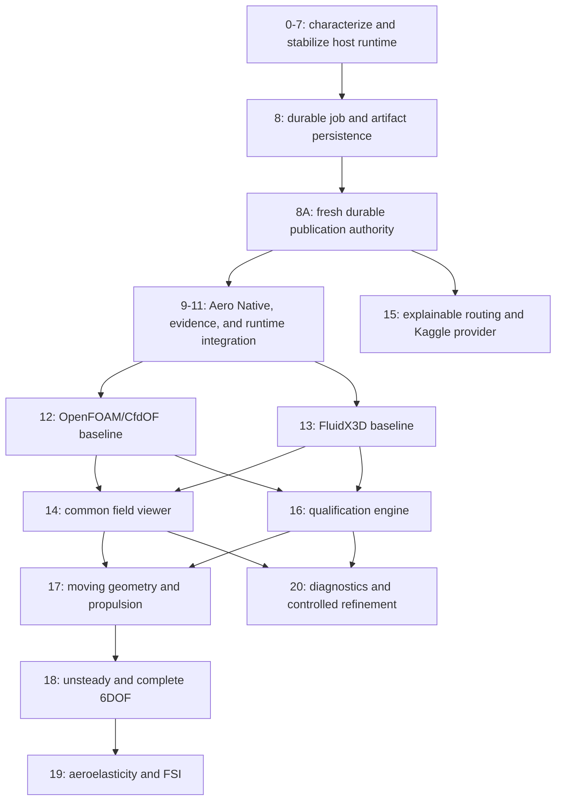

# VibeCADAero canonical roadmap

**Roadmap status:** active and canonical

**Live baseline audited:** `halthinks/vibecad@31ea810db044db6311207a2538a9b6f7694011ae` on 2026-08-25

**Scope:** VibeCAD host Analysis Runtime, Native Aero integration, the complete VibeCADAero solver ladder, evidence, visualization, remote compute, dynamics, and coupled analysis

This is the repository's real implementation roadmap for the recovered Advanced VibeCAD / VibeCADAero program. It converts the recovered research and design package into one dependency-ordered, evidence-bounded plan tied to the current source tree.

The roadmap is intentionally stricter than a feature list. A merged abstraction, a working process launch, a screenshot, or a numerical result does not complete a milestone unless its stated acceptance evidence also exists.

## 1. Source-of-truth order

Use these sources in this order:

1. **Current code, tests, and merged history** determine what is implemented now.
2. **This roadmap** determines the active sequence, status, acceptance criteria, and product boundary.
3. The [no-loss preservation supplement](vibecadaero-advanced-recovery/VIBECADAERO_SECOND_PASS_PRESERVATION_SUPPLEMENT.md) preserves the complete contracts, hazards, release gates, and source index.
4. The [recovered roadmap](vibecadaero-advanced-recovery/RECOVERED_ADVANCED_VIBECAD_ROADMAP.md) preserves the research-derived program and source anchors.
5. The [expanded 110-file source package](vibecadaero-advanced-recovery/source-package/) and its byte-for-byte ZIP are design evidence and reference material. They are not a drop-in patch and do not supersede newer host code.

If this roadmap and current implementation disagree about current status, the implementation wins and this roadmap must be corrected in the same pull request that discovers the drift. If a proposed change conflicts with a preserved architecture lock, stop and resolve the conflict explicitly; do not silently narrow or discard the requirement.

## 2. Status vocabulary

| Status | Meaning |
| --- | --- |
| **Verified complete** | The bounded milestone is present in current source, has executable coverage, and has no known remaining acceptance item inside that milestone. |
| **Partial** | A real slice is merged, but one or more required behaviors or release gates remain. |
| **Design-ready** | Detailed contracts and reference material are preserved, but no current integrated implementation was found. |
| **Not started** | No qualifying current implementation was found. |
| **Blocked** | Work cannot safely proceed until the named dependency or decision is resolved. |

“Verified complete” is milestone-specific. It never means the complete VibeCADAero product is finished.

## 3. Product objective and final definition of done

VibeCADAero will provide one integrated, multi-fidelity aerodynamic engineering environment inside VibeCAD that can:

- preserve exact geometry, configuration, frame, solver, provider, artifact, and publication provenance;
- run local low-order, local detached CPU/GPU, and qualified remote routes without confusing solver physics with compute location;
- support NeuralFoil, AeroSandbox VLM/lifting-line, engineering unsteady models, FluidX3D, and OpenFOAM through CfdOF under one coherent case/result model;
- visualize scalar, vector, surface, volume, wake, and time-dependent results in the VibeCAD/FreeCAD UI;
- keep solved, published, current, and qualified as independent claims;
- run moving-body, propulsion-interaction, unsteady, flight-dynamics, aeroelastic, and FSI workflows after their prerequisites are proven;
- reproduce and compare results from immutable inputs and exact toolchain identities;
- recover safely across application restart without serializing live authority or republishing by accident;
- make every engineering claim traceable to exact source geometry, case definition, solver build, settings, provider execution, input/output manifests, and publication receipt.

Final completion requires all roadmap milestones and all applicable release gates in this document. Nothing in the current baseline claims airworthiness or validated real-world flight safety.

## 4. Non-negotiable architecture locks

### 4.1 Host and domain ownership

The **host Analysis Runtime** owns only physics-neutral mechanics:

- durable job, attempt, provider, and artifact identity;
- lifecycle transitions, queue/concurrency policy, generic progress, bounded logs, timeout, cancellation, and failures;
- immutable manifests and hashes;
- restart reconciliation and provider reconnect orchestration;
- source-currentness validation orchestration;
- scheduling a domain-owned publication callback on the document thread;
- generic publication receipts, cleanup disposition, and quarantine/currentness disposition.

Each **engineering domain** owns:

- relevant source state and dependency fingerprints;
- conversion of live document state into immutable solver inputs;
- solver physics, mesh policy, configuration, boundary conditions, and parsing;
- result meaning and publication-draft construction;
- qualification, validation, claim ceilings, and domain result representation.

Each **compute provider** owns only where and how sealed work executes: capabilities, submit, poll, cancel, reconnect, collect, cleanup, logs, and provider execution receipts. Kaggle is a provider, never a solver.

**Native mutation authority** exclusively owns document-thread transactions, recompute, postcondition validation, structural revision, created/changed/deleted object receipts, and rollback. Worker threads, providers, and solver adapters may not mutate a live FreeCAD document.

### 4.2 Three distinct authorities

Long-running work must not turn an old approval into permanent mutation authority:

1. **Submission authorization** permits one exact immutable prepared analysis from one captured source state.
2. **Execution authority** permits only execution and collection of that sealed work.
3. **Publication authorization** is fresh and narrow for the exact completed result after source rebind, currentness validation, artifact validation, replay protection, and domain checks.

Persisted data may include inert identifiers, descriptors, manifests, hashes, revisions, receipts, and provider external IDs. It may not contain live `NativeRuntimeContext` objects, executable call tickets, callbacks, closures, FreeCAD/Qt objects, transaction handles, provider clients, credentials, tokens, threads, locks, futures, events, file descriptors, or `Popen` objects.

### 4.3 Independent state axes

Do not collapse these into one `SUCCEEDED` flag:

- **Execution:** `PREPARING`, `PREPARED`, `QUEUED`, `SUBMITTING`, `RUNNING`, `COLLECTING`, `SOLVED`, `FAILED`, `CANCELLED`, `TIMED_OUT`, `CAPABILITY_UNAVAILABLE`, or `ORPHANED`.
- **Publication/currentness:** `UNVALIDATED`, `VALIDATING_SOURCE`, `AWAITING_SOURCE`, `AWAITING_PUBLICATION`, `CURRENT`, `STALE`, `QUARANTINED`, `PUBLISHING`, `PUBLISHED`, or `PUBLICATION_FAILED`.
- **Qualification/evidence:** `not_solved`, `capability_unavailable`, `failed`, `model_unqualified`, `model_qualified`, or `measured`.

`SOLVED` does not mean published. `PUBLISHED` does not mean current forever. `returncode == 0` does not mean qualified. CFD output is derived evidence, not measured evidence. No state implies airworthiness.

### 4.4 Solver and provider separation

The solver ladder is:

| Level | Solver/model responsibility |
| --- | --- |
| 0 | Geometry, mass, configuration, frame, and source truth |
| 1 | NeuralFoil section analysis |
| 2 | AeroSandbox lifting-line/VLM |
| 3 | Engineering unsteady, strip, dynamic-stall, and hover models |
| 4 | FluidX3D high-throughput GPU LBM |
| 5 | OpenFOAM through the normal FreeCAD CfdOF path |
| 6 | Diagnostics, decomposition, cross-fidelity comparison, uncertainty, and refinement |

Providers may include in-process/local, detached local CPU/GPU, Kaggle remote compute, and future HPC/remote systems. Routing must be deterministic and explainable from actual availability, qualification, portability, resource estimates, device/quota facts, and user constraints. Providers do not select turbulence models, qualification states, or publication eligibility.

### 4.5 Compatibility locks

Unless an separately approved migration says otherwise, preserve:

- existing Native tool/action/schema names and synchronous Aero calls;
- `NativeBackgroundManager`, `NativeBackgroundSnapshot`, `native.job`, error/result shapes, one-active-job-per-document behavior, and current document-thread mutation boundaries;
- current FEM solver preparation, command/environment behavior, result graph, History, receipts, and public errors;
- current Aero ribbon/workbench actions, `AeroConfig`, `AeroReport`, `AeroPreview` compatibility behavior, and JSBSim export route;
- external solver overrides and optional dependency behavior;
- additive-first delivery with rollback by pull-request revert until a separately approved durable migration exists.

Protected public details include capability `analyze.solver_execution`, operation `run`, the current target schema/request modes, background response keys `job` and `next`, `native.job` operations `status` and `cancel`, Native/Aero bindings and dispatch, ribbon/GUI/agent routes, error families/codes, transaction behavior, FEM result graph/History/state hashes/receipts, CMake registration, installed-tree imports, and old modules used as compatibility facades.

Do not invent `start`, `clear`, a renamed capability, or a raw `/v1/run` solve/mutation escape hatch. New global discovery/recovery APIs must be additive and versioned. The temporary `legacy_fem_execution` versus `analysis_runtime_fem` switch described by the recovery package is a rollback mechanism, not a permanent user-facing product choice.

## 5. Verified live baseline

The audit of `main@31ea810db` found the following real implementation. These are foundations, not high-fidelity completion claims.

| Live capability | Current evidence | Honest boundary |
| --- | --- | --- |
| Domain-neutral in-memory Analysis Runtime beneath NativeBackground | `tool_impl/analysis_runtime.py`, the `VibeCADAnalysis*.py` source facades, merged PR #67, `test_analysis_runtime.py` | In-memory only; no restart recovery. Source-tree imports work, but `VibeCADAnalysisRuntime.py`, `VibeCADAnalysisContracts.py`, `VibeCADAnalysisArtifacts.py`, `VibeCADAnalysisProviders.py`, and `VibeCADAnalysisLocalProvider.py` are absent from `VibeCAD_Scripts` in `src/Mod/VibeCAD/CMakeLists.txt`, so build-tree/installed downstream imports are not yet a supported, tested compatibility surface. |
| One active background job per document, monotonic terminal state, status/cancel | Runtime manager and `native.job` surface | No durable job identity across application restart. |
| Atomic cancellation-versus-commit ordering | `VibeCADNativeBackground.py`, merged PR #63, race tests in `test_native_background_commit_gate.py` | Proven for the current in-memory path; durable replay/publication ownership is still missing. |
| Shared shell-free bounded local process sequence | `VibeCADScriptedProcess.py`, merged PR #61, process tests | POSIX process groups exist; Windows descendant-process ownership is not proven complete. |
| Provider contracts and local provider | `VibeCADAnalysisProviders.py`, `tool_impl/analysis_local_provider.py` | Local provider reports reconnect unsupported; no remote provider is integrated. |
| Host contracts for prepared analyses and manifests | `tool_impl/analysis_contracts.py`, `tool_impl/analysis_artifacts.py` | Contracts exist; the complete durable content-addressed artifact system does not. |
| Current supported FEM solver execution through host local provider | `tool_impl/analysis_fem_adapter.py` covers CalculiX, Elmer, Z88, and Mystran; provider-specific tests | Full A/B parity evidence and long stabilization/recovery gates remain roadmap obligations. |
| Native Aero background client | merged PR #81; `VibeCADNativeAeroRuntime.py`; `test_native_aero_analysis_runtime.py` | Current low-order Aero operations only; not FluidX3D or OpenFOAM. |
| Aero stale-ticket and geometry-revision checks before queue/publication | `VibeCADNativeAeroRuntime.py`, `AeroPreview.geometry_revision`, stale tests | Full dependency-scoped currentness/evidence correspondence is incomplete. |
| Current Aero low-order/product slice | NeuralFoil, AeroSandbox VLM, momentum-theory hover, bounded repairs, `AeroReport`, and JSBSim export | Results remain low-order/model-bounded; current JSBSim output is generated from solved coefficients, not high-fidelity CFD. |
| Human-authorized JSBSim output | Native Aero output authorization, hash guard, archive validation | This is output authorization, not the durable CFD publication coordinator. |

No current integrated implementation was found for Aero FluidX3D, Aero CfdOF/OpenFOAM, Kaggle compute, common CFD field visualization, benchmark qualification registry, high-Re FluidX3D, moving geometry, propulsion-interaction CFD, complete unsteady 6DOF, aeroelasticity/FSI, or advanced refinement orchestration.

## 6. Dependency graph

Remote execution may be prototyped against inert test fixtures, but it may not become a production route before durable job identity, restart/reconnect behavior, artifact validation, and fresh publication authority are complete.

### Roadmap at a glance

| Step | Current status | What remains before the step is closed |
| --- | --- | --- |
| 0 — live reconciliation | **Verified complete for this baseline** | Repeat on a newer `main` before implementation and record drift. |
| 1 — characterization | **Partial** | Complete normalized lifecycle and FEM legacy/host A/B oracles across Windows/POSIX. |
| 2 — host contracts/facades | **Partial** | Register all five public `VibeCADAnalysis*` facade modules in CMake and prove imports from build and installed trees without the source module directory on `sys.path`; retain domain neutrality and additive compatibility. |
| 3 — local process mechanics | **Partial** | Prove complete descendant-process ownership and cleanup on Windows and POSIX. |
| 4 — input/artifact sealing | **Partial** | Finish safe immutable manifests, storage, archive/path defenses, and evidence-aware cleanup. |
| 5 — host orchestration | **Verified complete for the in-memory compatibility slice** | Persistence/recovery remain explicitly outside this step. |
| 6 — current FEM migration | **Verified complete for CalculiX, Elmer, Z88, and Mystran** | Close the full A/B parity and rollback gates. |
| 7 — stabilization | **Partial** | Complete stress, leak/orphan, cross-platform, lifecycle, and rollback burn-in. |
| 8 — durable persistence | **Design-ready** | Implement versioned transactional job metadata and immutable artifact recovery. |
| 8A — publication authority | **Design-ready** | Implement fresh exact-source publication authorization and replay-idempotent receipts. |
| 9 — Aero repair authority | **Partial** | Converge host revision and preview/apply/reject authority; define bounded preview persistence. |
| 10 — Aero evidence/frames | **Partial** | Complete case schema, frames/references, readiness, correspondence, stamps/results/context, and claim ceilings. |
| 11 — Aero runtime client | **Partial** | Generalize the integrated low-order client across solver-neutral high-fidelity cases/results. |
| 12 — OpenFOAM/CfdOF | **Design-ready** | Build and benchmark a real end-to-end Aero baseline through the normal CfdOF path. |
| 13 — FluidX3D | **Design-ready** | Implement pinned build/bridge, exact notice, physical scale/domain/units/forces/fields, and benchmarks. |
| 14 — field viewer | **Design-ready** | Build the common source-bound scalar/vector/volume/time UI with bounded loading. |
| 15 — routing/Kaggle | **Design-ready** | Add explainable routing and restart-safe remote compute after persistence/publication gates. |
| 16 — qualification/high-Re | **Design-ready** | Build benchmark/envelope registry and complete high-Re sensitivity/convergence evidence. |
| 17 — moving/propulsion | **Design-ready** | Implement validated moving boundaries, rotor/prop fidelity, interaction, and feedback. |
| 18 — unsteady/6DOF | **Partial only for current low-order JSBSim export** | Complete validated unsteady, lateral/control/propulsion/gust inputs and coupled dynamics. |
| 19 — aeroelasticity/FSI | **Design-ready** | Implement structural authority, mapping, partitioned coupling, convergence, and flutter validation. |
| 20 — diagnostics/refinement | **Design-ready** | Compose uncertainty, convergence, comparison, decomposition, and refinement from host jobs. |

## 7. Dependency-ordered implementation roadmap

### Step 0 — live re-reconciliation

**Status: Verified complete for baseline `31ea810db`; repeat at every implementation tranche.**

The current tree, merged host-runtime history, Native Aero runtime, process helper, FEM adapter, tests, build registration, and recovered source package were compared. Newer host ownership was adopted where it already controls a seam; the frozen overlay remains reference evidence only.

Exit evidence:

- record exact `main` SHA and audit date;
- identify source owners for every seam touched by the next tranche;
- list drift from the previous baseline;
- update this roadmap when implementation status changes.

### Step 1 — characterize current FEM/background behavior

**Status: Partial.**

Real characterization exists for the generic runtime, atomic commit gate, shared process sequence, Native Aero background path, and each currently supported FEM local-provider path. The complete golden normalized lifecycle/A-B parity matrix is not yet present as one executable oracle.

Remaining exit criteria:

- capture normalized lifecycle traces for process, input digest, exact command/environment identity, stale checks, result graph/History, receipts, public APIs/errors, timeout/cancel, cleanup, document close/switch/reopen, and Windows/POSIX behavior;
- establish explicit legacy-versus-host A/B fixtures for all supported FEM solver paths;
- record accepted intentional differences before further extraction.

### Step 2 — introduce host Analysis contracts and facades

**Status: Partial.**

Domain-neutral contracts, provider interfaces, artifact helpers, source-tree facades, and Native compatibility surfaces exist. This status does not include persistence, remote providers, or domain qualification.

The compatibility surface is not complete in build-tree or installed deployments. `src/Mod/VibeCAD/CMakeLists.txt` copies and installs the explicit `VibeCAD_Scripts` list plus `tool_impl/*.py`, but the following public source facades are not registered in `VibeCAD_Scripts`:

- `VibeCADAnalysisRuntime.py`;
- `VibeCADAnalysisContracts.py`;
- `VibeCADAnalysisArtifacts.py`;
- `VibeCADAnalysisProviders.py`;
- `VibeCADAnalysisLocalProvider.py`.

Source-tree tests can import these modules because the source module directory is on `sys.path`; that does not prove downstream callers can import them from a build-tree or installed VibeCAD module.

Before Step 2 can be marked verified complete:

- register all five facades in `VibeCAD_Scripts` so the existing build-tree copy and install rules include them;
- add an installed-tree import test that imports every public facade with only the deployed `Mod/VibeCAD` location available, explicitly excluding the source module directory from `sys.path`;
- exercise the same import smoke against the CMake build-tree copy;
- retain the existing source-tree tests and prove the installed facades remain domain-neutral, additive, and free of import-time Aero/FluidX3D/OpenFOAM/Kaggle dependencies.

Guardrails:

- keep contracts serializable and domain-neutral;
- keep old public surfaces available while clients migrate;
- do not move physics or FreeCAD mutation into host contracts.

### Step 3 — extract local process mechanics

**Status: Partial.**

The shared direct-argv, shell-free local process sequence is integrated and the current FEM solvers use `LocalProcessProvider`. Timeout, cancellation, bounded output, cwd/environment preservation, and error mapping have executable coverage.

Remaining exit criteria:

- reproduce and test descendant-spawning workloads on Windows and POSIX;
- ensure timeout/cancel owns and terminates the entire process tree, including wrappers, MPI ranks, and helpers;
- prove no orphan survives cleanup;
- prove redaction before any future durable log persistence;
- keep any process-tree fix isolated from scheduler, persistence, and solver changes.

### Step 4 — extract input and artifact sealing

**Status: Partial.**

Prepared-analysis, dependency, command, manifest, and artifact contracts exist, and FEM input identity is represented. The complete safe immutable workspace/content-addressed artifact lifecycle is not integrated.

Remaining exit criteria:

- preserve the exact accepted FEM directory-digest behavior while adding generic manifests;
- implement immutable input/output manifests with role, logical name, media type, bytes, SHA-256, producer/job/provider/solver identity, source correlation, exactness class, and timestamps;
- reject traversal, unsafe symlinks, unsafe archive extraction, unbounded bundles, and hash mismatch;
- keep large artifacts outside FCStd while allowing compact references/evidence in the document;
- make cleanup effect-idempotent and evidence-aware.

### Step 5 — extract orchestration behind NativeBackground

**Status: Verified complete for the in-memory compatibility slice.**

Merged PR #67 moved generic prepare/worker/document-thread-commit orchestration into the installed host Analysis Runtime while preserving `NativeBackgroundManager`, public errors/results, one-active-job policy, atomic commit gate, and existing clients.

This step explicitly excludes persistence, restart recovery, new concurrency, remote providers, and solver/domain changes.

### Step 6 — migrate FEM one solver at a time

**Status: Verified complete for the currently supported detached solver set; parity gate remains open.**

CalculiX, Elmer, Z88, and Mystran execution route through the host local provider with compatibility mappings and solver-specific tests.

Remaining program obligations:

- complete Gate 5 A/B parity evidence for exact inputs, commands, environment identity, result graph, History, receipts, public outputs/errors, and cleanup;
- treat any future FEM backend as a new solver migration requiring its own parity proof;
- do not use this milestone to change FEM publication semantics.

### Step 7 — stabilization interval

**Status: Partial.**

Multiple host-runtime correctness slices have landed and dedicated regression tests exist. A named stabilization interval with cross-platform stress, leak/orphan checks, and a frozen compatibility report has not been completed.

Remaining exit criteria:

- run repeated cancel/timeout/close/switch/reopen and process-output-bound stress;
- test Windows and POSIX process behavior;
- confirm no job, thread, process, workspace, or document mutation leaks;
- publish the parity and known-difference report before persistence work begins.

### Step 8 — durable host metadata and artifact persistence

**Status: Design-ready; not implemented.**

Implement versioned transactional local persistence for compact job metadata plus immutable/content-addressed artifact storage in per-user VibeCAD application data. FCStd stores compact references and engineering evidence, not multi-gigabyte solver artifacts.

Required durable data:

- job, analysis, attempt, domain, adapter, solver, provider, and source-document identities;
- frozen dependency snapshot and input/output manifests;
- provider external job ID and capability snapshot;
- lifecycle state, timestamps, deadline/cancellation data, bounded event/log references;
- execution receipt, structured failure, cleanup disposition, and inert publication descriptor.

Required crash ordering:

1. persist prepared descriptor before provider submission;
2. persist provider external ID immediately after successful submission;
3. seal and persist output manifest before publication;
4. persist publication intent/gate where supported;
5. commit the CAD transaction;
6. persist the publication receipt;
7. only then persist terminal success.

Restart rules:

- completed/published jobs reopen as history;
- reconnect-capable remote jobs use the authoritative provider ID;
- unrecoverable local jobs become structured `host_interrupted`/orphaned records;
- leftover files or PIDs never prove success;
- no result republishes because a document with the same name or path opens.

### Step 8A — durable publication authority

**Status: Design-ready; not implemented.**

Build an independent publication coordinator using inert descriptors, exact `Document.Uid` rebind, validated output manifests, domain currentness, adapter compatibility, fresh Native authorization, one publication owner, and replay-idempotent receipts.

Required preconditions before mutation:

1. exact persisted job/submission identity;
2. validated immutable output manifests and hashes;
3. unambiguous exact-source-document rebind;
4. domain resolution of intended result targets;
5. currentness report against frozen dependencies;
6. known-compatible publication recipe/adapter version;
7. no existing successful receipt for the same publication identity;
8. fresh authorization for this exact publication;
9. document-thread transaction through Native mutation authority;
10. postconditions plus atomic receipt, otherwise rollback.

Duplicate callback, reconnect, UI retry, or crash recovery must return the existing receipt rather than create a second result graph. Initial FEM behavior remains globally strict and unchanged until a separately approved migration.

### Step 9 — close the Aero/Native repair revision gap

**Status: Partial.**

Current Native Aero operations reject stale Native tickets and background solves recheck Aero geometry revision before publication. Aero propose/apply repair operations use current ticket checks and `AeroPreview` revision behavior.

Remaining exit criteria:

- thread the actual host structural revision through every `/v1/aero` propose/apply path;
- converge Aero repair authorization onto the host preview/apply/reject authority instead of maintaining a second generic controller;
- define preview lifetime, retention, bounded storage, restart behavior, and stale rejection;
- keep `AeroPreview` as a compatibility seam until convergence is proven.

### Step 10 — Aero evidence, readiness, frames, and source correspondence

**Status: Partial.**

The current low-order Aero path has configuration, geometry revision, report objects, source selection, JSBSim hashes, and bounded stale checks. The full common evidence/readiness/frame contract is not integrated.

Remaining exit criteria:

- define CAD/body/solver/world frames, axes, handedness, origins, signs, units, transforms, reference area/lengths, force and moment reference points;
- make source correspondence explicit from exact/derived/presentation artifacts back to named CAD bodies and dependency fingerprints;
- publish machine-readable geometry readiness and blocking diagnostics;
- adopt the host evidence/artifact taxonomy and independent execution/publication/qualification state axes;
- distinguish source-current, stale historical, quarantined, and unbound results;
- prove no screenshot, mesh, CFD field, or solver exit code is mislabeled as measured or qualified evidence.

The recovered reference schema identifier is `vibecad.aero.cfd/1`. Its production case identity binds the exact document UID, captured host Native revision, Aero geometry revision/hash, geometry artifact hash, flow/atmosphere, reference quantities, solver backend/model/build/settings, and compute-provider request. Result identity includes schema version, case ID, solver backend, compute provider, execution state, method, evidence/claim fields, force/moment, coefficients, diagnostics, and hashed artifacts.

Canonical body axes are `+X` forward, `+Y` right, and `+Z` down. Freestream is expressed in body axes in m/s. Every backend records body-to-solver transform and origin and normalizes force/moment back into body axes. Lift, drag, and side force are projections onto an explicit aerodynamic basis derived from freestream and the configured lift-up vector; no backend may silently assume `Fx = drag` or `Fz = lift`. Reference quantities explicitly include density, velocity, `Sref`, chord/length, span, area definition, and moment-reference point.

Geometry readiness and artifact exactness remain independent. The readiness ladder is:

1. `unknown`;
2. `brep_accepted`;
3. `surface_closed`;
4. `surface_watertight`;
5. `fluid_domain_ready`;
6. `mesh_ready`;
7. `solver_input_frozen`.

Native B-rep/STEP is `exact`. STL/OBJ/surface meshes, OpenFOAM volume meshes, FluidX3D voxel grids, CFD fields/results, and VTK/VTM are `derived`. Screenshots, renders, and animation frames are `presentation`. Each derived artifact records source geometry, case, settings, conversion, producer hashes, and correspondence where available.

`AeroResults.py` remains the durable engineering-result authority and is extended additively with case/hash, solver/model/build, provider job, captured revisions, frozen-input/artifact provenance, qualification, convergence, force/moment/reference, coefficient references, fields, currentness, and uncertainty. `VibeCADAeroContext.py` remains bounded: it exposes summaries and reasons, never huge fields or full solver traces.

### Step 11 — make Aero the second Analysis Runtime client

**Status: Partial, with the current low-order client integrated.**

Native Aero `analyze`, `section`, and `vlm` can prepare detached immutable input, run through the shared Analysis Runtime, revalidate geometry and Native revision, and publish on the document thread. Synchronous behavior remains available.

Remaining exit criteria for the complete domain client:

- generalize Aero case preparation, dependency snapshots, solver-neutral result contracts, parser boundaries, publication drafts, and qualification adapters across the full solver ladder;
- keep solver and provider selection separate;
- make artifact/evidence/currentness contracts common to low- and high-fidelity routes;
- preserve existing low-order commands and report semantics while adding the new case/result surfaces.

### Step 12 — complete OpenFOAM through CfdOF baseline

**Status: Design-ready; no integrated Aero baseline found.**

Use the normal FreeCAD CfdOF/OpenFOAM workflow rather than inventing a parallel stale API.

Required scope:

- real fluid-domain construction and geometry correspondence;
- explicit boundary conditions, reference frames, turbulence/physical model, material properties, and solver controls;
- mesh generation and quality checks that distinguish surface meshes from fluid volume meshes;
- exact case manifests, command/toolchain identity, solve monitoring, bounded logs, and cancellation;
- force, moment, coefficient, field, residual, and convergence collection;
- domain-owned parsing, publication draft, currentness, and qualification evidence;
- benchmark fixtures and failure diagnostics.

Exit requires at least one reproducible benchmark case with input/output hashes, parsed forces/coefficients, field artifacts, UI publication, model-unqualified labeling unless a benchmark envelope matches, and documented local setup.

### Step 13 — complete vendored FluidX3D baseline

**Status: Design-ready; no integrated baseline found.**

FluidX3D is the remembered backend with the `I understand.` first-use checkbox. Its source pin, reference bridge, policy, tests, and license evidence are preserved in the recovery package. The reference overlay must be reconciled with current source before any code is adopted.

Required technical scope:

- pinned vendored source under `src/Mod/VibeCADAero/vendor/FluidX3D/` when distribution permission allows it;
- reproducible build and exact build identity;
- honest accelerator/device capability probing and external-install override;
- real bridge compatible with FluidX3D `main_setup` and actual APIs—no invented Python API or CLI flags;
- explicit CAD-to-lattice scale, domain sizing, boundary conditions, voxelization correspondence, memory estimate, and resolution controls;
- correct FluidX3D Units conversion for time, force, and torque;
- force/torque integration, coefficients, scalar/vector fields, provenance, currentness, and benchmark fixtures;
- model-unqualified output unless exact build/model/settings/envelope match versioned qualification evidence.

#### Exact first-use notice contract

On the first entry into VibeCADAero—not once per run, solver choice, backend version, or product update:

- title the notice **`Third-Party Software Notice`**;
- explain factually that VibeCAD Aero can use third-party software with component-specific terms, identify FluidX3D as one such solver, and state that the included component license/notices are authoritative;
- explain that FluidX3D's terms do not relicense VibeCAD, unrelated Aero backends, or user-created CAD designs, and do not change output ownership;
- provide a direct path to the included Third-Party Notices/license;
- checkbox text is exactly **`I understand.`**;
- action text is exactly **`Continue`**, and Continue remains disabled until the box is checked;
- persist one local unversioned boolean in preference group `User parameter:BaseApp/Preferences/Mod/VibeCADAero` under key `ThirdPartyNoticesAcknowledged`;
- normally never show the notice again, including after product, backend, or license-document updates;
- never transmit the flag; it records only that the notice was seen;
- give the bit no effect on solver eligibility, licensing, product behavior, or output ownership;
- do not ask intended use, classify the user, collect purpose, create telemetry/audit trails, or enforce commercial/military purpose in runtime job logic.

The notice is informed acknowledgement, not `I agree`, a license grant, a purpose declaration, an entitlement/compliance check, or a solver-selection control. FluidX3D's included license remains authoritative. VibeCAD must not invent a commercial agreement, price, EULA, redistribution grant, or deployment model.

The recovered license review recorded FluidX3D-specific commercial-use, military-use, AI-training, attribution/alteration, publication/source, citation, and license-retention conditions. That is historical source-pin evidence, not a substitute for rereading the exact included license at each re-vendor/release decision.

The recovered packaging policy distinguishes distribution profiles without purpose policing: non-commercial source/release engineering may vendor the pinned source and preserve its license/origin; commercial distributions exclude or disable the vendored payload by default unless compatible permission allows bundling; an explicitly configured external bridge remains supported; no normal run auto-downloads source. Re-vendoring freezes a new commit, rechecks API/build/license documents, rebuilds the bridge, reruns unit/scale/force/torque/domain/refinement/field/packaging tests, and updates the pin.

### Step 14 — common field and result viewer

**Status: Design-ready; not implemented.**

Build one VibeCAD/FreeCAD visualization path for high-fidelity results while jobs and artifact storage remain host-owned and physics meaning remains domain-owned.

Required surfaces:

- result tree with source case, solver, provider, currentness, and qualification badges;
- scalar surface fields, vector glyphs, streamlines/pathlines, slices, probes, residual/history plots, force/moment time histories, and volume views where supported;
- deformation/motion-aware time steps and animation;
- explicit units, frame, scale, legend, timestep, exactness class, and source-artifact identity;
- stale/quarantined results remain viewable as attributable history without appearing current;
- bounded/lazy data loading suitable for large CFD fields.

### Step 15 — explainable routing and Kaggle provider

**Status: Design-ready; not implemented.**

Kaggle is a remote compute provider. It does not define the solver, physics, mesh, or qualification.

Prerequisites: Steps 8, 8A, and local provider/recovery gates must be complete.

Required scope:

- provider capability snapshots, auth readiness, live quota/device facts, input/output size limits, cancellation/reconnect/log support, and immutable provider receipts;
- upload only sealed portable inputs with no hidden dependency on the local FreeCAD process;
- persist authoritative remote job identity immediately;
- reconnect after restart, collect bounded artifacts, verify manifests/hashes, parse off-document, revalidate source/currentness, and request fresh publication authorization;
- deterministic auto-routing with a human-readable explanation and manual override;
- no dummy sleep jobs, fixed quota assumptions, hard-coded GPU assumptions, or solver/provider conflation.

### Step 16 — qualification engine and high-Re FluidX3D

**Status: Design-ready; not implemented.**

Build a versioned benchmark registry and qualification-envelope engine before making validated-model claims.

Required scope:

- benchmark identity, trusted reference data, geometry/case/toolchain hashes, exact model/settings, mesh/grid family, acceptance metrics, uncertainty, and applicable envelope;
- separate code correctness, numerical convergence, model validation, and operational qualification;
- automated match from a result to exact benchmark evidence and envelope;
- high-Re FluidX3D turbulence/model choice, domain sensitivity, startup/transient removal, force averaging, stability, and grid-convergence studies;
- cross-solver comparisons without treating agreement as ground truth;
- explicit claim ceilings and reason codes when no qualification matches.

### Step 17 — moving geometry and propulsion interaction

**Status: Design-ready; not implemented.**

Required scope:

- rigid-body identities, motion laws, reference frames, constraints, and exact source correspondence;
- moving boundaries/revoxelization or solver-appropriate mesh motion with conservation and quality checks;
- rotor/propeller fidelity tiers, actuator approximations where appropriate, rotating-frame/sliding/moving methods where supported, wake-body/wing interaction, and force/torque feedback;
- time-step, motion, interpolation, and coupling provenance;
- benchmarks for moving boundaries, rotating systems, and propulsion interaction.

### Step 18 — unsteady analysis and complete 6DOF

**Status: Partial only for the existing low-order JSBSim export; high-fidelity milestone not implemented.**

The current Aero workbench can generate a JSBSim plant from solved low-order coefficients. The XML itself states that it is not CFD. Complete this milestone only after validated unsteady and propulsion inputs exist.

Required scope:

- versioned unsteady/strip/dynamic-stall models with applicable envelopes;
- full longitudinal and lateral derivatives, controls, propulsion, mass/inertia, atmosphere, wind, gust, ground/contact where applicable, and frame/sign/unit correctness;
- time-dependent high-fidelity force/moment ingestion where justified;
- closed-loop or co-simulation architecture with explicit ownership of timestep, interpolation, latency, and feedback;
- retain the JSBSim production route, but label each coefficient source and qualification state;
- reproducible trim, perturbation, maneuver, and regression cases.

### Step 19 — aeroelasticity and FSI

**Status: Design-ready; not implemented.**

Required scope:

- authoritative structural model/material/boundary-condition ownership;
- fluid/structure surface correspondence and conservative field/mesh mapping;
- partitioned coupling protocol, timestep ownership, relaxation/acceleration, convergence criteria, rollback/retry, and failure semantics;
- deformation publication without corrupting source geometry;
- static aeroelastic, dynamic response, and flutter validation with mesh/time-step/coupling sensitivity;
- complete provenance across both solvers, mapped fields, iterations, and publication receipts.

### Step 20 — advanced diagnostics and controlled refinement

**Status: Design-ready; not implemented.**

Required scope:

- wake/vortex and force decomposition, residual/convergence diagnostics, uncertainty, grid/time-step convergence, sensitivity, and cross-fidelity comparison;
- refinement studies expressed as compositions of host jobs, not a second scheduler;
- deterministic case-family identity and immutable parent/child lineage;
- cost/resource estimates and stop rules;
- result summaries that preserve individual cases and never hide divergent or failed evidence behind one aggregate score.

## 8. Required UI surfaces

The final UI must expose, without requiring console use:

1. **Aero case editor:** geometry/source correspondence, frames, reference quantities, model, boundaries, mesh/grid, solver, provider, resource estimate, and readiness blockers.
2. **Run control:** explicit route explanation, exact capability/dependency status, progress, cancel, retry/reconnect, and bounded diagnostics.
3. **Job/history panel:** execution, publication/currentness, and qualification shown independently; exact input/output/toolchain/provider identities; restart-visible history.
4. **Publication review:** exact completed job, source document/revision/dependencies, stale/current result, proposed document mutation, artifact evidence, and fresh Apply/Reject authorization.
5. **Result/field viewer:** common plots and fields from Step 14 with frame, units, source, currentness, and qualification always visible.
6. **Qualification view:** matching benchmark/envelope, metrics, failures, claim ceiling, and links to immutable evidence.
7. **FluidX3D first-use notice:** exact `I understand.` contract in Step 13 and the preserved [standalone notice specification](vibecadaero-advanced-recovery/RECOVERED_FLUIDX3D_FIRST_USE_GATE.md).

Do not add a second generic Aero Apply/Reject controller. Converge onto the host Native preview/publication authority while retaining compatibility until migration is proven.

## 9. Release gates that cannot be skipped

| Gate | Required proof |
| --- | --- |
| **G0 Fresh source freeze** | Exact live SHA, drift record, code/test/build reread, owner map, and updated roadmap status. |
| **G1 Characterization** | Public APIs, exact process/inputs/digests, result graph/History/receipts, errors, timeout/cancel, document lifecycle, and platform traces. |
| **G1A Cancellation/commit race** | Concurrent stress proves an accepted cancellation and later CAD mutation cannot coexist. Current in-memory path has this proof; durable path must repeat it. |
| **G1B Process-tree ownership** | Child-spawning tests on Windows and POSIX prove timeout/cancel/cleanup terminate descendants. |
| **G2 Pure state machine** | Linearizable publication ownership, monotonic terminal state, replay safety, idempotent cleanup, and independent state axes. |
| **G3 Local provider** | Direct argv/no shell, cwd/environment preservation, bounded logs, timeout/cancel, tree cleanup, output sealing, unsafe-path rejection, and redaction. |
| **G4 Document lifecycle** | Exact source publishes; switched/closed/replaced/same-name wrong source does not; reopened exact source is rebound and revalidated; stale output remains attributable history. |
| **G5 FEM A/B parity** | Solver files/hashes, command/environment, return behavior, result object graph/membership/History, hashes/receipts, public JSON/errors, and cleanup. |
| **G6 Persistence/recovery** | Fault injection at queued, submitted-before-ID, running, output-sealed, waiting-to-publish, and receipt-written-before-terminal-success boundaries. |
| **G6A Publication authority** | UID semantics, inert persistence, awaiting-source/publication states, domain drift quarantine, fresh authorization, one receipt, rollback, replay, and incompatible-adapter refusal. |
| **G7 Rollback exercise** | Representative cases run through the extracted path, switch back to legacy, and prove no schema/CAD state prevents fallback. |
| **G8 Aero adoption** | Aero uses shared execution only after FEM parity/burn-in while domain authority remains in Aero and physics stays out of the host. The current low-order client is partial satisfaction, not the high-fidelity gate. |
| **G9 Aero domain contracts** | Frames, readiness, source correspondence, dependencies, artifact/evidence taxonomy, currentness, publication draft, and claim ceilings. |
| **G10 Solver baseline** | Reproducible real benchmark, exact toolchain/case manifests, fields/forces, cancellation/failure behavior, publication, and honest qualification for each high-fidelity solver. |
| **G11 Remote provider** | Live capability/quota checks, immutable upload, persisted remote identity, restart reconnect, bounded logs/artifacts, hash verification, fresh publication, and deterministic routing explanation. |
| **G12 Dynamics/coupling** | Validated timestep/frame/feedback/mapping behavior, convergence and sensitivity evidence, rollback/failure semantics, and complete cross-domain provenance. |

A gate may be satisfied in a dedicated pull request or by a later pull request with equivalent evidence, but it may not be waived by prose.

## 10. Test and evidence matrix

Every implementation pull request must identify the affected rows and provide proportional tests.

| Area | Minimum automated evidence | Integration evidence |
| --- | --- | --- |
| Contracts/serialization | schema validation, canonical serialization/hash, forbidden-live-object rejection, version compatibility | save/restart/reload fixture where durable |
| Packaging/import compatibility | static CMake membership check for every public facade and source-directory exclusion in import smoke | import every public `VibeCADAnalysis*` facade from the CMake build tree and an installed `Mod/VibeCAD` tree |
| Lifecycle | all legal/illegal transitions, monotonic terminal state, cancel/publication race, replay | threaded stress and restart fault injection |
| Local processes | exact argv/env/cwd, timeout, cancel, output bound, redaction, tree kill | real child-spawning fixture on Windows and POSIX |
| Artifacts | manifest/hash, traversal/symlink/archive rejection, size bounds, cleanup | corrupt/missing/duplicate artifact recovery |
| Document publication | exact source/revision/dependencies, transaction rollback, receipt idempotence | close/switch/reopen/replaced/same-name cases in FreeCAD |
| FEM compatibility | solver-specific legacy/host A/B outputs and errors | representative installed solver runs |
| Aero low-order | coefficient/config/frame regression and stale checks | current ribbon/Native/synchronous workflows |
| OpenFOAM/CfdOF | case generation, parse, field/force identity, failure mapping | real benchmark through normal CfdOF path |
| FluidX3D | bridge/build/unit conversion, scale/domain/force fields, notice preference | pinned real benchmark on supported GPU plus external override |
| Remote/Kaggle | capability/auth/quota routing, reconnect, artifact verification | real remote job and restart reconnect |
| Visualization | units/frame/currentness/source binding, lazy bounds | real large field and stale-history view |
| Qualification | exact benchmark/envelope matching, rejection reason codes | repeat benchmark and cross-version invalidation |
| Dynamics/FSI | mapping/timestep/convergence/feedback determinism | validated canonical coupled cases |

Documentation-only roadmap changes do not require red/green production tests, but links, package hashes, manifest coverage, status evidence, and Markdown integrity must be checked.

## 11. Known hazards and forbidden shortcuts

Keep these visible during planning and review:

- Do not treat the recovered overlay as integrated production code.
- Do not serialize live Native, FreeCAD, Qt, provider, process, or credential authority.
- Do not allow accepted cancellation and later document mutation to coexist.
- Do not infer success from leftover PIDs/files, solver exit code, screenshots, or one plausible coefficient.
- Do not attach results to a same-name/same-path but wrong document.
- Do not republish on reconnect, retry, restart, or duplicate callback.
- Do not combine process extraction, persistence, physics changes, and publication redesign in one unreviewable change.
- Do not invent FluidX3D Python APIs/CLI flags, CfdOF APIs, Kaggle quotas, GPU guarantees, commercial terms, or purpose-enforcement logic.
- Do not call a surface mesh an OpenFOAM fluid volume mesh.
- Do not claim high-Re validity without domain, model, averaging, stability, and grid-convergence evidence.
- Do not call CFD output measured, model-qualified without a matching registry entry, or airworthy.
- Do not let providers choose physics or let workers/providers mutate FreeCAD.
- Do not add a second scheduler for refinement or a second generic Apply/Reject controller for Aero.
- Do not let large result fields bloat FCStd or load unboundedly into the UI.
- Do not omit new source/tests/resources from CMake and the installed product; a source-tree-only pass is not integration.
- Preserve the bundled FreeCAD NumPy `<2` ABI constraint unless the whole runtime compatibility boundary is deliberately migrated and tested.
- Do not destructively rewrite big-bang history or combine framework extraction, persistence, provider work, solver physics, UI, and qualification in one change.
- Do not silently remove external solver overrides, existing Aero actions, synchronous behavior, result history, or exact public error contracts.

## 12. Stop conditions

Stop the affected implementation slice and resolve explicitly if:

- the live tree owner or public compatibility behavior cannot be determined;
- characterization differs from the assumed oracle;
- a cancel/commit race or process-tree leak is reproducible but not isolated;
- exact source document UID/currentness cannot be proven;
- output manifests, hashes, or publication identity are missing or ambiguous;
- crash recovery cannot distinguish receipt-written success from an incomplete publication;
- a solver/provider version or license differs from the pinned/reviewed source;
- FluidX3D distribution permission is unclear for the intended build;
- a CfdOF/FluidX3D/Kaggle API assumption is unverified against the exact dependency;
- a qualification claim lacks exact benchmark/envelope evidence;
- an implementation would move physics into the host, mutation into a worker/provider, or authorization into persisted executable state;
- rollback would require destructive migration without a separately approved migration and recovery plan.

## 13. Next executable tranches

The next work should be small, reversible, and dependency-ordered:

1. **Close Steps 1, 2, and 7:** produce the complete host/FEM characterization and A/B parity matrix; register all five public Analysis facades in CMake; prove build-tree and installed-tree imports without source-tree path leakage; complete Windows/POSIX process-tree tests and a stabilization report.
2. **Close Step 4:** finish immutable workspace/artifact sealing and safety tests without changing persistence or scheduling.
3. **Implement Step 8:** add versioned transactional metadata/artifact persistence with restart fault injection, but no new publication semantics.
4. **Implement Step 8A:** add fresh durable publication authority and replay-idempotent receipts independently, preserving current FEM publication behavior.
5. **Close Steps 9-11:** converge Aero repair authority and complete common Aero evidence/readiness/frame/case contracts on the shared runtime.
6. **Implement real high-fidelity baselines:** OpenFOAM/CfdOF and FluidX3D in separate solver-focused tranches, each with real benchmark evidence.
7. **Then** add the common field viewer, remote providers/routing, qualification, dynamics, coupling, and refinement in dependency order.

No implementation tranche should claim completion of a later milestone merely because an interface for it exists.

## 14. Roadmap maintenance rules

Every pull request that changes roadmap status must:

- name the milestone and gates it affects;
- link exact source/tests/receipts or benchmark evidence;
- describe the completed bounded slice and remaining work;
- update the audited baseline SHA/date when performing a new reconciliation;
- preserve compatibility surfaces or name the separately approved migration;
- record any new hazard, stop condition, or dependency drift;
- keep the [recovery index](vibecadaero-advanced-recovery/README.md) and source package intact.

Do not mark a milestone complete from design prose, generated stubs, mocks alone, a passing reference overlay, a process launch, a solver exit code, screenshots, or hand-edited status. Completion is evidence-backed and reviewable.

## 15. Preserved detailed references

Historical source anchors retained by the recovery package:

- frozen VibeCAD design source: `halthinks/vibecad@df07a5e82ec2fb31515e10b33822253d69d496ff`;
- FluidX3D source pin: `ProjectPhysX/FluidX3D@8986874e626e0aebd317ab16c420b39e30dfa273`;
- CfdOF source pin: `a90f60c2313ceba09c236c81f0693d93357d1614`;
- reference-overlay result: 45 tests passed at the recovered pass.

These are historical design/reconciliation evidence, not current dependency or production-readiness proof. Each implementation/release tranche must recheck the exact source, API, build, license documents, and integration state it will use.

- [Advanced-plan recovery index](vibecadaero-advanced-recovery/README.md)
- [Recovered advanced roadmap](vibecadaero-advanced-recovery/RECOVERED_ADVANCED_VIBECAD_ROADMAP.md)
- [Second-pass no-loss supplement](vibecadaero-advanced-recovery/VIBECADAERO_SECOND_PASS_PRESERVATION_SUPPLEMENT.md)
- [FluidX3D first-use notice contract](vibecadaero-advanced-recovery/RECOVERED_FLUIDX3D_FIRST_USE_GATE.md)
- [Expanded 110-file source package](vibecadaero-advanced-recovery/source-package/)
- [SHA-256 manifest](vibecadaero-advanced-recovery/VIBECADAERO_EXTRACTED_FILE_MANIFEST.sha256)

The archive SHA-256 is `AB0E315D811F5FD77D0D4FA9220E5511481C57AA8AA65128F23D4475030915ED`. The expanded package contains 110 files and must continue to match all 110 manifest entries.
