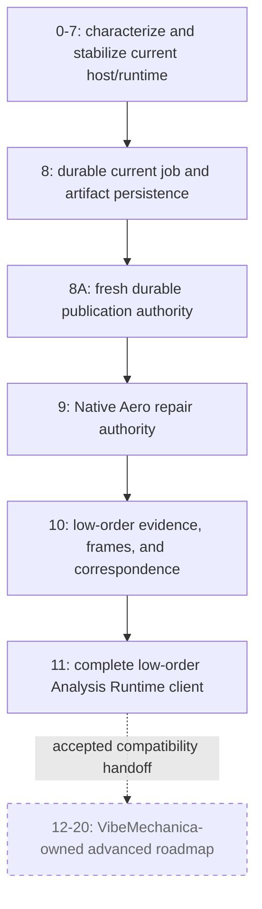

# VibeCADAero canonical roadmap

**Roadmap status:** canonical for the active bounded Steps 0-11 public lane; Steps 12-20 are historical/non-normative in VibeCAD and assigned to VibeMechanica

**Historical live baseline audit:** `halthinks/vibecad@31ea810db044db6311207a2538a9b6f7694011ae` on 2026-08-25

**Historical roadmap execution record:** the dependency-ordered PR stack #90
through #135 reported
`halthinks/vibecad@c0157d9a6b4a6bc4d54130025ec9dfaf5c7fbbda` on 2026-08-27 and
used `10-X-eng/vibecad@60b8f3fd` as its bounded upstream checkpoint. This is
preserved source lineage, not the accepted current implementation baseline, and
it receives no current completion credit by itself.

**Concurrent stabilization report; zero integrated credit:** a 2026-08-28
working tranche based on
`halthinks/vibecad@75917cf660cf100a09fc2d7cae033145b4661bea` reports matched
physical CalculiX, exact-source, active-close, visible file-tour, lock-repair,
and durable FEM publication work. That tranche lies outside the exact accepted
implementation tree and combines modifications to tracked baseline files,
untracked source/test additions, and ignored run evidence. None of those deltas
or results receives integrated completion credit until the contributor work is
committed, reviewed, built into one exact package, and rerun from that exact
tree. The detailed intended boundary remains preserved in
[the FEM compatibility report](vibecad-analysis-fem-compatibility-report.md).

**Scope:** retained low-order Aero, current Native/FEM/Analysis dependencies, exact evidence and publication, and Steps 0-11 closure; later advanced solver/remote/dynamics/coupling material is preserved but non-blocking

## 2026-08-31 live implementation reconciliation

<!-- VIBECADAERO-LIVE-RECONCILIATION:BEGIN -->
| Field | Value |
| --- | --- |
| Accepted implementation baseline | `halthinks/vibecad@d8bde1ba3f97a861b096ca8bb92a86b5306551e3` |
| Baseline source ref at audit | `origin/codex/vibecad-full-roadmap-20260830` |
| Baseline tree | `a6fa0ec77dd4b36aadd2f7bdd32576046124af82` |
| Baseline commit time | `2026-08-31T08:23:49-07:00` |
| Audit date | `2026-08-31` |
| Last revalidated | `2026-08-31` |
| Roadmap audit branch | `codex/g0-native-fem-clarification-20260831` |
| Previous accepted baseline | `8611ac881a67b77b777c38f1749880527d2cc956` |
| Accepted-baseline drift | `26` paths; canonical path-manifest SHA-256 `2ad30026c41466f2720381dff936bd5643cd2409f34b0fe0bec6ca4529f0884a` |
| Dependency freeze | root `pixi.lock` SHA-256 `45cb657fc0d8d7e320673c559918ffabae582ffdfb2ab69e4ade271eada568b2`; package lock SHA-256 `f5cf92da6ec353ae450cdf613180a3fb7e7d74418a337577602f30d14c94d48d`; recipe SHA-256 `c0e7a45efeef5e43f9e551aeaeeb0429aa5bc0cf0568782ad13406981757c287`; Fasteners gitlink `033225ae84d65cfde0a39c2750dfa8e549a10cab` |
| Parallel-work census | `17` registered worktrees: `12` clean, `5` dirty, `5` with committed heads not reachable from the accepted baseline; all preserved pending separate reconciliation |
| CI event-base rule | Pull-request runs require the recorded baseline to equal the event base SHA; pushes to main require it to equal the event before SHA. Manual dispatch and local runs are explicitly skipped as event-base enforcement unavailable. |
| Credit rule | Only exact blobs and behavior in the accepted implementation commit receive integrated completion credit; every tracked modification, untracked addition, or ignored artifact outside that tree receives zero credit until committed, reviewed, packaged, and rerun. |

Tracked baseline evidence includes:

Each entry below means the exact blob at the accepted baseline path, not any
same-named file modified in a concurrent working tree.

<!-- VIBECADAERO-BASELINE-EVIDENCE:BEGIN -->
- `.github/workflows/c-cpp.yml`;
- `Invoke-VibeCAD-VisibleTour.ps1`;
- `Launch-VibeCAD-Dev.cmd`;
- `Launch-VibeCAD-Dev.ps1`;
- `README.md`;
- `RUN-VIBECAD-DEV.cmd`;
- `docs/developer-launch-windows.md`;
- `docs/vibecad-agent-control.md`;
- `src/Mod/VibeCAD/CMakeLists.txt`;
- `src/Mod/VibeCAD/InitGui.py`;
- `src/Mod/VibeCAD/VibeCADAgentCli.py`;
- `src/Mod/VibeCAD/VibeCADAgentControl.py`;
- `src/Mod/VibeCAD/tool_impl/analysis_persistence.py`;
- `src/Mod/VibeCAD/tool_impl/engineering_contracts.py`;
- `src/Mod/VibeCAD/vibecad_tests/analysis_fem_installed_lifecycle_integration.py`;
- `src/Mod/VibeCAD/vibecad_tests/analysis_fem_installed_publication_integration.py`;
- `src/Mod/VibeCAD/vibecad_tests/test_agent_control.py`;
- `src/Mod/VibeCAD/vibecad_tests/test_agent_control_grok_bot.py`;
- `src/Mod/VibeCAD/vibecad_tests/test_analysis_persistence.py`;
- `src/Mod/VibeCAD/vibecad_tests/test_branding_contract.py`;
- `src/Mod/VibeCAD/vibecad_tests/test_dev_launcher_contract.py`;
- `src/Mod/VibeCAD/vibecad_tests/test_engineering_contracts.py`;
- `src/Mod/VibeCAD/vibecad_tests/test_visible_operator_contract.py`.
<!-- VIBECADAERO-BASELINE-EVIDENCE:END -->

Concurrent post-baseline report receives **zero integrated completion credit**.
The reported paths are not accepted implementation evidence; they remain a
provenance-preserving audit record until reviewed into a new accepted baseline
and their claimed acceptance is rerun from the exact committed and packaged
tree. At this audit that reported category includes:

<!-- VIBECADAERO-CONCURRENT-REPORT:BEGIN -->
- `docs/direct-geometry/VIBECAD_DIRECT_GEOMETRY_RECONCILIATION_ADDENDUM.md`;
- `docs/vibecad-g0-freeze-20260831.md`;
- `docs/vibecad-governed-engineering-roadmap.md`;
- `docs/vibecadaero-roadmap.md`;
- `src/Mod/VibeCAD/VibeCADAnalysisFEMPublication.py`;
- `src/Mod/VibeCAD/vibecad_tests/analysis_fem_installed_active_close_integration.py`;
- `src/Mod/VibeCAD/vibecad_tests/analysis_fem_installed_physical_calculix_integration.py`;
- `src/Mod/VibeCAD/vibecad_tests/analysis_fem_installed_verified_publication_integration.py`;
- `src/Mod/VibeCAD/vibecad_tests/test_cross_repository_roadmap_assignments.py`;
- `src/Mod/VibeCAD/vibecad_tests/test_vibecadaero_roadmap_live_reconciliation.py`;
- `tools/run_analysis_fem_installed_active_close.py`;
- `tools/run_analysis_fem_installed_physical_calculix.py`;
- `tools/run_analysis_fem_installed_verified_publication.py`.
<!-- VIBECADAERO-CONCURRENT-REPORT:END -->

The reusable tester source is integrated at the accepted baseline, including
the merged focused contract suite. Its earlier cold-package and visible runtime
receipt is bound to the independent tester parent, so its exact merged-tree
package acceptance remains open. Generic tester success is infrastructure
evidence only. It earns zero domain completion credit and zero physics, solver,
numerical, verification, qualification, or domain-result-publication credit.

Reported physical CalculiX work remains outside the accepted baseline. The
report-only paths above may still be uncommitted elsewhere and receive zero
integrated credit. The post-baseline G0 roadmap, freeze record, and enforcing
test also remain review changes rather than implementation completion evidence.
No status advances until the corresponding work is accepted and any package or
runtime claim is rerun from the exact committed tree.
<!-- VIBECADAERO-LIVE-RECONCILIATION:END -->

This is the repository's real implementation roadmap for the recovered Advanced VibeCAD / VibeCADAero program. It converts the recovered research and design package into one dependency-ordered, evidence-bounded plan tied to the current source tree.

The roadmap is intentionally stricter than a feature list. A merged abstraction, a working process launch, a screenshot, or a numerical result does not complete a milestone unless its stated acceptance evidence also exists.

## 2026-08-29 public-scope reconciliation

The active public VibeCADAero completion boundary is now the coherent low-order
Aero and shared-host compatibility lane represented by Steps 0-11. That boundary
retains and finishes all already-landed low-order Aero behavior, Native repair
and publication authority, current FEM/CalculiX compatibility work, durable host
Analysis foundations, exact frames/readiness/source correspondence, installed
acceptance, and zero unclassified regressions attributable to those public
slices. This reconciliation removes no current code, test, compatibility seam,
result history, or recovered design record.

VibeMechanica owns future implementation of Steps 12-20. They remain
historical/non-normative in VibeCAD as preserved advanced design records. Their
broad high-fidelity CFD, remote compute, qualification, moving-body,
propulsion-interaction, unsteady/6DOF, FSI, and advanced diagnostic requirements
are outside the current VibeCAD completion scope and do not block completion of
Steps 0-11. Already-present low-order behavior associated with a later historical
heading—most notably the current JSBSim export—remains supported and must not
regress.

The public [direct-geometry technical specification](direct-geometry/VIBECAD_DIRECT_GEOMETRY_ANALYSIS_WHITEPAPER.md)
adds a separate VC-DG-0 through VC-DG-7 lane owned and status-tracked by the
[VibeCAD governed engineering roadmap](vibecad-governed-engineering-roadmap.md).
VC-DG-0 through VC-DG-6 form its structural/thermal core. VC-DG-7 is assigned to
VibeCAD. VC-DG-7 remains planned post-core; not started until accepted VC-DG-6
plus an explicit VibeCAD-owner instruction to begin VC-DG-7; that instruction
controls when execution begins, not whether VC-DG-7 can be omitted. VC-DG-7
does not block the VC-DG-0 through VC-DG-6 structural/thermal core release and
earns no core or Aero completion credit. Full-fork entire-roadmap completion may
not be declared until VC-DG-7 satisfies its controlling
embedded-flow acceptance gate. VibeMechanica remains a compatibility/status
consumer only and has no implementation obligation.

The post-core sequence protects the structural/thermal product from the separate
fluid method, conservation checks, benchmark set, and qualification burden. It
does not make that VibeCAD milestone leaveable undone for full-fork
entire-roadmap completion, reactivate historical Aero Steps 12-20, or give it
Aero completion credit.

This is a deliberate bounded VibeCAD lane. Broad CFD, high-fidelity Aero,
multiphysics, nonlinear/composites/fatigue, remote execution, and generalized
solver expansion remain outside this roadmap's current completion boundary.
VibeCADAero continues to own only Steps 0-11 here; VibeMechanica owns future
implementation of Steps 12-20. VC-DG status remains solely in the governed
engineering roadmap, so the three lanes cannot claim the same implementation or
completion evidence.

### Active public completion objective

VibeCADAero completes its current public boundary when:

- existing low-order NeuralFoil, AeroSandbox VLM/lifting-line, hover, report, and
  JSBSim routes remain behaviorally compatible and source-bound;
- Steps 0-7 finish characterization, exact package/runtime acceptance, and
  stabilization for the shared public surfaces they changed;
- Steps 8 and 8A close durable host identity/artifacts/recovery/publication for
  the retained public FEM and Aero clients without moving physics or CAD
  authority;
- Step 9 converges Aero repair application onto Native authority while retaining
  compatibility;
- Step 10 closes low-order Aero frames, readiness, source correspondence,
  artifact/evidence/currentness, and bounded claim ceilings; and
- Step 11 proves the complete low-order Aero client through the shared Analysis
  Runtime, installed packages, visible GUI, save/reopen, cancellation,
  currentness, and publication gates.

Final completion means every acceptance item inside Steps 0-11 and their
applicable host/Aero release gates has evidence and no attributable issue remains.
It does not require historical Steps 12-20 or the post-core VC-DG-7 milestone.
That Aero-specific exclusion does not waive VC-DG-7 from the separate full-fork
entire-roadmap completion predicate. Nothing in this boundary claims
airworthiness, measured evidence, or validated real-world flight safety.

### Historical advanced continuation rule

Every Step 12-20 heading and requirement below remains searchable design
provenance. Its status in this repository is **Historical/non-normative; outside
current VibeCAD public scope**. The VibeMechanica roadmap owns future executable
status, dependency order, acceptance, and completion claims for those steps.
VibeCAD may mirror only an accepted synchronization receipt and must not infer
completion from a downstream branch or compatibility surface. Any future
reassignment back to VibeCAD requires an explicit owner-approved amendment in
both repositories. Additions remain additive, independently evidenced, and must
not silently turn these preserved records back into VibeCAD release blockers.

## 1. Source-of-truth order

Use these sources in this order:

1. **Current code, tests, and merged history** determine what is implemented now.
2. **This roadmap** determines the active sequence, status, acceptance criteria, and product boundary.
3. The [VibeCAD governed engineering roadmap](vibecad-governed-engineering-roadmap.md)
   owns cross-domain host extensions shared by Analysis, Native, Manufacture,
   Assembly, Robot, and future engineering domains. This Aero roadmap retains
   low-order Aero physics, solver, qualification, evidence, and original
   host-runtime acceptance obligations through Step 11. The
   [VibeMechanica roadmap](https://github.com/halthinks/VibeMechanica/blob/main/docs/vibemechanica/ROADMAP.md)
   owns future implementation of Steps 12-20. A change to shared Analysis
   persistence, publication, or provenance status must follow each repository's
   guarded synchronization and update the affected owner documents.
4. The preserved [direct-geometry technical specification](direct-geometry/VIBECAD_DIRECT_GEOMETRY_ANALYSIS_WHITEPAPER.md)
   owns its unaffected numerical contracts, while the
   [repository reconciliation addendum](direct-geometry/VIBECAD_DIRECT_GEOMETRY_RECONCILIATION_ADDENDUM.md)
   controls the tester-profile, separate-authorization, and generic-CfdOF
   integration clarifications. The governed engineering roadmap owns VC-DG
   status. Direct geometry is not an Aero Steps 12-20 reactivation.
5. The [no-loss preservation supplement](vibecadaero-advanced-recovery/VIBECADAERO_SECOND_PASS_PRESERVATION_SUPPLEMENT.md) preserves the complete contracts, hazards, release gates, and source index.
6. The [recovered roadmap](vibecadaero-advanced-recovery/RECOVERED_ADVANCED_VIBECAD_ROADMAP.md) preserves the research-derived program and source anchors.
7. The [expanded 110-file source package](vibecadaero-advanced-recovery/source-package/) and its byte-for-byte ZIP are design evidence and reference material. They are not a drop-in patch and do not supersede newer host code.

If this roadmap and current implementation disagree about current status, the implementation wins and this roadmap must be corrected in the same pull request that discovers the drift. If a proposed change conflicts with a preserved architecture lock, stop and resolve the conflict explicitly; do not silently narrow or discard the requirement.

## 2. Status vocabulary

| Status | Meaning |
| --- | --- |
| **Verified complete** | The bounded milestone is present in current source, has executable coverage, and has no known remaining acceptance item inside that milestone. |
| **Partial** | A real slice is merged, but one or more required behaviors or release gates remain. |
| **Design-ready** | Detailed contracts and reference material are preserved, but no current integrated implementation was found. |
| **Not started** | No qualifying current implementation was found. |
| **Blocked** | Work cannot safely proceed until the named dependency or decision is resolved. |
| **Historical/non-normative** | Preserved advanced design provenance outside the active Steps 0-11 public completion boundary. |
| **Retained current behavior** | Already-landed behavior remains supported and regression-protected even when its broader historical heading is non-blocking. |

“Verified complete” is milestone-specific. It never means the complete VibeCADAero product is finished.

## 3. Product objective and final definition of done

VibeCADAero's active public product is one coherent, source-bound low-order Aero
client inside VibeCAD. It preserves the current NeuralFoil, AeroSandbox
lifting-line/VLM, hover, report, repair, Native integration, and JSBSim behavior;
keeps solver/model meaning separate from host execution and publication; records
frames, units, configuration, source correspondence, immutable artifacts,
currentness, qualification ceiling, and publication receipt; and safely
survives cancel, save, close, reopen, stale-source changes, and application
restart through the shared host authorities.

Final completion requires every acceptance item inside Steps 0-11 and every
applicable G0-G9 release gate, from exact built packages and the visible
one-click GUI, with zero attributable unclassified regression. It does not
require historical Steps 12-20, remote compute, broad CFD, advanced coupling, or
the post-core VC-DG-7 milestone. Existing behavior documented under a later
historical heading remains supported. Nothing here claims airworthiness,
measured evidence, or validated real-world flight safety.

## 4. Non-negotiable architecture locks

### 4.1 Host and domain ownership

The **host Analysis Runtime** owns only physics-neutral mechanics:

- durable job, attempt, provider, and artifact identity;
- lifecycle transitions, queue/concurrency policy, generic progress, bounded logs, timeout, cancellation, and failures;
- immutable manifests and hashes;
- restart reconciliation and provider reconnect orchestration;
- source-currentness validation orchestration;
- scheduling a domain-owned publication callback on the document thread;
- generic publication receipts, cleanup disposition, and quarantine/currentness disposition.

Each **engineering domain** owns:

- relevant source state and dependency fingerprints;
- conversion of live document state into immutable solver inputs;
- solver physics, mesh policy, configuration, boundary conditions, and parsing;
- result meaning and publication-draft construction;
- qualification, validation, claim ceilings, and domain result representation.

Each **compute provider** owns only where and how sealed work executes: capabilities, submit, poll, cancel, reconnect, collect, cleanup, logs, and provider execution receipts. Kaggle is a provider, never a solver.

**Native mutation authority** exclusively owns document-thread transactions, recompute, postcondition validation, structural revision, created/changed/deleted object receipts, and rollback. Worker threads, providers, and solver adapters may not mutate a live FreeCAD document.

### 4.2 Three distinct authorities

Long-running work must not turn an old approval into permanent mutation authority:

1. **Submission authorization** permits one exact immutable prepared analysis from one captured source state.
2. **Execution authority** permits only execution and collection of that sealed work.
3. **Publication authorization** is fresh and narrow for the exact completed result after source rebind, currentness validation, artifact validation, replay protection, and domain checks.

Persisted data may include inert identifiers, descriptors, manifests, hashes, revisions, receipts, and provider external IDs. It may not contain live `NativeRuntimeContext` objects, executable call tickets, callbacks, closures, FreeCAD/Qt objects, transaction handles, provider clients, credentials, tokens, threads, locks, futures, events, file descriptors, or `Popen` objects.

### 4.3 Independent state axes

Do not collapse these into one `SUCCEEDED` flag:

- **Execution:** `PREPARING`, `PREPARED`, `QUEUED`, `SUBMITTING`, `RUNNING`, `COLLECTING`, `SOLVED`, `FAILED`, `CANCELLED`, `TIMED_OUT`, `CAPABILITY_UNAVAILABLE`, or `ORPHANED`.
- **Publication/currentness:** `UNVALIDATED`, `VALIDATING_SOURCE`, `AWAITING_SOURCE`, `AWAITING_PUBLICATION`, `CURRENT`, `STALE`, `QUARANTINED`, `PUBLISHING`, `PUBLISHED`, or `PUBLICATION_FAILED`.
- **Qualification/evidence:** `not_solved`, `capability_unavailable`, `failed`, `model_unqualified`, `model_qualified`, or `measured`.

`SOLVED` does not mean published. `PUBLISHED` does not mean current forever. `returncode == 0` does not mean qualified. CFD output is derived evidence, not measured evidence. No state implies airworthiness.

### 4.4 Solver and provider separation

The preserved solver ladder is shown for provenance. Levels 0-3 contain the active low-order public boundary; Levels 4-6 are historical/non-normative and do not block Steps 0-11:

| Level | Solver/model responsibility |
| --- | --- |
| 0 | Geometry, mass, configuration, frame, and source truth |
| 1 | NeuralFoil section analysis |
| 2 | AeroSandbox lifting-line/VLM |
| 3 | Engineering unsteady, strip, dynamic-stall, and hover models |
| 4 | Historical design: FluidX3D high-throughput GPU LBM |
| 5 | Historical design: OpenFOAM through the normal FreeCAD CfdOF path |
| 6 | Historical design: diagnostics, decomposition, cross-fidelity comparison, uncertainty, and refinement |

The active lane uses current in-process and detached-local providers. Kaggle and future HPC/remote systems remain historical design options. Routing must be deterministic and explainable from actual availability, qualification, portability, resource estimates, device/quota facts, and user constraints. Providers do not select turbulence models, qualification states, or publication eligibility.

### 4.5 Compatibility locks

Unless an separately approved migration says otherwise, preserve:

- existing Native tool/action/schema names and synchronous Aero calls;
- `NativeBackgroundManager`, `NativeBackgroundSnapshot`, `native.job`, error/result shapes, one-active-job-per-document behavior, and current document-thread mutation boundaries;
- current FEM solver preparation, command/environment behavior, result graph, History, receipts, and public errors;
- current Aero ribbon/workbench actions, `AeroConfig`, `AeroReport`, `AeroPreview` compatibility behavior, and JSBSim export route;
- external solver overrides and optional dependency behavior;
- additive-first delivery with rollback by pull-request revert until a separately approved durable migration exists.

Protected public details include capability `analyze.solver_execution`, operation `run`, the current target schema/request modes, background response keys `job` and `next`, `native.job` operations `status` and `cancel`, Native/Aero bindings and dispatch, ribbon/GUI/agent routes, error families/codes, transaction behavior, FEM result graph/History/state hashes/receipts, CMake registration, installed-tree imports, and old modules used as compatibility facades.

Do not invent `start`, `clear`, a renamed capability, or a raw `/v1/run` solve/mutation escape hatch. New global discovery/recovery APIs must be additive and versioned. The temporary `legacy_fem_execution` versus `analysis_runtime_fem` switch described by the recovery package is a rollback mechanism, not a permanent user-facing product choice.

### 4.6 Observable exact-checkout development

The visible local application is a mandatory development and acceptance surface,
not an optional final demonstration:

- Windows development uses the repo-root one-click launcher documented in
  [developer-launch-windows.md](developer-launch-windows.md); it initializes the
  checkout's pinned submodules, builds only into the checkout's Pixi
  environment, and may not fall back to an installed VibeCAD executable;
- the launched GUI visibly identifies the exact source SHA and exposes a
  checkout-scoped, bearer-authenticated `127.0.0.1` agent-control endpoint;
- the external development agent drives the same visible application a human is
  watching through `/v1/native`, `/v1/aero`, the other bounded agent routes, or
  the repo's Qt GUI harness, while preserving every Native, domain, preview,
  authorization, receipt, and document-thread boundary above;
- every user-visible implementation slice includes a watchable live workflow,
  before/after context or screenshots where relevant, authoritative
  receipts/artifacts, and proportional automated tests;
- menu/ribbon demonstrations use the repo's independent plain cyan virtual
  cursor and semantic Qt activation; they must never move, click, confine,
  hide, or block the human's physical cursor;
- file-dependent demonstrations prove a real open/save-as/save/close/reopen
  round trip, default overwrite refusal, and zero unintended additional open
  documents;
- a headless proxy, installed release build, mocked window, screenshot alone, or
  unreceipted `/v1/run` CAD mutation cannot satisfy this gate.

The GUI remains open for human inspection unless restart, shutdown, crash, or
recovery is the behavior under test. Observable evidence supplements rather
than replaces the engineering evidence and claim ceilings in this roadmap.

## 5. Verified live baseline

The historical audit of `main@31ea810db` found the following real
implementation. These are foundations, not high-fidelity completion claims and
not a substitute for the accepted implementation baseline recorded above.

| Live capability | Current evidence | Honest boundary |
| --- | --- | --- |
| Domain-neutral in-memory Analysis Runtime beneath NativeBackground | `tool_impl/analysis_runtime.py`, the `VibeCADAnalysis*.py` source facades, merged PR #67, `test_analysis_runtime.py` | In-memory only; no restart recovery. At this historical baseline, the five public facades were not registered in `VibeCAD_Scripts`, and no isolated build-tree/installed-tree facade-import test existed. |
| One active background job per document, monotonic terminal state, status/cancel | Runtime manager and `native.job` surface | No durable job identity across application restart. |
| Atomic cancellation-versus-commit ordering | `VibeCADNativeBackground.py`, merged PR #63, race tests in `test_native_background_commit_gate.py` | Proven for the current in-memory path; durable replay/publication ownership is still missing. |
| Shared shell-free bounded local process sequence | `VibeCADScriptedProcess.py`, merged PR #61, process tests | POSIX process groups exist; Windows descendant-process ownership is not proven complete. |
| Provider contracts and local provider | `VibeCADAnalysisProviders.py`, `tool_impl/analysis_local_provider.py` | Local provider reports reconnect unsupported; no remote provider is integrated. |
| Host contracts for prepared analyses and manifests | `tool_impl/analysis_contracts.py`, `tool_impl/analysis_artifacts.py` | Contracts exist; the complete durable content-addressed artifact system does not. |
| Current supported FEM solver execution through host local provider | `tool_impl/analysis_fem_adapter.py` covers CalculiX, Elmer, Z88, and Mystran; provider-specific tests | Full A/B parity evidence and long stabilization/recovery gates remain roadmap obligations. |
| Native Aero background client | merged PR #81; `VibeCADNativeAeroRuntime.py`; `test_native_aero_analysis_runtime.py` | Current low-order Aero operations only; not FluidX3D or OpenFOAM. |
| Aero stale-ticket and geometry-revision checks before queue/publication | `VibeCADNativeAeroRuntime.py`, `AeroPreview.geometry_revision`, stale tests | Full dependency-scoped currentness/evidence correspondence is incomplete. |
| Current Aero low-order/product slice | NeuralFoil, AeroSandbox VLM, momentum-theory hover, bounded repairs, `AeroReport`, and JSBSim export | Results remain low-order/model-bounded; current JSBSim output is generated from solved coefficients, not high-fidelity CFD. |
| Human-authorized JSBSim output | Native Aero output authorization, hash guard, archive validation | This is output authorization, not the durable CFD publication coordinator. |

No current integrated implementation was found for Aero FluidX3D, Aero CfdOF/OpenFOAM, Kaggle compute, common CFD field visualization, benchmark qualification registry, high-Re FluidX3D, moving geometry, propulsion-interaction CFD, complete unsteady 6DOF, aeroelasticity/FSI, or advanced refinement orchestration.

### Post-baseline implementation reconciliation

The table above is historical evidence from `main@31ea810db`; it is not
rewritten to attribute later work to that revision. The following capabilities
are tracked in the accepted implementation baseline
`d8bde1ba3f97a861b096ca8bb92a86b5306551e3`:

- all public Analysis facades are registered in `VibeCAD_Scripts`, the existing default `Unspecified` install-component behavior is retained, and isolated build-tree and component-installed import coverage exists;
- artifact descriptors, manifests, canonical hashing, bounded archive admission, quota-enforced content-addressed storage, protected idempotent cleanup, and exact live publication-artifact references are implemented and tested;
- the four supported FEM adapters have a frozen normalized compatibility oracle and report, and shared process execution has descendant cleanup and environment-output redaction coverage;
- versioned atomic durable metadata, explicit audited v1-to-v2 migration, centralized per-user application-data ownership, bounded global/document discovery, legal lifecycle transitions, attempt/provider identity, latest-attempt bounded provider recovery snapshots, reasoned restart disposition, append-only structured host-interruption evidence, retry identity, artifact retention metadata, and opt-in runtime lifecycle binding are implemented;
- a provider-facing recovery coordinator now validates the live provider identity and recovery capabilities, reconnects only a persisted reconnect-authorized remote attempt, consumes a strict bounded status contract, collects a completed generic artifact manifest, validates descriptor shape/identity/count/declared-byte bounds, persists a compact attempt-bound collection receipt, and stops in `collecting` without verification or publication authority;
- a separate output-admission coordinator binds that exact collection receipt to an owned local transport root, rejects path/symlink escape, bounds reads by the declared size, verifies every returned file hash and byte count, admits immutable content-addressed objects, records exact artifact metadata idempotently, and advances only from `collecting` to `verifying`;
- a separate domain-verification coordinator rechecks every admitted content-addressed byte against the exact collected manifest before invoking a domain-owned verifier, requires the existing bounded `EngineeringResultEnvelope` and finding contracts to bind the exact domain, adapter, source document, dependency snapshot, provider attempt, and artifact identities, persists a bounded write-once result receipt, resumes idempotently after receipt persistence, and advances only from `verifying` to `waiting_to_publish` without CAD-mutation or publication authority;
- the compatibility publication coordinator remains available, while an additive verified-publication coordinator now requires the exact latest domain-verification receipt, rechecks every referenced content-addressed object, binds a canonical descriptor hash to fresh authorization and persisted currentness evidence, acquires one publication owner with compare-and-swap, persists a bounded write-once publication receipt before terminal success, finalizes a receipt-backed transition crash without remutation, and refuses to replay a mutation whose outcome remains unknown;

These are additive tracked slices. Provider recovery and returned-file transport
remain proven only against an inert provider and owned local-transport fixture,
and generic verification/publication fault coverage remains fixture-backed.
`collecting` and `verifying` resume idempotently across their covered
receipt/transition crash boundaries. Verified publication rejects stale,
mismatched, missing, or mutated fixture evidence; a durable publication receipt
can finish its terminal state transition without a second mutation, while a
mutation with no receipt remains outcome-unknown and non-replayable.

The reported production FEM completed-workspace adapter and its physical
CalculiX save/reopen, rollback, active-close, and durable-publication runs exist
only in concurrent uncommitted work at this checkpoint. They receive zero
integrated completion credit here. No production FEM publisher on the normal
package route, production remote provider, credentials, authenticated network
transport, Aero verifier/publisher migration, final package-contained FEM
publisher gate, complete process-crash reconstruction, or G5 workflow
submission is integrated. The accepted slices also do not close repeated
cross-platform packaging, governed quota-policy and cross-record cleanup,
compact document references, corruption/restore acceptance, future migration
chains, broader domain migration, or the production-integration gates below.

## 6. Dependency graph

The solid graph is the active VibeCAD public completion path. The dashed
advanced node records the accepted compatibility handoff of Steps 12-20 to
VibeMechanica. It preserves VibeCAD design provenance, but it is not a VibeCAD
release dependency or permission for VibeCAD to resume that implementation.

VC-DG-0 through VC-DG-6 are a separate public structural/thermal lane in the
governed engineering roadmap. The required post-core VC-DG-7 milestone does not
block that structural/thermal core release and earns no completion credit here.
Aero Step 8A contributes evidence to the bounded Native authority foundation;
it does not gate VC-DG-0. This diagram declares no VC-DG dependency edge because
the governed engineering roadmap owns the normative VC-DG graph.

### Roadmap at a glance

| Step | Public scope | Current status | What remains before the step is closed |
| --- | --- | --- | --- |
| 0 — live reconciliation | **ACTIVE** | **Verified complete at accepted baseline `d8bde1ba`; repeat per tranche** | Repeat on a newer accepted source before implementation and record branch, commit, date, dependency, evidence, and concurrent-work drift. The current source/owner record is [the 2026-08-31 G0 freeze](vibecad-g0-freeze-20260831.md). |
| 1 — characterization | **ACTIVE** | **Partial** | The tracked four-solver process-lifecycle oracle and installed synthetic-publication harnesses are executable. Reported physical CalculiX, exact-source, active-close/refusal, and visible-file traces remain concurrent with zero integrated credit; commit and rerun them from the exact package, then complete applicable Windows/Linux/macOS and remaining-backend runtime traces. |
| 2 — host contracts/facades | **ACTIVE** | **Verified complete for the domain-neutral packaging/compatibility foundation** | Durable persistence remains a later active milestone; production remote providers and advanced qualification are preserved non-blocking design records and are not implied by this closure. |
| 3 — local process mechanics | **ACTIVE** | **Verified complete for the shared process primitive** | Keep the Windows/POSIX parity, timeout, cancellation, cleanup, output-bound, and redaction matrix required by the current local/package providers; repeated lifecycle and leak burn-in remains Step 7. Future provider changes must repeat the same gate if separately authorized. |
| 4 — input/artifact sealing | **ACTIVE** | **Partial** | Retained-object count/byte quotas and live publication-reference protection are implemented; complete application-data/compact-document integration and installed/cross-platform acceptance around the immutable manifests, storage, archive defenses, and cleanup. |
| 5 — host orchestration | **ACTIVE** | **Verified complete for the in-memory compatibility slice** | Persistence/recovery remain explicitly outside this step. |
| 6 — current FEM migration | **ACTIVE** | **Verified complete for the tracked CalculiX, Elmer, Z88, and Mystran compatibility migration** | Process parity and installed synthetic-result publication harnesses are frozen. Physical multi-cycle and durable-publication evidence remains concurrent with zero integrated credit; integrate and rerun the exact package, then close remaining physical-backend, platform, importer, and stabilization gates. |
| 7 — stabilization | **ACTIVE** | **Partial** | The accepted baseline contains lifecycle and installed-publication harnesses. Reported multi-cycle physical CalculiX, exact-source, active-close/refusal, and visible Windows save/reopen burn-ins remain concurrent with zero integrated credit; integrate them and finish applicable cross-platform, remaining-backend, and leak/orphan burn-in. |
| 8 — durable persistence | **ACTIVE** | **Partial** | Explicit migration/discovery/restart primitives, bounded provider reconciliation, collection receipts, immutable local-transport admission, idempotent `collecting` and `verifying` recovery, receipt-bound domain verification, quotas, and exact live publication references are tracked. The physical FEM bundle-verification cycle and production FEM adapter remain concurrent with zero integrated credit. Integrate the normal package route, prove real process-crash recovery, and add governed cleanup, compact references, corruption/restore, and installed cross-platform acceptance for current FEM and retained low-order Aero. Authenticated remote transport and future migration chains remain non-blocking compatibility work. |
| 8A — publication authority | **ACTIVE** | **Partial** | Generic fixture-backed verification-receipt, immutable-object, descriptor-hash, currentness, authorization, single-owner, write-once-receipt, terminal-transition recovery, and unknown-outcome refusal are tracked. The production FEM publisher, real `Document.Uid` rebind/Native transaction cycle, and physical replay evidence remain concurrent with zero integrated credit. Integrate them into normal Native FEM submission, rerun from the exact installed package, migrate retained low-order Aero, and prove real process-crash restart cannot duplicate publication. |
| 9 — Aero repair authority | **ACTIVE** | **Partial** | Converge host revision and preview/apply/reject authority; define bounded preview persistence. |
| 10 — Aero evidence/frames | **ACTIVE** | **Partial** | Complete case schema, frames/references, readiness, correspondence, stamps/results/context, and claim ceilings. |
| 11 — Aero runtime client | **ACTIVE** | **Partial** | Complete the integrated low-order client, including solver-neutral case/result seams needed by the retained routes, without making advanced high-fidelity solvers a closure gate. |
| 12 — OpenFOAM/CfdOF | **HISTORICAL HERE; VIBEMECHANICA-OWNED** | **Planned in VibeMechanica** | VibeMechanica owns the production CFD baseline; generic VibeCAD CfdOF compatibility earns no Step 12 credit. |
| 13 — FluidX3D | **HISTORICAL HERE; VIBEMECHANICA-OWNED** | **Optional and non-blocking in VibeMechanica** | VibeMechanica owns any restricted-use evaluation and separate qualification; this item blocks no required step or release. |
| 14 — field viewer | **HISTORICAL HERE; VIBEMECHANICA-OWNED** | **Planned in VibeMechanica** | VibeMechanica owns the common source-bound scalar/vector/volume/time UI with bounded loading. |
| 15 — routing/Kaggle | **HISTORICAL HERE; VIBEMECHANICA-OWNED** | **Planned in VibeMechanica** | VibeMechanica owns explainable routing and restart-safe remote compute after its persistence/publication gates. |
| 16 — qualification/high-Re | **HISTORICAL HERE; VIBEMECHANICA-OWNED** | **Planned in VibeMechanica** | VibeMechanica owns the benchmark/envelope registry and high-Re sensitivity/convergence evidence. |
| 17 — moving/propulsion | **HISTORICAL HERE; VIBEMECHANICA-OWNED** | **Planned in VibeMechanica** | VibeMechanica owns validated moving boundaries, rotor/prop fidelity, interaction, and feedback. |
| 18 — unsteady/6DOF | **RETAIN CURRENT VIBECAD JSBSIM; ADVANCED SCOPE VIBEMECHANICA-OWNED** | **Current low-order path partial in VibeCAD; advanced work planned in VibeMechanica** | VibeCAD retains its current JSBSim compatibility; VibeMechanica owns advanced validated unsteady and coupled-dynamics work. |
| 19 — aeroelasticity/FSI | **HISTORICAL HERE; VIBEMECHANICA-OWNED** | **Planned in VibeMechanica** | VibeMechanica owns structural authority, mapping, partitioned coupling, convergence, and flutter validation. |
| 20 — diagnostics/refinement | **HISTORICAL HERE; VIBEMECHANICA-OWNED** | **Planned in VibeMechanica** | VibeMechanica owns uncertainty, convergence, comparison, decomposition, and controlled refinement from host jobs. |

## 7. Dependency-ordered implementation roadmap

### Step 0 — live re-reconciliation

**Status: Verified complete for accepted source baseline `d8bde1ba3f97a861b096ca8bb92a86b5306551e3` on 2026-08-31; repeat at every implementation tranche.**

The current tree, merged host-runtime history, reusable visible tester, Native
Aero runtime, process helper, FEM adapter, tests, build registration, dependency
locks, registered worktrees, and recovered source package were compared. The
[2026-08-31 G0 freeze](vibecad-g0-freeze-20260831.md) records the exact source,
tree, dependency hashes, drift, owner map, compatibility surfaces, and preserved
parallel work. Newer host ownership was adopted where it already controls a
seam; the frozen overlay remains reference evidence only.

Exit evidence:

- record exact `main` SHA and audit date;
- identify source owners for every seam touched by the next tranche;
- list drift from the previous baseline;
- for a user-visible tranche, launch that exact checkout through the one-click
  development path and record authenticated control readiness plus the
  watchable workflow evidence;
- update this roadmap when implementation status changes.

### Step 1 — characterize current FEM/background behavior

**Status: Partial.**

The accepted baseline tracks characterization for the generic runtime, atomic
commit gate, shared process sequence, Native Aero background path, and each
supported FEM local-provider path. `analysis_fem_parity_v2.json` and
`test_analysis_fem_parity_oracle.py` form the executable legacy/host
process-lifecycle oracle for CalculiX, Elmer, Z88, and Mystran. The tracked
installed lifecycle and synthetic-publication harnesses cover exact-source,
closed/switched/replaced-source, drift, result-graph, History, ownership,
save/reopen, cleanup, and the explicit absence of a durable publication receipt.
Their presence is executable source, not a claim that this documentation tranche
reran every installed platform gate.

Concurrent uncommitted physical CalculiX, active-close, durable FEM
publication, visible GUI, package-lock, and Linux evidence reports preserve
useful intended acceptance detail, including the `model_unqualified` ceiling.
They receive zero integrated credit at this baseline. The corresponding files
must be committed and all claimed cycles rerun from the exact package before any
of those results advance Step 1. Physical Elmer/Z88/Mystran, macOS
installed/active-runtime traces, repeated package-contained durable publication,
and complete process-crash reconstruction also stay open.

Remaining exit criteria:

- preserve the normalized lifecycle traces for process, input digest, exact command/environment identity, stale checks, result graph/History, receipts, public APIs/errors, timeout/cancel, cleanup, document close/switch/reopen, and Windows/Linux behavior, then add the missing macOS traces;
- rerun the tracked installed synthetic-publication and exact-source harnesses
  from the accepted package, then integrate and rerun the concurrent physical
  backend/importer, active-close, durable-receipt, and visible-file gates across
  the applicable Windows/Linux/macOS and remaining-backend matrix;
- preserve the reviewed intentional-difference list in both the compatibility report and executable oracle before further extraction.

### Step 2 — introduce host Analysis contracts and facades

**Status: Verified complete for the domain-neutral packaging/compatibility foundation.**

Domain-neutral contracts, provider interfaces, artifact helpers, public facades, and Native compatibility surfaces exist. This status does not include persistence, remote providers, or domain qualification.

Closure evidence:

- `VibeCADAnalysisRuntime.py`, `VibeCADAnalysisContracts.py`, `VibeCADAnalysisArtifacts.py`, `VibeCADAnalysisProviders.py`, and `VibeCADAnalysisLocalProvider.py` are explicitly registered in `VibeCAD_Scripts`;
- the CMake build target copies those facades and their existing `tool_impl`/compatibility dependencies into `build/release/Mod/VibeCAD`;
- the pre-existing default CMake install rules remain associated with `Unspecified`, preserving downstream `cmake --install ... --component Unspecified` behavior for public scripts, Python resources, update-trust scripts, and `tool_impl/*.py`;
- `test_analysis_facade_packaging.py` statically checks both facade membership and retention of the default component, invokes `cmake --install` on VibeCAD's generated binary subdirectory with `--component Unspecified`, then imports every facade from the real CMake build tree and that isolated installed tree under `python -I -S`, after removing `PYTHONPATH` and `PYTHONHOME`;
- each imported module must resolve beneath the deployment tree, which prevents a source-tree import from satisfying the packaging test;
- the existing source/runtime tests continue to cover the additive, domain-neutral contracts and compatibility behavior.

Guardrails:

- keep contracts serializable and domain-neutral;
- keep old public surfaces available while clients migrate;
- do not move physics or FreeCAD mutation into host contracts.

### Step 3 — extract local process mechanics

**Status: Verified complete for the shared process primitive.**

The shared direct-argv, shell-free local process sequence is integrated and the current FEM solvers use `LocalProcessProvider`. Timeout, cancellation, bounded output, cwd/environment preservation, and error mapping have executable coverage.

Closure evidence:

- `test_analysis_process_tree.py` launches a real child-spawning workload and proves both timeout and cancellation reap the descendant before returning;
- `vibecad-analysis-fem-stabilization.yml` runs that real workload and the FEM parity/process matrix on Windows and POSIX for every pull request and `main` update;
- `test_scripted_process.py`, `test_mesh_windows_process_contract.py`, and the solver/provider suites preserve direct argv, no-shell execution, exact cwd/environment, bounded output, timeout/cancel error mapping, and cleanup behavior;
- environment values are redacted before process failure details leave the shared primitive, while durable log persistence remains outside this primitive;
- this closure changes no scheduler, persistence, solver adapter, publication, or CAD mutation semantics.

Step 7 still owns repeated timeout/cancel/close/switch/reopen/output-bound stress, leak detection, rollback burn-in, and the complete parity/known-difference report.

### Step 4 — extract input and artifact sealing

**Status: Partial.**

Prepared-analysis, dependency, command, manifest, and artifact contracts exist, and FEM input identity is represented. Content-addressed admission now serializes retained-object quota accounting across processes, preserves digest-idempotent admission, and recovers quota on cleanup. Durable publication evidence can name exact live artifact digests, rejects unknown/tombstoned references, and protects those objects from metadata cleanup. The complete application-data, compact-document-reference, and installed cross-platform lifecycle is not integrated.

Remaining exit criteria:

- preserve the exact accepted FEM directory-digest behavior and current generic manifests while later storage/persistence work lands;
- integrate the implemented object and per-analysis quotas with governed per-user application-data policy and cross-record cleanup authority;
- keep large artifacts outside FCStd while wiring the implemented exact live references into compact document evidence;
- prove immutable admission, quota accounting, archive defenses, reference protection, and cleanup in installed Windows and POSIX hosts.

### Step 5 — extract orchestration behind NativeBackground

**Status: Verified complete for the in-memory compatibility slice.**

Merged PR #67 moved generic prepare/worker/document-thread-commit orchestration into the installed host Analysis Runtime while preserving `NativeBackgroundManager`, public errors/results, one-active-job policy, atomic commit gate, and existing clients.

This step explicitly excludes persistence, restart recovery, new concurrency, remote providers, and solver/domain changes.

### Step 6 — migrate FEM one solver at a time

**Status: Verified complete for the currently supported detached solver set; parity gate remains open.**

CalculiX, Elmer, Z88, and Mystran execution route through the tracked host local
provider with compatibility mappings and solver-specific tests. The v2
executable A/B oracle compares legacy and host success, failure, cancellation,
cleanup, and exact legacy publication delegation for every solver. Tracked
installed synthetic-publication harnesses cover the bounded four-solver result
graph, membership, History, ownership, hashes, public output, and save/reopen
contract while recording rather than concealing the absence of a durable
publication receipt. The process oracle also preserves the shared FEM failure
translator that repaired a discovered host-path diagnostic loss.

The reported physical CalculiX multi-cycle and durable-publisher gates remain
concurrent uncommitted work and receive zero integrated Step 6 credit. Their
reported field semantics, cleanup, exact-UID, receipt, rollback, and claim-ceiling
behavior must be reviewed and rerun from the exact accepted package.

Remaining program obligations:

- complete Gate 5 with accepted-package physical result publication for
  CalculiX and the remaining applicable backend/importer paths, repeated
  lifecycle/leak evidence, macOS evidence, and repeated durable publication
  receipts; preserve the tracked synthetic publication state and v2 oracle;
- treat any future FEM backend as a new solver migration requiring its own parity proof;
- do not use this milestone to change FEM publication semantics.

### Step 7 — stabilization interval

**Status: Partial.**

Multiple host-runtime correctness slices and dedicated regression tests are
tracked. The FEM compatibility report is frozen against the v2 executable
oracle. A temporary internal, context-local route defaults to
`analysis_runtime_fem`, can exercise `legacy_fem_execution` without a public or
durable setting, captures the route at submission, and restores it
automatically. Tracked tests cover success, cancellation, failure, cleanup,
stale-document refusal, Windows/POSIX descendant cleanup, bounded output,
terminal retention, document-owner release, worker shutdown, and synthetic
workspace cleanup. That burn-in previously found and fixed the delayed-cleanup
document-ownership race.

Reported installed physical CalculiX, exact-source, active-close, visible GUI,
and durable-publication cycles remain concurrent uncommitted evidence. They
receive zero integrated Step 7 credit and must be rerun after exact-package
integration. Repeated durable publication, remaining solver/importer physical
and active-runtime burn-in, macOS evidence, and complete cross-backend
leak/orphan evidence remain open.

Remaining exit criteria:

- preserve the now-repeated Windows/POSIX cancel, timeout, process-output-bound, descendant-process, runtime-terminal, worker-thread, document-owner, and synthetic-workspace checks;
- integrate and rerun the reported Windows/Linux physical CalculiX
  active-close/refusal work, then extend equivalent close/switch evidence to the
  remaining applicable backend/platform matrix;
- run accepted-package physical backend/importer cycles and confirm no host
  document mutation, solver process, or real case-workspace leak across the
  supported matrix, including applicable macOS evidence;
- keep the published parity and known-difference report synchronized with every compatibility change while completing the remaining installed-solver and lifecycle evidence.

### Step 8 — durable host metadata and artifact persistence

**Status: Partial on the current roadmap execution branch.**

**Active public boundary:** close durability, recovery, and artifact/publication
behavior required by current FEM and retained low-order Aero through local and
package-contained routes. Keep provider-neutral recovery seams compatible, but
a production remote provider, credentials, authenticated network transport, and
portable remote upload/download are not Steps 0-11 completion gates.

The accepted baseline implements versioned atomic JSON metadata, an audited and
backup-preserving v1-to-v2 migration, unknown-version refusal, migration fault
outcomes, centralized per-user data ownership, bounded discovery,
inter-process locking, legal transitions, attempt/provider identities, and
same-analysis retry with a new attempt. Provider recovery records bounded inert
capabilities and uses only the latest exact provider attempt. Separate recovery,
local-transport admission, and domain-verification coordinators validate
provider identity, manifests, bounds, content hashes, immutable artifacts,
engineering-result identities, and write-once verification receipts while
stopping before CAD mutation. Covered crash boundaries resume idempotently;
missing authority preserves retryable state and integrity failures become
explicit evidence. The baseline also tracks quotas, pins, cleanup eligibility,
tombstones, exact live publication-artifact references, opt-in runtime binding,
additive schema compatibility, and compact FCStd references rather than large
solver artifacts.

The production FEM workspace-bundle adapter and one-cycle physical gate are
present only in concurrent uncommitted work and receive zero integrated Step 8
credit. Their reported byte/dependency revalidation and Native delegation remain
the intended implementation direction, not accepted evidence.

This remains a recovery foundation rather than a production remote route.
Reconnect/status/collect and returned transport are exercised with inert
provider and owned local-transport fixtures; there is no production provider,
credential boundary, authenticated network transport, or portable-bundle
upload/download implementation. Generic verification fault coverage remains
fixture-backed. Remaining active work is to integrate the concurrent FEM route
into the exact package and normal Native submission, rerun its physical evidence,
migrate retained low-order Aero, prove publication-phase process-crash
reconstruction, add governed quota policy and cross-record cleanup, integrate
compact document references, cover corruption/restore, and complete installed
cross-platform acceptance. Production remote networking and a future migration
registry remain preserved compatibility work only.

Required durable data:

- job, analysis, attempt, domain, adapter, solver, provider, and source-document identities;
- frozen dependency snapshot and input/output manifests;
- provider external job ID and capability snapshot;
- lifecycle state, timestamps, deadline/cancellation data, bounded event/log references;
- execution receipt, structured failure, cleanup disposition, and inert publication descriptor.

Required crash ordering:

1. persist prepared descriptor before provider submission;
2. persist provider external ID immediately after successful submission;
3. seal and persist output manifest before publication;
4. persist publication intent/gate where supported;
5. commit the CAD transaction;
6. persist the publication receipt;
7. only then persist terminal success.

Restart rules:

- completed/published jobs reopen as history;
- reconnect-capable remote jobs use the authoritative provider ID;
- unrecoverable local jobs become structured `host_interrupted`/orphaned records;
- leftover files or PIDs never prove success;
- no result republishes because a document with the same name or path opens.

The accepted implementation proves classification, durable interruption
recording, bounded provider-facing reconciliation, immutable returned-file
admission, and a domain-verification receipt/restart boundary through inert
fixtures. A `reconnect_remote` disposition remains only persisted authority to
query the exact live provider; completion is accepted only from a strict matching
status. Returned descriptors remain provider claims until independently matched
to bounded local file content. The generic fixture verifier produces only an
exact, bounded, unpublished `EngineeringResultEnvelope`. The concurrent
physical CalculiX production verifier/publisher receives zero integrated credit.
No real remote provider or network transport is integrated, and no production
FEM path is yet the package-contained normal submission route.

### Step 8A — durable publication authority

**Status: Partial on the current roadmap execution branch.**

The current roadmap execution branch preserves the independent compatibility publication coordinator and adds a strict `VerifiedAnalysisPublicationCoordinator`. The verified path accepts only the latest durable domain-verification receipt, binds source/dependency/provider-attempt/output/result identity through a canonical publication-descriptor hash, rechecks all exact content-addressed bytes, records a successful currentness decision and fresh exact authorization before ownership, and acquires publication with compare-and-swap. After postconditions pass, it persists a bounded, secret-screened, path-free, write-once receipt before terminal success. A crash after that receipt can finalize `publishing -> succeeded` without invoking document mutation again; a crash or exception after ownership but before the receipt remains explicitly outcome-unknown and cannot replay blindly.

The tracked additive Native host boundary separates domain-owned currentness,
draft construction, and postcondition verification from host-owned
document-thread dispatch and transaction authority. It enumerates open FreeCAD
documents, requires one exact `Document.Uid`, rebinds immediately before
mutation, rechecks currentness inside the transaction, screens returned evidence,
and rolls back failed postconditions. Unit coverage proves exact-UID ambiguity
refusal, close/reopen replacement rebind, in-transaction stale refusal, commit,
rollback, and bounded evidence. The tracked installed `FreeCADCmd` fixture gate
uses a saved/reopened document and real transactions to exercise persistence and
rollback without claiming a production physical solver result.

The reported physical CalculiX replacement adapter, completed-workspace bundle,
production importer/result graph, write-once receipt, duplicate-free replay, and
unknown-outcome lanes remain concurrent uncommitted work. They receive zero
integrated Step 8A credit until exact-package integration and rerun.

Remaining work is to integrate and rebuild the concurrent FEM adapter into the
exact package, run the durable physical gate on applicable Windows/Linux hosts,
wire it into normal Native FEM submission, migrate Aero additively, and prove
real process crash/restart/retry reconstruction cannot duplicate document
objects or publication history. No accepted physical gate currently proves a
process crash, all-platform package acceptance, remaining-backend publication,
Aero publication, or an engineering-qualification upgrade.

Required preconditions before mutation:

1. exact persisted job/submission identity;
2. validated immutable output manifests and hashes;
3. unambiguous exact-source-document rebind;
4. domain resolution of intended result targets;
5. currentness report against frozen dependencies;
6. known-compatible publication recipe/adapter version;
7. no existing successful receipt for the same publication identity;
8. fresh authorization for this exact publication;
9. document-thread transaction through Native mutation authority;
10. postconditions plus atomic receipt, otherwise rollback.

Duplicate callback, reconnect, UI retry, or crash recovery must return the existing receipt rather than create a second result graph. Initial FEM behavior remains globally strict and unchanged until a separately approved migration.

### Step 9 — close the Aero/Native repair revision gap

**Status: Partial.**

Current Native Aero operations reject stale Native tickets and background solves recheck Aero geometry revision before publication. Aero propose/apply repair operations use current ticket checks and `AeroPreview` revision behavior.

Remaining exit criteria:

- thread the actual host structural revision through every `/v1/aero` propose/apply path;
- converge Aero repair authorization onto the host preview/apply/reject authority instead of maintaining a second generic controller;
- define preview lifetime, retention, bounded storage, restart behavior, and stale rejection;
- keep `AeroPreview` as a compatibility seam until convergence is proven.

### Step 10 — Aero evidence, readiness, frames, and source correspondence

**Status: Partial.**

The current low-order Aero path has configuration, geometry revision, report objects, source selection, JSBSim hashes, and bounded stale checks. The full common evidence/readiness/frame contract is not integrated.

Remaining exit criteria:

- define CAD/body/solver/world frames, axes, handedness, origins, signs, units, transforms, reference area/lengths, force and moment reference points;
- make source correspondence explicit from exact/derived/presentation artifacts back to named CAD bodies and dependency fingerprints;
- publish machine-readable geometry readiness and blocking diagnostics;
- adopt the host evidence/artifact taxonomy and independent execution/publication/qualification state axes;
- distinguish source-current, stale historical, quarantined, and unbound results;
- prove no screenshot, mesh, CFD field, or solver exit code is mislabeled as measured or qualified evidence.

The recovered reference schema identifier is `vibecad.aero.cfd/1`. It remains a compatibility and design-provenance contract for any separately reactivated advanced CFD route; only fields consumed by retained low-order routes and shared evidence/currentness contracts are active Steps 0-11 gates. Its production case identity binds the exact document UID, captured host Native revision, Aero geometry revision/hash, geometry artifact hash, flow/atmosphere, reference quantities, solver backend/model/build/settings, and compute-provider request. Result identity includes schema version, case ID, solver backend, compute provider, execution state, method, evidence/claim fields, force/moment, coefficients, diagnostics, and hashed artifacts.

Canonical body axes are `+X` forward, `+Y` right, and `+Z` down. Freestream is expressed in body axes in m/s. Every backend records body-to-solver transform and origin and normalizes force/moment back into body axes. Lift, drag, and side force are projections onto an explicit aerodynamic basis derived from freestream and the configured lift-up vector; no backend may silently assume `Fx = drag` or `Fz = lift`. Reference quantities explicitly include density, velocity, `Sref`, chord/length, span, area definition, and moment-reference point.

Geometry readiness and artifact exactness remain independent. The readiness ladder is:

1. `unknown`;
2. `brep_accepted`;
3. `surface_closed`;
4. `surface_watertight`;
5. `fluid_domain_ready`;
6. `mesh_ready`;
7. `solver_input_frozen`.

The upper CFD-specific states (`fluid_domain_ready`, `mesh_ready`, and `solver_input_frozen`) are preserved compatibility states for a separately reactivated advanced solver. Active low-order closure requires honest model-appropriate readiness and must not fabricate those states.

Native B-rep/STEP is `exact`. STL/OBJ/surface meshes, OpenFOAM volume meshes, FluidX3D voxel grids, CFD fields/results, and VTK/VTM are `derived`. Screenshots, renders, and animation frames are `presentation`. Each derived artifact records source geometry, case, settings, conversion, producer hashes, and correspondence where available.

`AeroResults.py` remains the durable engineering-result authority and is extended additively with case/hash, solver/model/build, provider job, captured revisions, frozen-input/artifact provenance, qualification, convergence, force/moment/reference, coefficient references, fields, currentness, and uncertainty. `VibeCADAeroContext.py` remains bounded: it exposes summaries and reasons, never huge fields or full solver traces.

### Step 11 — make Aero the second Analysis Runtime client

**Status: Partial, with the current low-order client integrated.**

Native Aero `analyze`, `section`, and `vlm` can prepare detached immutable input, run through the shared Analysis Runtime, revalidate geometry and Native revision, and publish on the document thread. Synchronous behavior remains available.

Remaining exit criteria for the complete domain client:

- complete Aero case preparation, dependency snapshots, solver-neutral result contracts, parser boundaries, publication drafts, and qualification adapters for the retained low-order routes;
- keep solver and provider selection separate;
- make artifact/evidence/currentness contracts complete and consistent across the retained low-order routes; preserve future advanced compatibility without making it a closure gate;
- preserve existing low-order commands and report semantics while adding the new case/result surfaces.

The detailed Step 12-20 sections below preserve technical source and acceptance
history. Their local classification and status lines are VibeCAD evidence
snapshots, not current executable assignments. Future implementation is governed
by the VibeMechanica roadmap: Step 13 is optional and non-blocking there, while
Steps 12 and 14-20 are planned there. None is assigned back to VibeCAD by this
preserved detail.

### Step 12 — complete OpenFOAM through CfdOF baseline

**Public classification: HISTORICAL / NON-NORMATIVE; OUTSIDE CURRENT PUBLIC COMPLETION.**

**Status: Design-ready; no integrated Aero baseline found.**

The repository's existing generic FreeCAD CfdOF workbench/module and any current
packaging or compatibility behavior remain supported. Their presence is not an
integrated VibeCADAero Step 12 client, does not prove the governed case/result,
publication, benchmark, or qualification contracts below, and earns no Step 12
completion credit. Generic CfdOF compatibility fixes may remain public without
reactivating this historical Aero milestone.

Use the normal FreeCAD CfdOF/OpenFOAM workflow rather than inventing a parallel stale API.

Required scope:

- real fluid-domain construction and geometry correspondence;
- explicit boundary conditions, reference frames, turbulence/physical model, material properties, and solver controls;
- mesh generation and quality checks that distinguish surface meshes from fluid volume meshes;
- exact case manifests, command/toolchain identity, solve monitoring, bounded logs, and cancellation;
- force, moment, coefficient, field, residual, and convergence collection;
- domain-owned parsing, publication draft, currentness, and qualification evidence;
- benchmark fixtures and failure diagnostics.

Exit requires at least one reproducible benchmark case with input/output hashes, parsed forces/coefficients, field artifacts, UI publication, model-unqualified labeling unless a benchmark envelope matches, and documented local setup.

### Step 13 — complete vendored FluidX3D baseline

**Public classification: HISTORICAL / NON-NORMATIVE; OUTSIDE CURRENT PUBLIC COMPLETION.**

**Status: Design-ready; no integrated baseline found.**

FluidX3D is the remembered backend with the `I understand.` first-use checkbox. Its source pin, reference bridge, policy, tests, and license evidence are preserved in the recovery package. The reference overlay must be reconciled with current source before any code is adopted.

Required technical scope:

- pinned vendored source under `src/Mod/VibeCADAero/vendor/FluidX3D/` when distribution permission allows it;
- reproducible build and exact build identity;
- honest accelerator/device capability probing and external-install override;
- real bridge compatible with FluidX3D `main_setup` and actual APIs—no invented Python API or CLI flags;
- explicit CAD-to-lattice scale, domain sizing, boundary conditions, voxelization correspondence, memory estimate, and resolution controls;
- correct FluidX3D Units conversion for time, force, and torque;
- force/torque integration, coefficients, scalar/vector fields, provenance, currentness, and benchmark fixtures;
- model-unqualified output unless exact build/model/settings/envelope match versioned qualification evidence.

#### Exact first-use notice contract

On the first entry into VibeCADAero—not once per run, solver choice, backend version, or product update:

- title the notice **`Third-Party Software Notice`**;
- explain factually that VibeCAD Aero can use third-party software with component-specific terms, identify FluidX3D as one such solver, and state that the included component license/notices are authoritative;
- explain that FluidX3D's terms do not relicense VibeCAD, unrelated Aero backends, or user-created CAD designs, and do not change output ownership;
- provide a direct path to the included Third-Party Notices/license;
- checkbox text is exactly **`I understand.`**;
- action text is exactly **`Continue`**, and Continue remains disabled until the box is checked;
- persist one local unversioned boolean in preference group `User parameter:BaseApp/Preferences/Mod/VibeCADAero` under key `ThirdPartyNoticesAcknowledged`;
- normally never show the notice again, including after product, backend, or license-document updates;
- never transmit the flag; it records only that the notice was seen;
- give the bit no effect on solver eligibility, licensing, product behavior, or output ownership;
- do not ask intended use, classify the user, collect purpose, create telemetry/audit trails, or enforce commercial/military purpose in runtime job logic.

The notice is informed acknowledgement, not `I agree`, a license grant, a purpose declaration, an entitlement/compliance check, or a solver-selection control. FluidX3D's included license remains authoritative. VibeCAD must not invent a commercial agreement, price, EULA, redistribution grant, or deployment model.

The recovered license review recorded FluidX3D-specific commercial-use, military-use, AI-training, attribution/alteration, publication/source, citation, and license-retention conditions. That is historical source-pin evidence, not a substitute for rereading the exact included license at each re-vendor/release decision.

The recovered packaging policy distinguishes distribution profiles without purpose policing: non-commercial source/release engineering may vendor the pinned source and preserve its license/origin; commercial distributions exclude or disable the vendored payload by default unless compatible permission allows bundling; an explicitly configured external bridge remains supported; no normal run auto-downloads source. Re-vendoring freezes a new commit, rechecks API/build/license documents, rebuilds the bridge, reruns unit/scale/force/torque/domain/refinement/field/packaging tests, and updates the pin.

### Step 14 — common field and result viewer

**Public classification: HISTORICAL / NON-NORMATIVE; OUTSIDE CURRENT PUBLIC COMPLETION.**

**Status: Design-ready; not implemented.**

Build one VibeCAD/FreeCAD visualization path for high-fidelity results while jobs and artifact storage remain host-owned and physics meaning remains domain-owned.

Required surfaces:

- result tree with source case, solver, provider, currentness, and qualification badges;
- scalar surface fields, vector glyphs, streamlines/pathlines, slices, probes, residual/history plots, force/moment time histories, and volume views where supported;
- deformation/motion-aware time steps and animation;
- explicit units, frame, scale, legend, timestep, exactness class, and source-artifact identity;
- stale/quarantined results remain viewable as attributable history without appearing current;
- bounded/lazy data loading suitable for large CFD fields.

### Step 15 — explainable routing and Kaggle provider

**Public classification: HISTORICAL / NON-NORMATIVE; OUTSIDE CURRENT PUBLIC COMPLETION.**

**Status: Design-ready; not implemented.**

Kaggle is a remote compute provider. It does not define the solver, physics, mesh, or qualification.

Prerequisites: Steps 8, 8A, and local provider/recovery gates must be complete.

Required scope:

- provider capability snapshots, auth readiness, live quota/device facts, input/output size limits, cancellation/reconnect/log support, and immutable provider receipts;
- upload only sealed portable inputs with no hidden dependency on the local FreeCAD process;
- persist authoritative remote job identity immediately;
- reconnect after restart, collect bounded artifacts, verify manifests/hashes, parse off-document, revalidate source/currentness, and request fresh publication authorization;
- deterministic auto-routing with a human-readable explanation and manual override;
- no dummy sleep jobs, fixed quota assumptions, hard-coded GPU assumptions, or solver/provider conflation.

### Step 16 — qualification engine and high-Re FluidX3D

**Public classification: HISTORICAL / NON-NORMATIVE; OUTSIDE CURRENT PUBLIC COMPLETION.**

**Status: Design-ready; not implemented.**

Build a versioned benchmark registry and qualification-envelope engine before making validated-model claims.

Required scope:

- benchmark identity, trusted reference data, geometry/case/toolchain hashes, exact model/settings, mesh/grid family, acceptance metrics, uncertainty, and applicable envelope;
- separate code correctness, numerical convergence, model validation, and operational qualification;
- automated match from a result to exact benchmark evidence and envelope;
- high-Re FluidX3D turbulence/model choice, domain sensitivity, startup/transient removal, force averaging, stability, and grid-convergence studies;
- cross-solver comparisons without treating agreement as ground truth;
- explicit claim ceilings and reason codes when no qualification matches.

### Step 17 — moving geometry and propulsion interaction

**Public classification: HISTORICAL / NON-NORMATIVE; OUTSIDE CURRENT PUBLIC COMPLETION.**

**Status: Design-ready; not implemented.**

Required scope:

- rigid-body identities, motion laws, reference frames, constraints, and exact source correspondence;
- moving boundaries/revoxelization or solver-appropriate mesh motion with conservation and quality checks;
- rotor/propeller fidelity tiers, actuator approximations where appropriate, rotating-frame/sliding/moving methods where supported, wake-body/wing interaction, and force/torque feedback;
- time-step, motion, interpolation, and coupling provenance;
- benchmarks for moving boundaries, rotating systems, and propulsion interaction.

### Step 18 — unsteady analysis and complete 6DOF

**Public classification: HISTORICAL / NON-NORMATIVE; OUTSIDE CURRENT PUBLIC COMPLETION; EXISTING LOW-ORDER JSBSIM REMAINS SUPPORTED.**

**Status: Partial only for the existing low-order JSBSim export; high-fidelity milestone not implemented.**

The current Aero workbench can generate a JSBSim plant from solved low-order coefficients. The XML itself states that it is not CFD. A separately authorized future reactivation of the broader milestone would require validated unsteady and propulsion inputs; that advanced work is not an active completion gate.

Required scope:

- versioned unsteady/strip/dynamic-stall models with applicable envelopes;
- full longitudinal and lateral derivatives, controls, propulsion, mass/inertia, atmosphere, wind, gust, ground/contact where applicable, and frame/sign/unit correctness;
- time-dependent high-fidelity force/moment ingestion where justified;
- closed-loop or co-simulation architecture with explicit ownership of timestep, interpolation, latency, and feedback;
- retain the JSBSim production route, but label each coefficient source and qualification state;
- reproducible trim, perturbation, maneuver, and regression cases.

### Step 19 — aeroelasticity and FSI

**Public classification: HISTORICAL / NON-NORMATIVE; OUTSIDE CURRENT PUBLIC COMPLETION.**

**Status: Design-ready; not implemented.**

Required scope:

- authoritative structural model/material/boundary-condition ownership;
- fluid/structure surface correspondence and conservative field/mesh mapping;
- partitioned coupling protocol, timestep ownership, relaxation/acceleration, convergence criteria, rollback/retry, and failure semantics;
- deformation publication without corrupting source geometry;
- static aeroelastic, dynamic response, and flutter validation with mesh/time-step/coupling sensitivity;
- complete provenance across both solvers, mapped fields, iterations, and publication receipts.

### Step 20 — advanced diagnostics and controlled refinement

**Public classification: HISTORICAL / NON-NORMATIVE; OUTSIDE CURRENT PUBLIC COMPLETION.**

**Status: Design-ready; not implemented.**

Required scope:

- wake/vortex and force decomposition, residual/convergence diagnostics, uncertainty, grid/time-step convergence, sensitivity, and cross-fidelity comparison;
- refinement studies expressed as compositions of host jobs, not a second scheduler;
- deterministic case-family identity and immutable parent/child lineage;
- cost/resource estimates and stop rules;
- result summaries that preserve individual cases and never hide divergent or failed evidence behind one aggregate score.

## 8. Required UI surfaces

The active Steps 0-11 UI must expose, without console use:

1. **Low-order Aero case/configuration:** exact source bodies, geometry/config
   revision, frames, reference quantities, model, readiness blockers, and
   dependency identity.
2. **Run control:** actual route, capability status, progress, cancellation,
   bounded diagnostics, and current low-order result semantics.
3. **History and currentness:** execution, verification, currentness,
   qualification ceiling, artifacts, and publication shown independently across
   save/close/reopen and restart.
4. **Repair/publication review:** exact source/dependencies, proposed Native
   mutation, stale refusal, evidence, and fresh Apply/Reject authorization
   through the owning authority.
5. **Current result/report/JSBSim surfaces:** source-bound coefficients, frames,
   units, model ceiling, hashes, and retained synchronous compatibility.
6. **Observable development:** exact checkout marker, authenticated agent
   readiness, plain cyan independent pointer, File/Tools/Macro/Aero/Model and
   dynamic-tab navigation, screenshots, and native file round trip.

The advanced CFD field viewer, remote-provider UI, benchmark qualification view,
and FluidX3D first-use notice remain preserved historical requirements under
Steps 12-20. They are not current release gates. Do not add a second generic
Aero Apply/Reject controller; converge active repairs onto Native authority while
retaining compatibility until migration is proven.

## 9. Active release gates and preserved historical gates

The gate IDs below are namespaced `AERO-G0` through `AERO-G12`. They are
Aero-local release gates, not the governed G0 through G12 milestone IDs in the
cross-domain engineering roadmap; an unqualified `G2` elsewhere in the governed
roadmap always means governed durable Analysis/publication G2, never
`AERO-G2`.

| Gate | Public scope | Required proof |
| --- | --- | --- |
| **AERO-G0 — Fresh source freeze** | **ACTIVE** | Exact live SHA, drift record, code/test/build reread, owner map, and updated roadmap status. |
| **AERO-G0A — Observable exact-checkout loop** | **ACTIVE** | Repo-local one-click build/launch with Python user-site quarantine, visible source-SHA identity, checkout-scoped authenticated control readiness, a human-watchable real GUI workflow, independent plain cyan semantic cursor where needed, no physical-cursor control, real file round trip where applicable, before/after capture, and the owning route's receipts/artifacts plus automated evidence. No installed fallback, headless proxy, or screenshot-only substitution. |
| **AERO-G1 — Characterization** | **ACTIVE** | Public APIs, exact process/inputs/digests, result graph/History/receipts, errors, timeout/cancel, document lifecycle, and platform traces. |
| **AERO-G1A — Cancellation/commit race** | **ACTIVE** | Concurrent stress proves an accepted cancellation and later CAD mutation cannot coexist. Current in-memory path has this proof; durable path must repeat it. |
| **AERO-G1B — Process-tree ownership** | **ACTIVE** | Child-spawning tests on Windows and POSIX prove timeout/cancel/cleanup terminate descendants. |
| **AERO-G2 — Pure state machine** | **ACTIVE** | Linearizable publication ownership, monotonic terminal state, replay safety, idempotent cleanup, and independent state axes. |
| **AERO-G3 — Local provider** | **ACTIVE** | Direct argv/no shell, cwd/environment preservation, bounded logs, timeout/cancel, tree cleanup, output sealing, unsafe-path rejection, and redaction. |
| **AERO-G4 — Document lifecycle** | **ACTIVE** | Exact source publishes; switched/closed/replaced/same-name wrong source does not; reopened exact source is rebound and revalidated; stale output remains attributable history. |
| **AERO-G5 — FEM A/B parity** | **ACTIVE** | Solver files/hashes, command/environment, return behavior, result object graph/membership/History, hashes/receipts, public JSON/errors, and cleanup. |
| **AERO-G6 — Persistence/recovery** | **ACTIVE** | Fault injection at queued, submitted-before-ID, running, output-sealed, waiting-to-publish, and receipt-written-before-terminal-success boundaries. |
| **AERO-G6A — Publication authority** | **ACTIVE** | UID semantics, inert persistence, awaiting-source/publication states, domain drift quarantine, fresh authorization, one receipt, rollback, replay, and incompatible-adapter refusal. |
| **AERO-G7 — Rollback exercise** | **ACTIVE** | Representative cases run through the extracted path, switch back to legacy, and prove no schema/CAD state prevents fallback. |
| **AERO-G8 — Aero adoption** | **ACTIVE FOR LOW-ORDER ADOPTION** | Aero uses shared execution only after FEM parity/burn-in while domain authority remains in Aero and physics stays out of the host. The current low-order adoption and its remaining Steps 10-11 acceptance evidence define this gate; advanced solver adoption does not. |
| **AERO-G9 — Aero domain contracts** | **ACTIVE** | Frames, readiness, source correspondence, dependencies, artifact/evidence taxonomy, currentness, publication draft, and claim ceilings. |
| **AERO-G10 — Solver baseline** | **HISTORICAL / NON-NORMATIVE** | Reproducible real benchmark, exact toolchain/case manifests, fields/forces, cancellation/failure behavior, publication, and honest qualification for each high-fidelity solver. |
| **AERO-G11 — Remote provider** | **HISTORICAL / NON-NORMATIVE** | Live capability/quota checks, immutable upload, persisted remote identity, restart reconnect, bounded logs/artifacts, hash verification, fresh publication, and deterministic routing explanation. |
| **AERO-G12 — Dynamics/coupling** | **HISTORICAL / NON-NORMATIVE** | Validated timestep/frame/feedback/mapping behavior, convergence and sensitivity evidence, rollback/failure semantics, and complete cross-domain provenance. |

Active AERO-G0 through AERO-G9 gates may be satisfied in a dedicated pull request or by a later pull request with equivalent evidence, but they may not be waived by prose. AERO-G10 through AERO-G12 remain preserved evidence contracts for VibeMechanica-owned advanced continuation and do not block VibeCAD Steps 0-11.

## 10. Test and evidence matrix

Every implementation pull request must identify the affected rows and provide proportional tests.

Rows through **Aero low-order** are active as applicable to VibeCAD Steps 0-11.
OpenFOAM/CfdOF, FluidX3D, Remote/Kaggle, advanced Visualization,
Qualification, and Dynamics/FSI rows are historical/non-normative in VibeCAD.
They are acceptance-contract references for the VibeMechanica-owned advanced
roadmap; Step 13 remains optional and non-blocking there, while the required
rows apply only when their owning VibeMechanica milestones are implemented.

| Area | Minimum automated evidence | Integration evidence |
| --- | --- | --- |
| Observable exact-checkout workflow | launcher contract, repo-local executable refusal/fallback checks, Python user-site quarantine, checkout-scoped endpoint/auth/readiness, independent-cursor, and semantic-target checks | visible `VibeCAD DEV • <commit>` GUI driven through the owning route or Qt harness while a human can watch, with a plain cyan virtual cursor where needed, no physical-cursor control, real file lifecycle where applicable, before/after capture, and exact receipts/artifacts |
| Contracts/serialization | schema validation, canonical serialization/hash, forbidden-live-object rejection, version compatibility | save/restart/reload fixture where durable |
| Packaging/import compatibility | static CMake membership check for every public facade and source-directory exclusion in import smoke | import every public `VibeCADAnalysis*` facade from the CMake build tree and an installed `Mod/VibeCAD` tree |
| Lifecycle | all legal/illegal transitions, monotonic terminal state, cancel/publication race, replay | threaded stress and restart fault injection |
| Local processes | exact argv/env/cwd, timeout, cancel, output bound, redaction, tree kill | real child-spawning fixture on Windows and POSIX |
| Artifacts | manifest/hash, traversal/symlink/archive rejection, size bounds, cleanup | corrupt/missing/duplicate artifact recovery |
| Document publication | exact source/revision/dependencies, transaction rollback, receipt idempotence | close/switch/reopen/replaced/same-name cases in FreeCAD |
| FEM compatibility | solver-specific legacy/host A/B outputs and errors | representative installed solver runs |
| Aero low-order | coefficient/config/frame regression and stale checks | current ribbon/Native/synchronous workflows |
| OpenFOAM/CfdOF | case generation, parse, field/force identity, failure mapping | real benchmark through normal CfdOF path |
| FluidX3D | bridge/build/unit conversion, scale/domain/force fields, notice preference | pinned real benchmark on supported GPU plus external override |
| Remote/Kaggle | capability/auth/quota routing, reconnect, artifact verification | real remote job and restart reconnect |
| Visualization | units/frame/currentness/source binding, lazy bounds | real large field and stale-history view |
| Qualification | exact benchmark/envelope matching, rejection reason codes | repeat benchmark and cross-version invalidation |
| Dynamics/FSI | mapping/timestep/convergence/feedback determinism | validated canonical coupled cases |

Documentation-only roadmap changes do not require red/green production tests, but links, package hashes, manifest coverage, status evidence, and Markdown integrity must be checked.

## 11. Known hazards and forbidden shortcuts

Keep these visible during planning and review:

- Do not treat the recovered overlay as integrated production code.
- Do not present historical Steps 12-20 as current public completion obligations or use the post-core VC-DG-7 milestone as Aero completion credit.
- Do not serialize live Native, FreeCAD, Qt, provider, process, or credential authority.
- Do not allow accepted cancellation and later document mutation to coexist.
- Do not infer success from leftover PIDs/files, solver exit code, screenshots, or one plausible coefficient.
- Do not attach results to a same-name/same-path but wrong document.
- Do not republish on reconnect, retry, restart, or duplicate callback.
- Do not combine process extraction, persistence, physics changes, and publication redesign in one unreviewable change.
- Do not invent FluidX3D Python APIs/CLI flags, CfdOF APIs, Kaggle quotas, GPU guarantees, commercial terms, or purpose-enforcement logic.
- Do not call a surface mesh an OpenFOAM fluid volume mesh.
- Do not claim high-Re validity without domain, model, averaging, stability, and grid-convergence evidence.
- Do not call CFD output measured, model-qualified without a matching registry entry, or airworthy.
- Do not let providers choose physics or let workers/providers mutate FreeCAD.
- Do not add a second scheduler for refinement or a second generic Apply/Reject controller for Aero.
- Do not let large result fields bloat FCStd or load unboundedly into the UI.
- Do not omit new source/tests/resources from CMake and the installed product; a source-tree-only pass is not integration.
- Preserve the bundled FreeCAD NumPy `<2` ABI constraint unless the whole runtime compatibility boundary is deliberately migrated and tested.
- Do not destructively rewrite big-bang history or combine framework extraction, persistence, provider work, solver physics, UI, and qualification in one change.
- Do not silently remove external solver overrides, existing Aero actions, synchronous behavior, result history, or exact public error contracts.

## 12. Stop conditions

Stop the affected implementation slice and resolve explicitly if:

- the live tree owner or public compatibility behavior cannot be determined;
- characterization differs from the assumed oracle;
- a cancel/commit race or process-tree leak is reproducible but not isolated;
- exact source document UID/currentness cannot be proven;
- the exact checkout cannot be built, visibly identified, authenticated, and
  controlled through the required one-click live-development path;
- output manifests, hashes, or publication identity are missing or ambiguous;
- crash recovery cannot distinguish receipt-written success from an incomplete publication;
- for an explicitly reactivated advanced slice, a solver/provider version or license differs from the pinned/reviewed source;
- for an explicitly reactivated FluidX3D slice, distribution permission is unclear for the intended build;
- for an explicitly reactivated CfdOF/FluidX3D/Kaggle slice, an API assumption is unverified against the exact dependency;
- any claimed qualification lacks exact benchmark/envelope evidence;
- an implementation would move physics into the host, mutation into a worker/provider, or authorization into persisted executable state;
- rollback would require destructive migration without a separately approved migration and recovery plan.

## 13. Next executable tranches

The active Steps 0-11 work remains small, reversible, and dependency-ordered:

1. **Close Steps 1 and 7:** review and integrate the concurrent physical
   CalculiX, exact-source, active-close, and visible-file work without crediting
   its uncommitted state; rebuild the exact final package and rerun the
   applicable backend/platform leak, cleanup, and importer evidence without
   changing current behavior.
2. **Close Step 4:** finish application-data and compact-document integration,
   immutable artifact quotas/reference protection, corruption/restore behavior,
   and installed cross-platform acceptance.
3. **Close Steps 8 and 8A:** put the current FEM verifier/publisher into the
   normal package-contained route, prove process-crash reconstruction,
   currentness, rollback, duplicate refusal, and publish-once behavior, then
   migrate retained low-order Aero through the same authority boundaries.
4. **Close Step 9:** converge Aero repair proposals and application onto the
   Native preview/apply/reject owner while retaining compatibility.
5. **Close Steps 10 and 11:** finish low-order frames, readiness, source
   correspondence, artifact/evidence/currentness, claim ceilings, installed
   Analysis Runtime behavior, cancellation, save/reopen, publication, and the
   visible one-click GUI acceptance.
6. **Cross-reference VC-DG only:** the governed engineering roadmap owns
   VC-DG-0 through VC-DG-7. That work does not assign Steps 12-20 back to
   VibeCAD.

Steps 12-20 remain searchable historical/non-normative records in VibeCAD. They
are not VibeCAD's next public tranches and do not block VibeCAD's active final
definition of done. Their future closure belongs to the controlling
VibeMechanica roadmap: Step 13 is optional and non-blocking; Steps 12 and 14-20
are planned VibeMechanica work.

## 14. Roadmap maintenance rules

Every pull request that changes roadmap status must:

- name the milestone, its public classification, and the active gates it affects;
- link exact source/tests/receipts or benchmark evidence;
- describe the completed bounded slice and remaining work;
- update the audited baseline SHA/date when performing a new reconciliation;
- preserve compatibility surfaces or name the separately approved migration;
- record any new hazard, stop condition, dependency drift, or explicitly authorized scope reactivation;
- for every user-visible status change, link the exact-checkout launcher run,
  authenticated control result, watchable workflow capture, and owning
  receipts/artifacts in addition to automated tests;
- keep the [recovery index](vibecadaero-advanced-recovery/README.md) and source package intact.

Do not mark a milestone complete from design prose, generated stubs, mocks alone, a passing reference overlay, a process launch, a solver exit code, screenshots, or hand-edited status. Completion is evidence-backed and reviewable.

## 15. Preserved detailed references

Historical source anchors retained by the recovery package:

- frozen VibeCAD design source: `halthinks/vibecad@df07a5e82ec2fb31515e10b33822253d69d496ff`;
- FluidX3D source pin: `ProjectPhysX/FluidX3D@8986874e626e0aebd317ab16c420b39e30dfa273`;
- CfdOF source pin: `a90f60c2313ceba09c236c81f0693d93357d1614`;
- reference-overlay result: 45 tests passed at the recovered pass.

These are historical design/reconciliation evidence, not current dependency or production-readiness proof. Each implementation/release tranche must recheck the exact source, API, build, license documents, and integration state it will use.

- [Advanced-plan recovery index](vibecadaero-advanced-recovery/README.md)
- [Recovered advanced roadmap](vibecadaero-advanced-recovery/RECOVERED_ADVANCED_VIBECAD_ROADMAP.md)
- [Second-pass no-loss supplement](vibecadaero-advanced-recovery/VIBECADAERO_SECOND_PASS_PRESERVATION_SUPPLEMENT.md)
- [FluidX3D first-use notice contract](vibecadaero-advanced-recovery/RECOVERED_FLUIDX3D_FIRST_USE_GATE.md)
- [Expanded 110-file source package](vibecadaero-advanced-recovery/source-package/)
- [SHA-256 manifest](vibecadaero-advanced-recovery/VIBECADAERO_EXTRACTED_FILE_MANIFEST.sha256)

The archive SHA-256 is `AB0E315D811F5FD77D0D4FA9220E5511481C57AA8AA65128F23D4475030915ED`. The expanded package contains 110 files and must continue to match all 110 manifest entries.
